# Лабораторная работа №2. Введение в AWS. Вычислительные сервисы
 
 - **Калинкова София, I2302** 
 - **12.10.2025** 

## Цель работы

Познакомиться с основными вычислительными сервисами AWS, научиться создавать и настраивать виртуальные машины (EC2), а также развёртывать простые веб-приложения.

## Условие

### Задание 0. Подготовка среды

1. Регистрация в AWS и создание бесплатного аккаунта (Free Tier).
2. Вход в консоль управления под root-пользователем.
    **Root-пользователь** — это главный аккаунт AWS, созданный при регистрации. Он имеет полный доступ ко всем ресурсам и настройкам. Его рекомендуется использовать только для первоначальной настройки и создания других пользователей.
3. Выбор региона EU (Frankfurt) `eu-central-1`.

### Задание 1. Создание IAM группы и пользователя

_IAM_ — это сервис для управления доступом в AWS. Здесь создаются пользователи, группы и политики (наборы прав).

#### Выполнение

1. Открыть сервис IAM (Identity and Access Management).
2. Создать IAM группу `Admins`:

   1. Переход в раздел `"Groups"` и нажмите `"Create New Group"`.
   2. имя группы `Admins`.
   
   3. На шаге "Attach Policy" выбрать политику `AdministratorAccess`.
   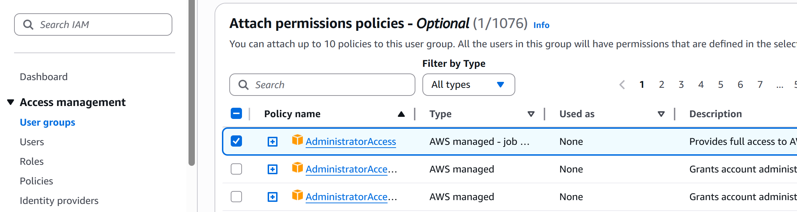

   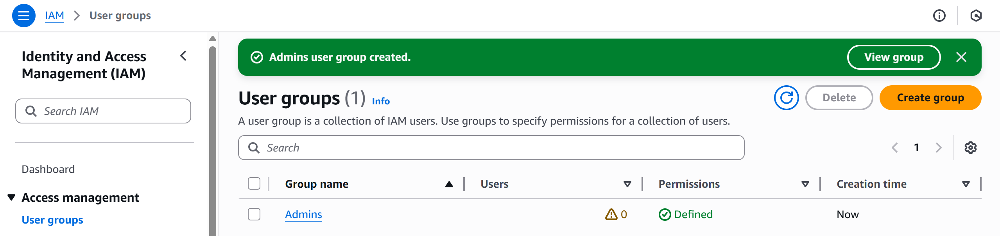

   **IAM-группа** — это способ объединить нескольких пользователей и назначить им одинаковые права через политики.

   >    Политика `AdministratorAccess` предоставляет полный доступ ко всем ресурсам AWS и действиям, включая управление пользователями, сервисами и настройками безопасности.

3. Создание IAM пользователя:

**IAM-пользователь** — это отдельная учётная запись с уникальными данными входа и ограниченными правами. Такой пользователь может иметь консольный или программный доступ и действует в пределах разрешений, выданных через группу или индивидуальные политики.

   1. Переход в раздел `"Users"`, `"Add user"`.
   2. Ввод имени пользователя.
   
   3. Привязать пользователя к группе `Admins`.
   
   4. Разрешить пользователю доступ в AWS Management Console.
   
4. Пользователь создан и имеет доступ к консоли.
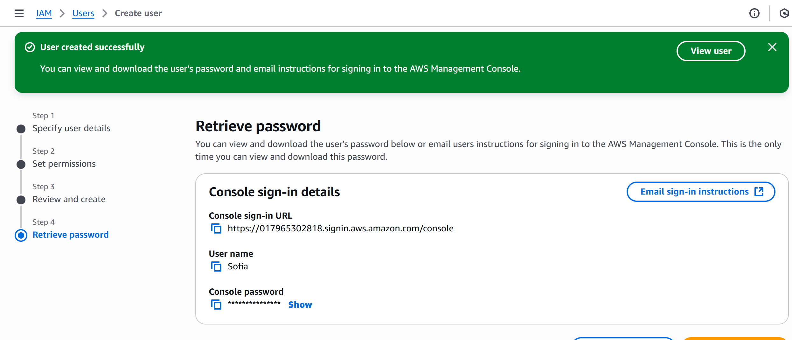

Также скачиваю файл .csv с данными о данном пользователе на компьютер.
5. Выйход из консоли под root-пользователем и вход под новым IAM пользователем.

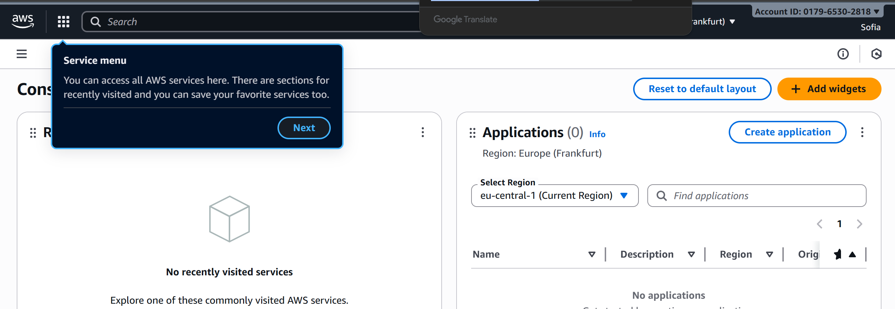

### Задание 2. Настройка Zero-Spend Budget

**Zero-Spend Budget** — это инструмент контроля расходов в AWS, который помогает не выходить за пределы бесплатного уровня.
Он отслеживает использование ресурсов и отправляет уведомление, если затраты превышают $0, то есть как только начинается платное использование.

Такая настройка позволяет избежать неожиданных списаний и вовремя заметить, что какой-то сервис начал потреблять платные ресурсы.

Для данного задания былы проделаны следующие шаги:

1. Переход в сервис Billing and Cost Management.
2. В меню слева выбрано `Budgets` → `Create budget`.
3. затем "Zero spend budget" шаблон со следующие параметры: Budget name и Email
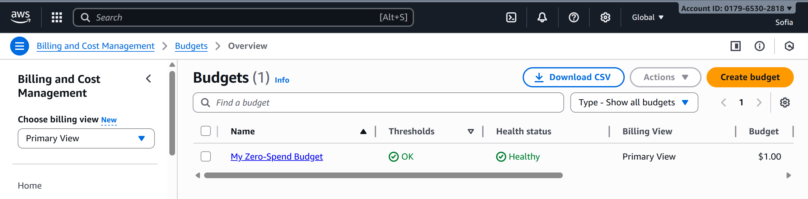

### Задание 3. Создание и запуск EC2 экземпляра (виртуальной машины)

Для запуска и настройки виртуальной машины используется сервис Amazon EC2 (Elastic Compute Cloud) — это основной вычислительный сервис AWS, который позволяет запускать и управлять виртуальными серверами (инстансами) в облаке. EC2 предоставляет гибкость в выборе операционной системы, производительности и конфигурации сети.

1.  Переход в сервис EC2.
2.  В меню слева выбрать `Instances` → `Launch instances`.
3.  Заполнение соответствующих параметров для запуска виртуальной машины:

    1.  _Name and tags_: `webserver`.
    2.  _AMI_: Amazon Linux 2023 AMI. Это образ, который будет использоваться для создания виртуальной машины.
    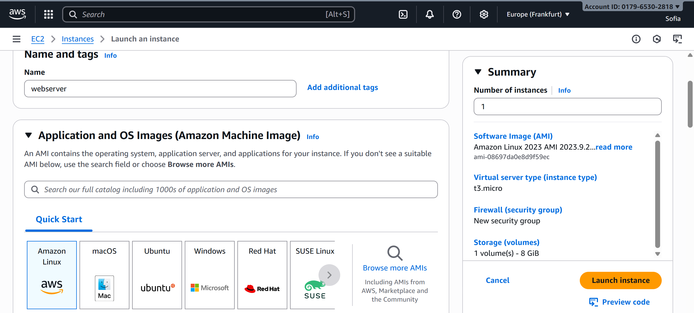
    3.  _Instance type_: t3.micro.
    4.  _Key pair_. Это криптографическая пара ключей (приватный и публичный). Она нужна для безопасного входа на сервер по SSH.
        1. Выбор "Create a new key pair".
        2. Ввод имени для ключа `sofi-keypair`.
        
        3. Нажимаю "Create key pair" и скачиваю файл с приватным ключом (расширение `.pem`). Сохраняю его в надежном месте.
    5.  _Security group_. Это файрвол, набор правил, которые определяют, какой трафик разрешен к вашему экземпляру.

        1. Выбор "Create a new security group".
        2. Имя группы `webserver-sg`.
        3. Два правила для входящего трафика (_Inbound rules_).

           - Разрешить входящий HTTP трафик с любого IP-адреса.
           - Разрешить входящий SSH трафик только с вашего текущего IP-адреса.
           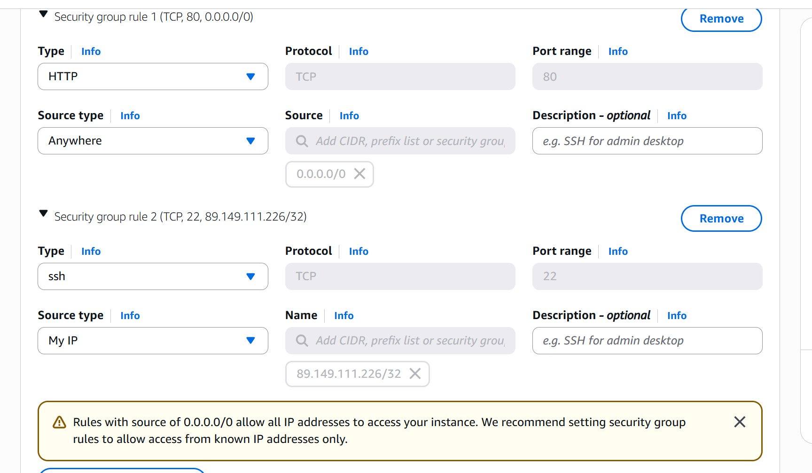

    6.  _Network settings_. Остаются настройки по умолчанию. AWS автоматически создаст виртуальную сеть (VPC) и подсеть (subnet).

    7.  _Configure Storage_. Настройки по умолчанию.

    8.  Пролистав вниз до _Advanced details_ → _User Data_ и вставляем следующий скрипт:

    ```bash
    #!/bin/bash
    dnf -y update
    dnf -y install htop
    dnf -y install nginx
    systemctl enable nginx
    systemctl start nginx
    ```

    В зависимости от выбранного AMI, команды в скрипте могут отличаться.

    > Что такое _User Data_ и какую роль выполняет данный скрипт? Для чего используется nginx?User Data — это сценарий автоматической настройки, который выполняется при первом запуске инстанса. Он позволяет автоматически установить и запустить нужные программы.

    В данном случае скрипт:
    - обновляет систему (dnf -y update),
    - устанавливает утилиту мониторинга htop,
    - устанавливает и запускает веб-сервер nginx.

    Nginx — это популярный веб-сервер, который принимает HTTP-запросы от пользователей и отвечает веб-страницами. После запуска вы сможете проверить его работу, открыв публичный IP-адрес вашего сервера в браузере.

4.  Нажав `Launch instance` и дождаться статуса _Running_ и _Status checks: 2/2_. После того, как виртуальная машина запустится, вы виден её публичный IP-адрес в колонке "IPv4 Public IP".
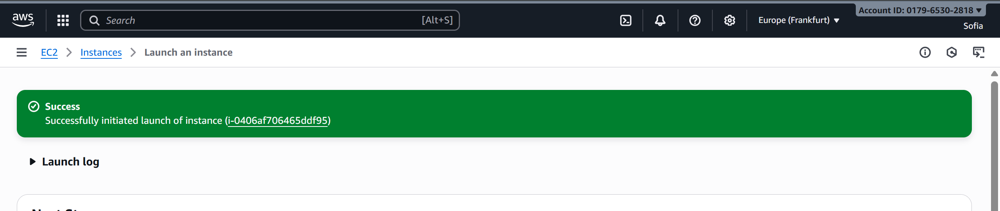
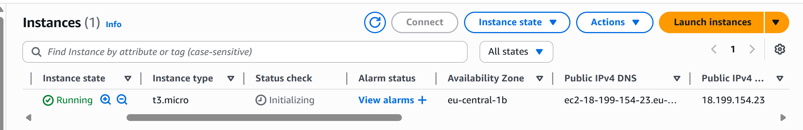
5.  Проверка, что веб-сервер работает, открыв в браузере URL: `http://18.199.154.23`, где `<Public-IP>` — это публичный IP-адрес вашей виртуальной машины.
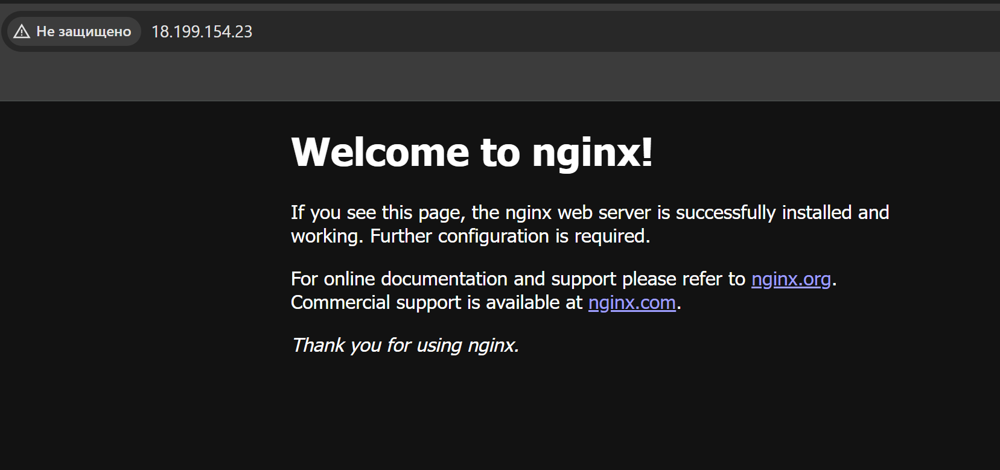

### Задание 4. Логирование и мониторинг

_Мониторинг_ — это важная часть обеспечения надёжности, доступности и производительности экземпляров Amazon EC2 и решений в AWS. Он помогает отслеживать состояние экземпляров EC2, выявлять проблемы на ранних этапах и реагировать до того, как это приведёт к сбою сервиса.

1. Открыть вкладку Status checks.

   - В карточке инстанса EC2 найnb вкладку Status checks.
   - Здесь можно быстро определить, выявил ли Amazon EC2 какие-либо проблемы, которые могут помешать работе приложений.
   - Amazon EC2 выполняет автоматические проверки для каждого работающего экземпляра:
     - _System reachability check_ — проверяет аппаратный уровень (серверы, сеть, гипервизор), на котором запущен экземпляр. Если здесь возникает ошибка — проблема на стороне AWS, и восстановление обычно происходит автоматически.
     - _Instance reachability check_ — проверяет доступность операционной системы на уровне самого инстанса (например, зависание ОС, переполненная память, ошибки загрузки). В случае сбоя требуется вмешательство пользователя.
   - Проверки прошли успешно (3/3 checks passed).
   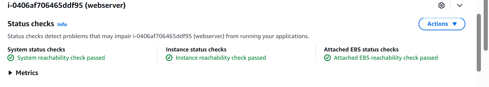

2. Открыть вкладку _Monitoring_.

   - На этой вкладке отображаются метрики Amazon CloudWatch для инстанса.
   - Так как инстанс был создан недавно, метрик пока немного.
   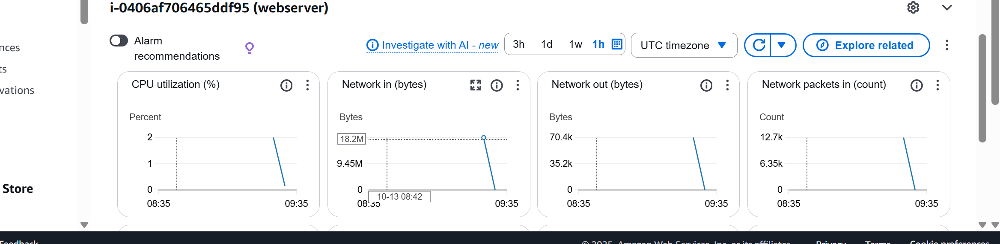
   - Можно нажать на иконку с тремя точками на любом графике и выбрать _Enlarge_, чтобы открыть метрику в развёрнутом виде.
   - По умолчанию включён базовый мониторинг (Basic monitoring) — данные отправляются в CloudWatch каждые 5 минут.
   - При необходимости можно включить детализированный мониторинг (Detailed monitoring) — метрики будут отправляться каждую минуту.

   > В каких случаях важно включать детализированный мониторинг?
   - для высоконагруженных приложений, где важно быстро реагировать на пики нагрузки;
   - при автоматическом масштабировании (Auto Scaling), где решения о запуске/остановке инстансов принимаются на основе метрик в реальном времени;
   - при тонкой настройке производительности и SLA.

3. Просмотр системного лога (System Log)

   - В верхнем меню нажать `Actions` → `Monitor and troubleshoot` → `Get system log`.
   - Здесь отображается вывод консоли инстанса. Это полезный инструмент для диагностики:
     - помогает разбирать ошибки ядра,
     - ошибки конфигурации сервисов,
     - проблемы, из-за которых инстанс может завершиться или стать недоступным до старта SSH.
   - Пролистайте вывод и найдите строки, показывающие установку пакетов (например, _nginx_ из вашего User Data).
   

4. Просмотр снимка экрана инстанса (Instance Screenshot)

Instance Screenshot позволяет получить изображение экрана экземпляра, как если бы к нему был подключён монитор. Это помогает в случаях, когда экземпляр зависает до загрузки SSH — например, при ошибках ядра (kernel panic) или проблемах с загрузкой ОС. Такой снимок часто используется для анализа “замороженных” систем.
   - В меню выберите `Actions` → `Monitor and troubleshoot` → `Get instance screenshot`.
   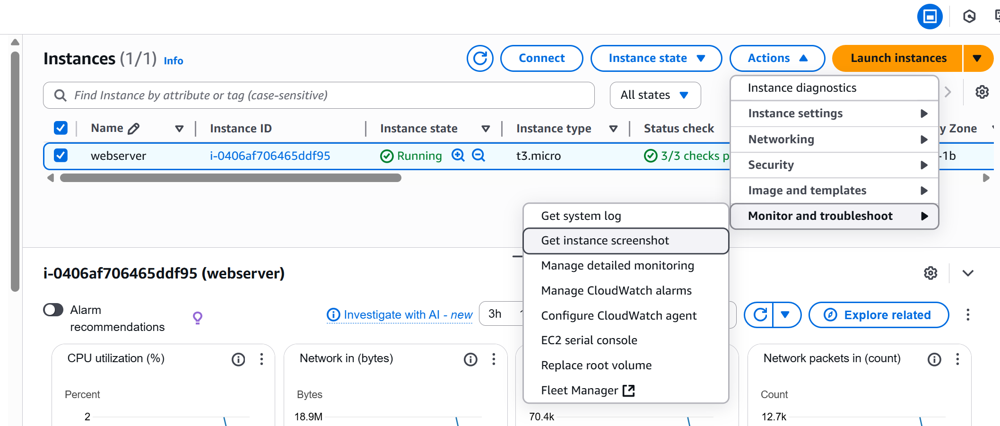
   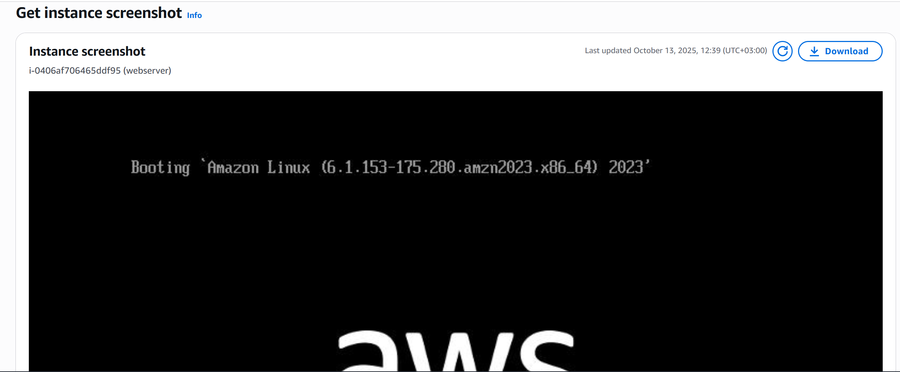
   - Можно увидеть изображение консоли EC2 (как если бы к нему был подключён монитор).

### Задание 5. Подключение к EC2 инстансу по SSH

1. Открываю терминал на компьютере.
2. Переход в директорию, где сохранён файл приватного ключа `.pem` 

   ```bash
   cd "C:\Users\kalin\Downloads\sofi-keypair.pem"
   ```

3. Установить права на ключ (для Linux/MacOS):

   ```bash
   chmod 400 yournickname-keypair.pem
   ```
   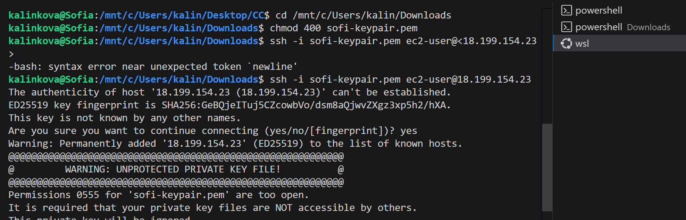
   что-то пошло не по плану права не поменялись, поэтому

4. В PowerShell, убедиться, что:

   - Файл ключа `.pem` не имеет разрешений для других пользователей.

   - Настроить можно следующим образом:
     - Щёлкнув правой кнопкой мыши на файле `.pem` и выбрать "Свойства".
     - Перейти на вкладку "Безопасность".
     - Убедится, что доступ есть только у вашей учётной записи Windows.
     - Удалите права у «Все» (Everyone) или других пользователей.

     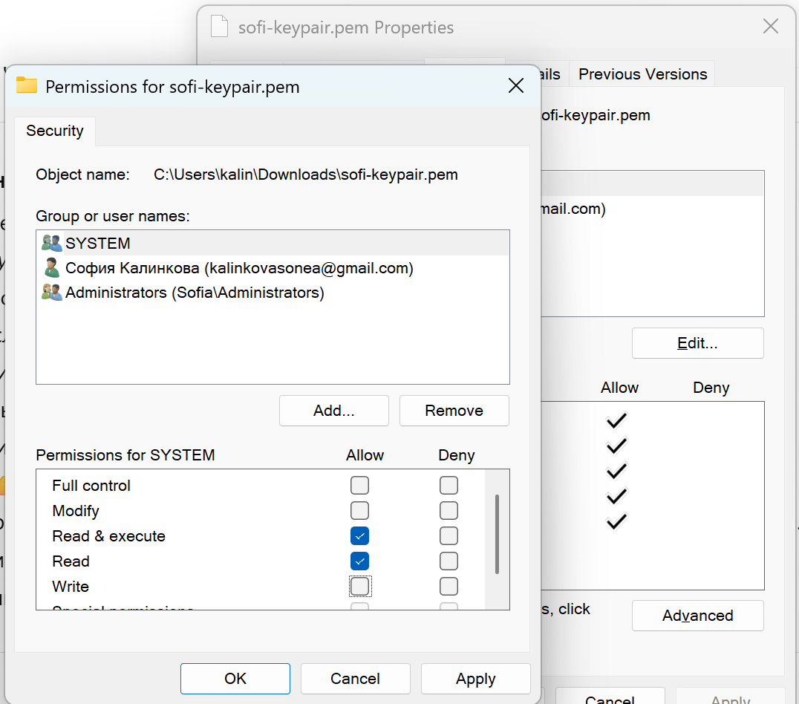

5. Подключение к инстансу по SSH (Secure Shell) — это защищённый протокол, который позволяет управлять сервером с помощью командной строки.:

   ```bash
   ssh -i yournickname-keypair.pem ec2-user@<Public-IP>
   ```

   где,

   - `-i` — это параметр, указывающий на файл приватного ключа.
   - `yournickname-keypair.pem` — это имя вашего файла с приватным ключом.
   - `ec2-user` — это стандартное имя пользователя для Amazon Linux AMI.
   - `<Public-IP>` — это публичный IP-адрес инстанса EC2.

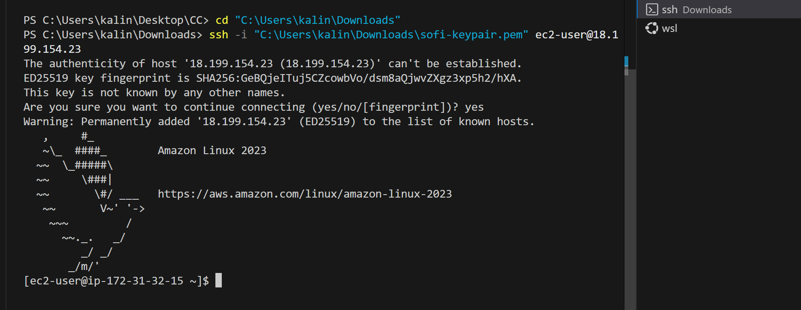
6. После успешного подключения видно приглашение командной строки
7. Выполнив команду для проверки статуса веб-сервера Nginx:

   ```bash
   systemctl status nginx
   ```

   > Почему в AWS нельзя использовать пароль для входа по SSH?
   Использование пароля небезопасно, так как:
   - пароли могут быть подобраны или украдены;
   - при большом числе серверов управление паролями становится сложным;
   - AWS стремится к “passwordless” безопасности, где доступ возможен только по проверенным ключам.
   
   Аутентификация по ключам:
   - обеспечивает высокий уровень защиты (ключи трудно подобрать);
   - позволяет легко ограничить доступ, удалив ключ в настройках;
   - является стандартом безопасности для облачных систем.
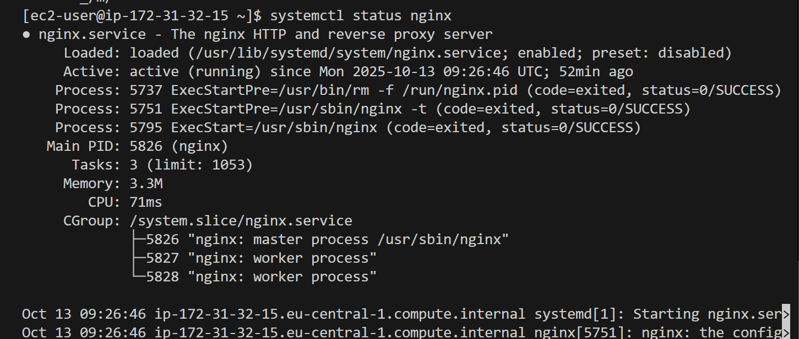

### Задание 6c. Запуск PHP-приложения в Docker (Для специализации DevOps)

Docker позволяет запускать приложения в контейнерах — изолированных средах, которые включают всё необходимое для работы приложения (библиотеки, зависимости, сервер). В AWS можно использовать Docker на EC2, а также готовые образы из Docker Hub или AWS Marketplace.

1. Подключение к инстансу EC2 по SSH
2. Установка Docker, если он ещё не установлен.

   ```bash
   sudo dnf -y install docker
   sudo systemctl enable docker
   sudo systemctl start docker
   sudo usermod -aG docker ec2-user
   ```

   Проверка, что Docker работает:

   ```bash
   docker --version
   ```
   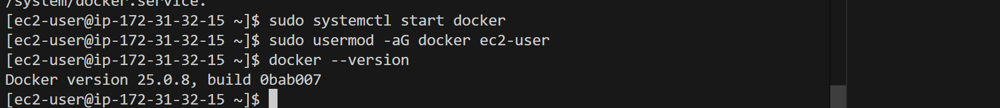
   
   Также нужно установить docker-compose

3. Выйти из сессии SSH и подключиться снова, чтобы обновить группы пользователя.
4. Используя `docker compose`, развернуть PHP-приложение (созданное в рамках лабораторной работы по основам веб-разработки). Для работы приложения необходимо поднять несколько контейнеров, каждый из которых отвечает за свою часть инфраструктуры:

   - `nginx` — веб-сервер, принимающий HTTP-запросы и перенаправляющий их в PHP-обработчик.
   - `php-fpm` — сервис для интерпретации и выполнения PHP-кода.
   - `mysql` — реляционная база данных для хранения информации приложения.
   - `adminer` — лёгкий веб-интерфейс для администрирования базы данных (альтернатива phpMyAdmin).

   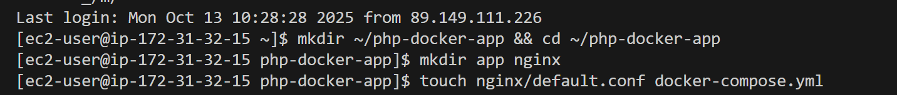

*перезаустила ВМ, поэтому будет другой IP*

копирую папку с приложением с локального устройства на папку в виртуальную машину, введя в powerShell команду:
```
scp -i "C:\Users\kalin\Downloads\sofi-keypair.pem" -r "C:\Users\kalin\Desktop\recipe-book" ec2-user@3.75.207ю249:/home/ec2-user/php-docker-app/app
```
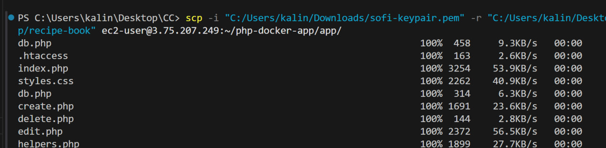

Создать `docker-compose.yml` в котором описывается, какие контейнеры нужно запустить и как они взаимодействуют между собой.
В данном случае он объединяет четыре сервиса. Также в docker-compose.yml задаются:
- пути к исходному коду (тома);
- открытые порты (например, 80:80 для сайта и 8080:8080 для Adminer);
- переменные окружения (логин, пароль и имя базы данных);
- зависимости между контейнерами (например, PHP зависит от MySQL)

Чтобы Nginx мог корректно обрабатывать запросы к PHP-файлам, создаётся файл nginx.conf.
В нём указываются:
- корневая директория проекта;
- правила для обработки PHP-файлов — через передачу запросов на php-fpm;
- обработка статических файлов;
- настройки ошибок и логирования.

Этот конфигурационный файл монтируется в контейнер nginx при запуске, чтобы веб-сервер знал, как взаимодействовать с приложением внутри PHP-контейнера.

запускаю проект
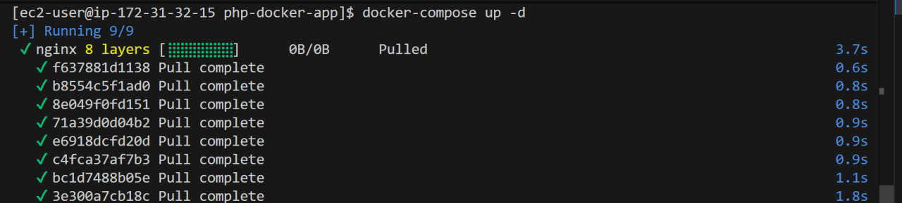
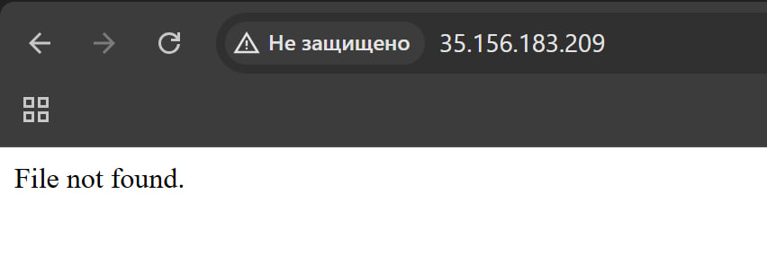

меняю права доступа к папке app
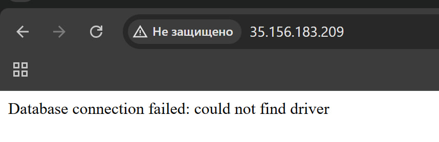

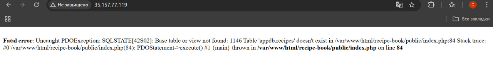

К сожалению после нескольких попыток, так и не увидела корректную работу сайта по нужному IP адресу, поэтому с гордостью принимаю тот факт что приложение сделано не супер хорошо и выбираю другое приложение.


подключаюсь к ВМ
создаю проект с такой структурой
```
php-docker-app1/
├── app/
│   └── sawmlab3/
├── nginx/
│   └── default.conf
└── docker-compose.yml
```
в powerShell пишу команду чтобы перенести папку с проектом
```
scp -i "C:/Users/kalin/Downloads/sofi-keypair.pem" -r "C:/Users/kalin/Desktop/sawmlab3" ec2-user@3.121.227.162:~/php-docker-app1/app/
```
#### Содержимое файлов

- default.conf
```nginx
server {
    listen 80;
    server_name localhost;

    root /var/www/html/sawmlab3;
    index index.php index.html;

    location / {
        try_files $uri $uri/ /index.php?$query_string;
    }

    location ~ \.php$ {
        include fastcgi_params;
        fastcgi_pass php:9000;
        fastcgi_param SCRIPT_FILENAME $document_root$fastcgi_script_name;
        fastcgi_index index.php;
    }
}
```
- docker-compose.yml
```yaml
version: '3.9'

services:
  php:
    image: php:8.2-fpm
    container_name: php
    volumes:
      - ./app:/var/www/html:delegated
    networks:
      - appnet

  nginx:
    image: nginx:stable-alpine
    container_name: nginx
    ports:
      - "80:80"
    volumes:
      - ./app:/var/www/html:ro
      - ./nginx/default.conf:/etc/nginx/conf.d/default.conf:ro
    depends_on:
      - php
    networks:
      - appnet

  mysql:
    image: mysql:8.0
    container_name: mysql
    environment:
      MYSQL_ROOT_PASSWORD: rootpassword
      MYSQL_DATABASE: appdb
      MYSQL_USER: appuser
      MYSQL_PASSWORD: apppass
    volumes:
      - mysql-data:/var/lib/mysql
    networks:
      - appnet

  adminer:
    image: adminer
    container_name: adminer
    restart: always
    ports:
      - "8080:8080"
    networks:
      - appnet

volumes:
  mysql-data:

networks:
  appnet:
    driver: bridge
```
Перед запуском решаю почистить все контейнеры, для этого выполняю следующие шаги:

- Остановить все контейнеры `docker ps -aq | xargs docker stop`
- Удалить все контейнеры `docker ps -aq | xargs docker rm -f`
- Удалить все тома (volumes), чтобы база данных тоже сбросилась `docker volume ls -q | xargs docker volume rm -f`
- Удалить все образы `docker images -q | xargs docker rmi -f`

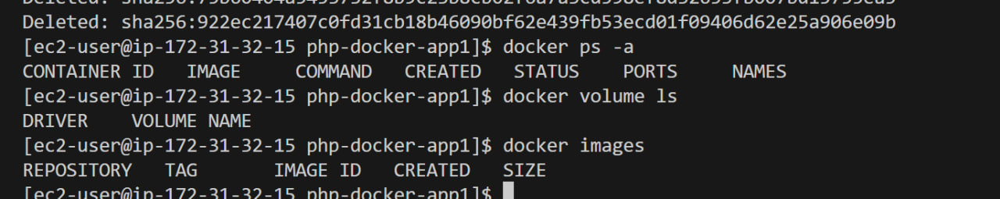

Запускаю проект заново `docker compose up -d --build`

- При проверке в браузере: http://<EC2_PUBLIC_IP> выводится 403 ошибка, поменяла права доступа к папке с приложением командой `chmod -R 755 ./app/sawmlab3`

- перезапустила Nginx `docker-compose restart nginx`

После запуска убедилась, что:

   - Приложение доступно по адресу `http://<Public-IP>`. 
   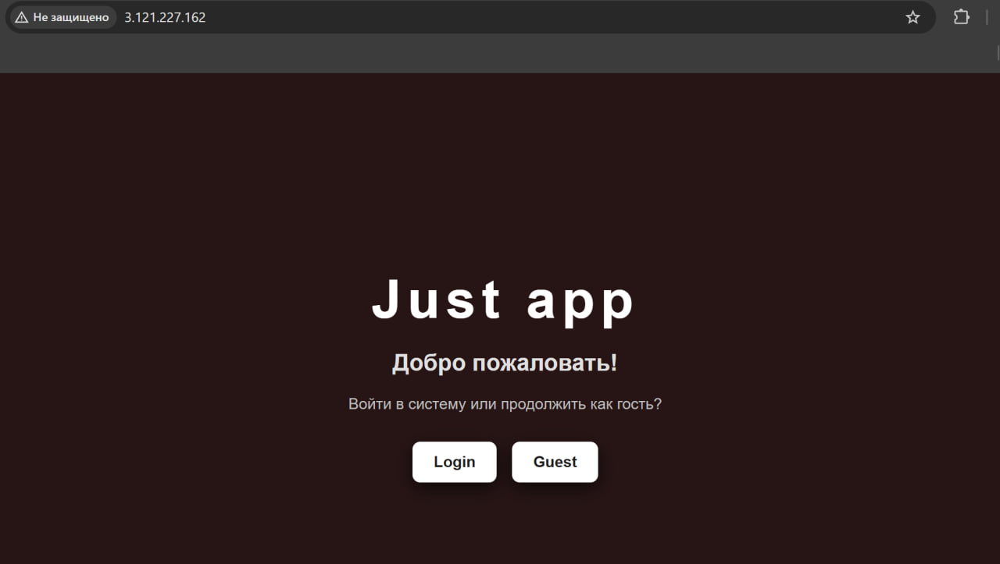
   - Приложение корректно взаимодействует с базой данных MySQL.
   но пока что на порту 8080 нет доступа, добавляю его 
   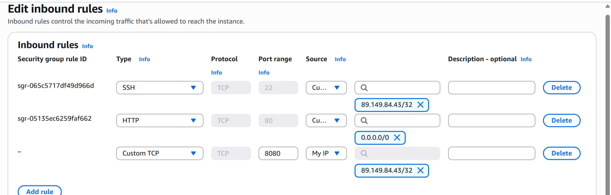
   - Админка Adminer доступна по адресу `http://<Public-IP>:8080`.
   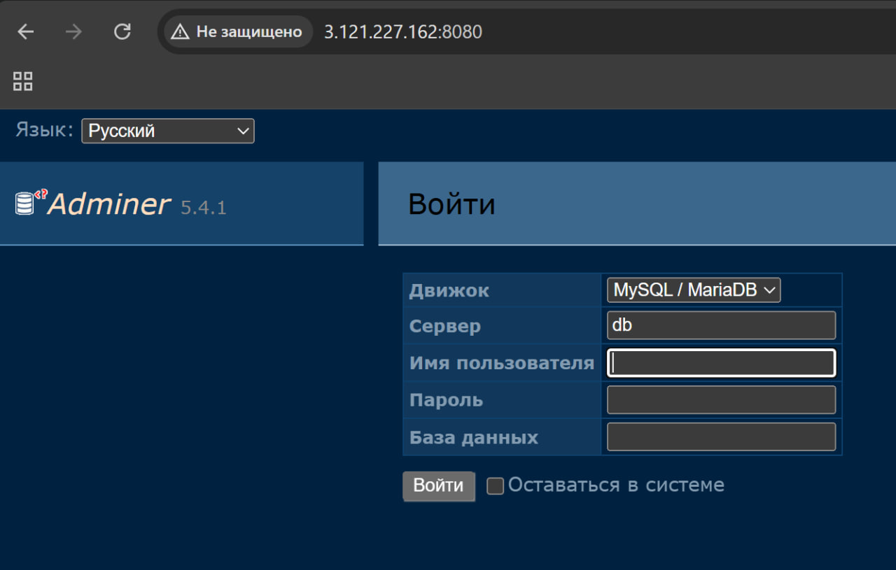

### Задание 7. Завершение работы и удаление ресурсов

После того как вы закончили работу с виртуальной машиной (инстансом EC2), важно корректно завершить её работу, чтобы не расходовать ресурсы AWS и избежать лишних затрат.

 Остановка запущенной виртуальной машину (инстанс EC2) _используя AWS CLI_.
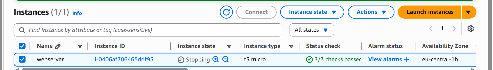

> Чем «Stop» отличается от «Terminate»
Команда Stop останавливает виртуальную машину, но не удаляет её. Все данные и настройки сохраняются, диск (EBS) остаётся прикреплённым, и при необходимости инстанс можно снова запустить. Это похоже на выключение компьютера — он перестаёт работать, но при включении всё остаётся на месте.

Команда Terminate, наоборот, полностью удаляет виртуальную машину вместе с её данными и настройками. После выполнения этого действия восстановить инстанс невозможно, так как его хранилище и ресурсы освобождаются. Эту команду используют, когда сервер больше не нужен и нужно освободить ресурсы в AWS.

### Вывод

В ходе лабораторной работы была изучена работа с вычислительными сервисами AWS на примере EC2. Создана IAM-группу и пользователя с административными правами, настроила Zero-Spend Budget для контроля расходов, развернула виртуальную машину EC2 с Amazon Linux и веб-сервером Nginx, подключилась к ней по SSH с использованием ключей безопасности, а также изучила возможности мониторинга и логирования через CloudWatch.

Дополнительно я попробовала развернуть PHP-приложение в Docker-контейнерах с использованием Nginx и PHP-FPM, что позволило понять принципы контейнеризации и взаимодействия сервисов. В завершение рассмотрела разницу между остановкой (Stop) и удалением (Terminate) инстанса и научилась корректно завершать работу ресурсов, чтобы избежать лишних затрат.

### Библиография

1. https://docs.aws.amazon.com/ — официальные материалы Amazon Web Services, описывающие работу всех облачных сервисов и их настройки.
2. https://docs.aws.amazon.com/AWSEC2/latest/UserGuide/concepts.html — руководство пользователя по работе с виртуальными машинами EC2.
3. https://docs.aws.amazon.com/IAM/latest/UserGuide/introduction.html — руководство по управлению пользователями, группами и политиками в IAM.
4. https://docs.aws.amazon.com/cli/latest/index.html — справочник по использованию команд AWS CLI.
5. https://nginx.org/en/docs/ — официальная документация по веб-серверу NGINX.
6. https://docs.docker.com/ — официальная документация по установке и использованию Docker.
7. https://docs.docker.com/compose/ — руководство по настройке многоконтейнерных приложений с использованием Docker Compose.
