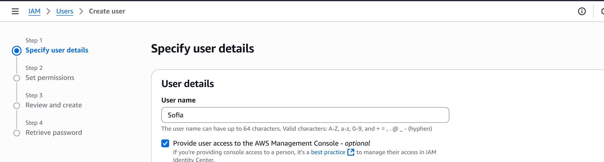
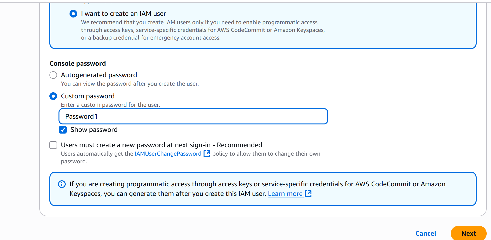
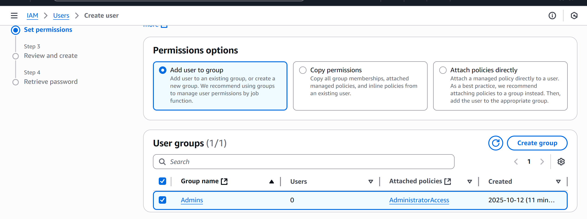
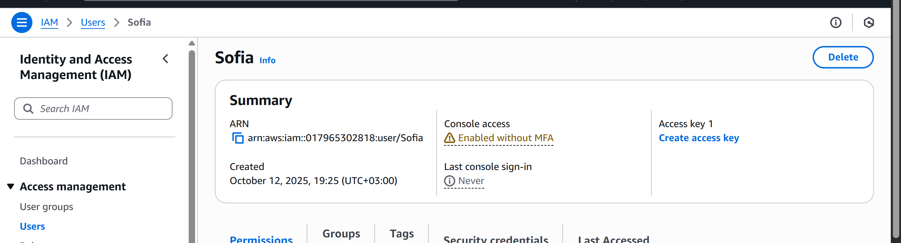

# Лабораторная работа №2. Введение в AWS. Вычислительные сервисы
 
 - **Калинкова София, I2302** 
 - **12.10.2025** 

## Цель работы

Познакомиться с основными вычислительными сервисами AWS, научиться создавать и настраивать виртуальные машины (EC2), а также развёртывать простые веб-приложения.

## Условие

### Задание 0. Подготовка среды

1. Зарегистрироваться в AWS и создать бесплатный аккаунт (Free Tier).
2. Вход в консоль управления под root-пользователем.
3. Выбор региона EU (Frankfurt) `eu-central-1`.

### Задание 1. Создание IAM группы и пользователя

_IAM_ — это сервис для управления доступом в AWS. Здесь создаются пользователи, группы и политики (наборы прав).

1. Откройте сервис IAM (Identity and Access Management).
2. Создайте IAM группу `Admins`:

   1. Перейдите в раздел `"Groups"` и нажмите `"Create New Group"`.
   2. Введите имя группы `Admins` и нажмите "Next Step".
   
   3. На шаге "Attach Policy" выберите политику `AdministratorAccess`.
   

   

   > Что делает данная политика?
   Политика AdministratorAccess предоставляет полный доступ ко всем ресурсам AWS и действиям, включая управление пользователями, сервисами и настройками безопасности.

3. Создайте IAM пользователя с любым именем:

   1. Перейдите в раздел `"Users"` и нажмите `"Add user"`.
   
   
   
   
   2. Введите имя пользователя, например `cloudstudent`.
   3. Привяжите пользователя к группе `Admins`.
   4. Разрешите пользователю доступ в AWS Management Console.
   

4. Убедитесь, что пользователь создан и имеет доступ к консоли.

скачала .csv еще

5. Выйдите из консоли под root-пользователем и войдите под новым IAM пользователем.


### Задание 2. Настройка Zero-Spend Budget

1. Откройте сервис Billing and Cost Management.
2. В меню слева выберите `Budgets` → `Create budget`.
3. Выберите "Zero spend budget" шаблон и укажите следующие параметры:
   - Budget name: `ZeroSpend`
   - Email recipients: ваш email
4. Нажмите "Create budget" внизу страницы.

После создания данного бюджета вы будете получать уведомления, если ваши расходы превысят $0.

### Задание 3. Создание и запуск EC2 экземпляра (виртуальной машины)

Для запуска и настройки виртуальной машины используется сервис Amazon EC2 (Elastic Compute Cloud).

1.  Откройте сервис EC2.
2.  В меню слева выберите `Instances` → `Launch instances`.
3.  Заполните соответствующие параметры для запуска виртуальной машины:

    1.  _Name and tags_: `webserver`.
    2.  _AMI_: Выберите Amazon Linux 2023 AMI. Это образ, который будет использоваться для создания виртуальной машины.
    3.  _Instance type_: t3.micro.
    4.  _Key pair_. Это криптографическая пара ключей (приватный и публичный). Она нужна для безопасного входа на сервер по SSH.
        1. Выберите "Create a new key pair".
        2. Введите имя для ключа в формате `yournickname-keypair`.
        3. Нажмите "Create key pair" и скачайте файл с приватным ключом (расширение `.pem`). Сохраните его в надежном месте.
    5.  _Security group_. Это набор правил, которые определяют, какой трафик разрешен к вашему экземпляру.

        1. Выберите "Create a new security group".
        2. Введите имя группы `webserver-sg`.
        3. Добавьте два правила для входящего трафика (_Inbound rules_).

           - Разрешить входящий HTTP трафик с любого IP-адреса.
           - Разрешить входящий SSH трафик только с вашего текущего IP-адреса.

    6.  _Network settings_. Оставьте настройки по умолчанию. AWS автоматически создаст виртуальную сеть (VPC) и подсеть (subnet).

    7.  _Configure Storage_. Оставьте настройки по умолчанию.

    8.  Пролистайте вниз до _Advanced details_ → _User Data_ и вставьте следующий скрипт:

    ```bash
    #!/bin/bash
    dnf -y update
    dnf -y install htop
    dnf -y install nginx
    systemctl enable nginx
    systemctl start nginx
    ```

    В зависимости от выбранного AMI, команды в скрипте могут отличаться.

    > Что такое _User Data_ и какую роль выполняет данный скрипт? Для чего используется nginx?

4.  Нажмите `Launch instance` и дождитесь статуса _Running_ и _Status checks: 2/2_. После того, как виртуальная машина запустится, вы увидите её публичный IP-адрес в колонке "IPv4 Public IP".
5.  Проверьте, что веб-сервер работает, открыв в браузере URL: `http://<Public-IP>`, где `<Public-IP>` — это публичный IP-адрес вашей виртуальной машины.

### Задание 4. Логирование и мониторинг

_Мониторинг_ — это важная часть обеспечения надёжности, доступности и производительности ваших экземпляров Amazon EC2 и решений в AWS.

1. Откройте вкладку Status checks.

   - В карточке вашего инстанса EC2 найдите вкладку Status checks.
   - Здесь вы можете быстро определить, выявил ли Amazon EC2 какие-либо проблемы, которые могут помешать работе приложений.
   - Amazon EC2 выполняет автоматические проверки для каждого работающего экземпляра:
     - _System reachability check_ — проверяет инфраструктуру AWS (железо и гипервизор).
     - _Instance reachability check_ — проверяет, доступна ли операционная система на уровне инстанса.
   - Убедитесь, что обе проверки прошли успешно (2/2 checks passed).

2. Откройте вкладку _Monitoring_.

   - На этой вкладке отображаются метрики Amazon CloudWatch для вашего инстанса.
   - Так как инстанс был создан недавно, метрик пока немного.
   - Вы можете нажать на иконку с тремя точками на любом графике и выбрать _Enlarge_, чтобы открыть метрику в развёрнутом виде.
   - По умолчанию включён базовый мониторинг (Basic monitoring) — данные отправляются в CloudWatch каждые 5 минут.
   - При необходимости можно включить детализированный мониторинг (Detailed monitoring) — метрики будут отправляться каждую минуту.

   > В каких случаях важно включать детализированный мониторинг?

3. Просмотр системного лога (System Log)

   - В верхнем меню нажмите `Actions` → `Monitor and troubleshoot` → `Get system log`.
   - Здесь отображается вывод консоли инстанса. Это полезный инструмент для диагностики:
     - помогает разбирать ошибки ядра,
     - ошибки конфигурации сервисов,
     - проблемы, из-за которых инстанс может завершиться или стать недоступным до старта SSH.
   - Пролистайте вывод и найдите строки, показывающие установку пакетов (например, _nginx_ из вашего User Data).
   - Если лог пока пуст — подождите пару минут и попробуйте снова.
   - Нажмите Cancel, чтобы выйти.

4. Просмотр снимка экрана инстанса (Instance Screenshot)
   - В меню выберите `Actions` → `Monitor and troubleshoot` → `Get instance screenshot`.
   - Вы увидите изображение консоли вашего EC2 (как если бы к нему был подключён монитор).
   - Это особенно полезно, если вы не можете подключиться к инстансу по SSH: скриншот помогает понять, зависла ли ОС, есть ли kernel panic или другие ошибки.
   - Нажмите Cancel, чтобы выйти.

### Задание 5. Подключение к EC2 инстансу по SSH

1. Откройте терминал на вашем компьютере.
2. Перейдите в директорию, где сохранён файл приватного ключа `.pem`.

   ```bash
   cd /path/to/your/key
   ```

3. Установите права на ключ (для Linux/MacOS):

   ```bash
   chmod 400 yournickname-keypair.pem
   ```

4. Если используете PowerShell или CMD, убедитесь, что:

   - Файл ключа `.pem` находится в директории, доступной только вашему пользователю,ине имеет разрешений для других пользователей.

   - Настроить можно следующим образом:
     - Щёлкните правой кнопкой мыши на файле `.pem` и выберите "Свойства".
     - Перейдите на вкладку "Безопасность".
     - Убедитесь, что доступ есть только у вашей учётной записи Windows.
     - Удалите права у «Все» (Everyone) или других пользователей.

5. Подключитесь к инстансу по SSH:

   ```bash
   ssh -i yournickname-keypair.pem ec2-user@<Public-IP>
   ```

   где,

   - `-i` — это параметр, указывающий на файл приватного ключа.
   - `yournickname-keypair.pem` — это имя вашего файла с приватным ключом.
   - `ec2-user` — это стандартное имя пользователя для Amazon Linux AMI.
   - `<Public-IP>` — это публичный IP-адрес инстанса EC2.

6. После успешного подключения вы должны увидеть приглашение командной строки, например:

   ```bash
   [ec2-user@ip-xx-xx-xx-xx ~]$
   ```

7. Выполните команду для проверки статуса веб-сервера Nginx:

   ```bash
   systemctl status nginx
   ```

   > Почему в AWS нельзя использовать пароль для входа по SSH?

Далее, в зависимости от вашей специализации, выберите одно из трёх заданий (6a, 6b или 6c). Для специализации _Frontend & Backend & Security_ подойдут задания 6a и 6b, для специализации _DevOps_ — рекомендуется задание 6c.

### Задание 6a. Развёртывание статического веб-сайта (_Для специализаций Frontend & Backend & Security_)

> Начальный уровень

1. Создайте на локальном компьютере 3 HTML-файла:
   1. `index.html` — главная страница сайта.
   2. `about.html` — страница "О нас".
   3. `contact.html` — страница "Контакты".
2. Подключитесь к вашему инстансу EC2 по SSH (см. задание 5).
3. Перейдите в директорию веб-сервера Nginx:

   ```bash
   cd /usr/share/nginx/html
   ```

4. Скопируйте созданные HTML-файлы на сервер с помощью `scp` (в отдельном терминале на вашем локальном компьютере):

   ```bash
    scp -i yournickname-keypair.pem index.html ec2-user@<Public-IP>:/usr/share/nginx/html
    scp -i yournickname-keypair.pem about.html ec2-user@<Public-IP>:/usr/share/nginx/html
    scp -i yournickname-keypair.pem contact.html ec2-user@<Public-IP>:/usr/share/nginx/html
   ```

   > Что делает команда `scp`?

5. Проверьте, что файлы успешно скопированы на сервер:

   ```bash
    ls -l /usr/share/nginx/html
   ```

6. Откройте в браузере URL: `http://<Public-IP>` и убедитесь, что ваш сайт доступен.

### Задание 6b. Развёртывание веб-сайта на PHP (_Для специализаций Frontend & Backend & Security_)

> Продвинутый уровень

1. Подготовьте локально простую структуру сайта на PHP с тремя страницами или используйте лабораторную работу по основам веб-разработки.
2. Скопируйте файлы веб-приложения на сервер с помощью `scp` или `ftp` клиента (например, FileZilla).
   Пример команды `scp`:

   ```bash
    scp -i yournickname-keypair.pem -r /path/to/your/php-website/* ec2-user@<Public-IP>:/usr/share/nginx/html
   ```

3. Подключитесь к инстансу по SSH (см. задание 5).
4. Установите Nginx и PHP-FPM.

   ```bash
   sudo dnf -y install nginx php php-fpm
   sudo systemctl enable nginx
   sudo systemctl start nginx
   sudo systemctl enable php-fpm
   sudo systemctl start php-fpm
   ```

   - `nginx` — веб-сервер, который будет принимать и обрабатывать HTTP-запросы.
   - `php-fpm` — сервис для интерпретации и выполнения PHP-кода.

5. Настройте Nginx для работы с PHP.

   1. Создайте резервную копию основного конфигурационного файла Nginx:

      ```bash
      sudo cp /etc/nginx/nginx.conf /etc/nginx/nginx.conf.bak
      ```

   2. Создайте новый конфигурационный файл для вашего сайта на локальном компьютере, например `mywebsite.conf`:

      ```nginx
      server {
          listen 80;
          server_name _;

          root /usr/share/nginx/html;
          index index.php index.html index.htm;

          location / {
              try_files $uri $uri/ =404;
          }

          location ~ \.php$ {
              include snippets/fastcgi-php.conf;
              fastcgi_pass unix:/run/php-fpm/www.sock;
          }

          location ~ /\.ht {
              deny all;
          }
      }
      ```

      > Что делает данный конфигурационный файл?

   3. Скопируйте этот файл на сервер в директорию `/etc/nginx/conf.d/`:

      ```bash
      scp -i yournickname-keypair.pem mywebsite.conf ec2-user@<Public-IP>:/tmp
      ssh -i yournickname-keypair.pem ec2-user@<Public-IP> "sudo mv /tmp/mywebsite.conf /etc/nginx/conf.d/"
      ```

   4. Проверьте конфигурацию Nginx на наличие ошибок:

      ```bash
      sudo nginx -t
      ```

   5. Перезапустите Nginx, чтобы применить изменения:

      ```bash
      sudo systemctl restart nginx
      ```

6. Откройте в браузере URL: `http://<Public-IP>` и убедитесь, что ваш PHP-сайт работает корректно.

### Задание 6c. Запуск PHP-приложения в Docker (_Для специализации DevOps_)

Docker позволяет запускать приложения в контейнерах — изолированных средах, которые включают всё необходимое для работы приложения (библиотеки, зависимости, сервер). В AWS вы можете использовать Docker на EC2, а также готовые образы из Docker Hub или AWS Marketplace.

1. Подключитесь к вашему инстансу EC2 по SSH
2. Установите Docker, если он ещё не установлен.

   ```bash
   sudo dnf -y install docker
   sudo systemctl enable docker
   sudo systemctl start docker
   sudo usermod -aG docker ec2-user
   ```

   Проверьте, что Docker работает:

   ```bash
   docker --version
   ```

3. Выйдите из сессии SSH и подключитесь снова, чтобы обновить группы пользователя.
4. Используя `docker compose`, разверните PHP-приложение (созданное в рамках лабораторной работы по основам веб-разработки). Для работы приложения необходимо поднять несколько контейнеров, каждый из которых отвечает за свою часть инфраструктуры:

   - `nginx` — веб-сервер, принимающий HTTP-запросы и перенаправляющий их в PHP-обработчик.
   - `php-fpm` — сервис для интерпретации и выполнения PHP-кода.
   - `mysql` — реляционная база данных для хранения информации приложения.
   - `adminer` — лёгкий веб-интерфейс для администрирования базы данных (альтернатива phpMyAdmin).

5. После запуска убедитесь, что:

   - Приложение доступно по адресу `http://<Public-IP>`.
   - Приложение корректно взаимодействует с базой данных MySQL.
   - Админка Adminer доступна по адресу `http://<Public-IP>:8080`.

### Задание 7. Завершение работы и удаление ресурсов

1. Остановите запущенную виртуальную машину (инстанс EC2) _используя AWS CLI_.
2. Удалять виртуальную машину не обязательно, так как в следующей лабораторной работе вы будете работать с тем же инстансом.

> Чем «Stop» отличается от «Terminate»

### Что делать, если что-то пошло не так?

- _Ошибка_: Не открывается сайт.
- _Решение_: Проверьте Security Group (Inbound 80/tcp), состояние сервиса nginx, и `/var/log/cloud-init-output.log`.

- _Ошибка_: Не удаётся подключиться по SSH.
- _Решение_: Удостоверьтесь, что используете правильный Public IP, правильный пользователь (ec2-user для Amazon Linux), и в SG открыт порт 22 с вашего IP.

## Контрольные вопросы

Контрольные вопросы указаны выше в некоторых заданиях. Ответьте на них письменно во время выполнения лабораторной работы.

## Правила предоставления лабораторной работы

Необходимо написать отчёт по лабораторной работе. Отчет может быть предоставлен в 2 форматах:

- В формате PDF (Word). Максимальная оценка - _8_.
- Файл README.md, то есть в формате Markdown. Максимальная оценка - _10_.

### Отчет в формате Word (PDF) файла

1. Титульный лист
2. Теоретическая часть
   1. Формулировка задачи
   2. Описание цели и основные этапы работы
3. Практическая часть
   1. Пошаговое описание выполнения работы с пояснениями и скриншотами.
4. Вывод и ссылка на репозиторий Git
5. Ответы на контрольные вопросы
6. Список использованных источников

### Отчет в формате Markdown (README.md)

1. Описание лабораторной работы
   1. Постановка задачи
   2. Цель и основные этапы работы
2. Практическая часть
   1. Пошаговое описание выполнения лабораторной работы с пояснениями и скриншотами
   2. Ответы на контрольные вопросы (можно включить прямо в описание шагов)
3. Список использованных источников
4. Дополнительные важные аспекты, если применимо

## Представление лабораторной работы

Представление лабораторной работы обязательно. В случае отсутствия представления лабораторной работы, максимальная оценка составит 7 при выполнении всех условий.

_Если при защите лабораторной работы студент не отвечает на вопросы преподавателя, итоговая оценка может быть ниже 7_.