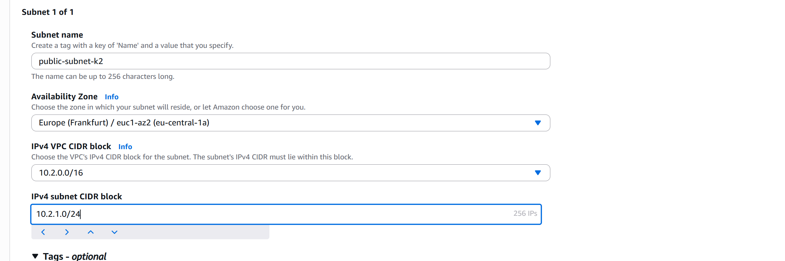
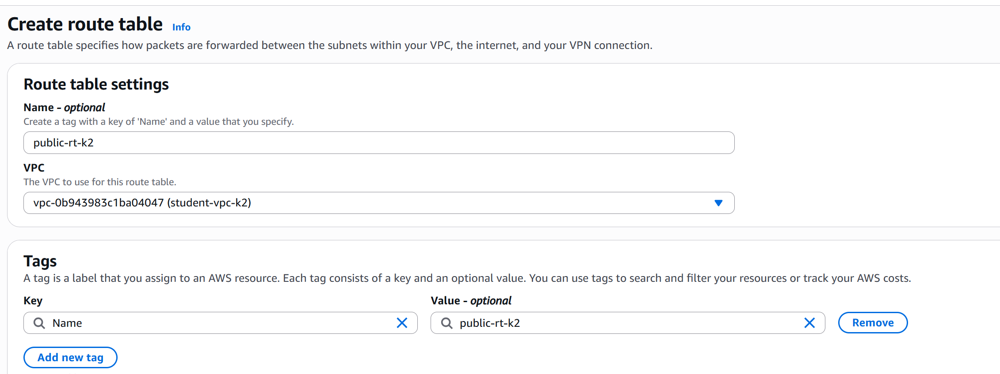
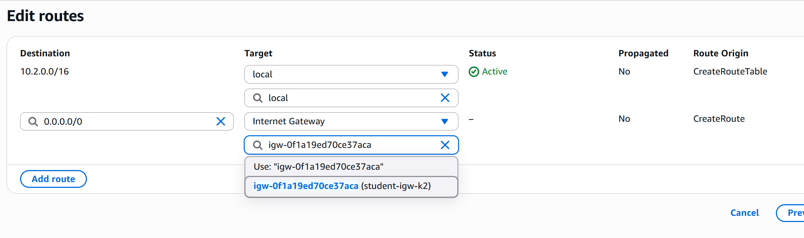
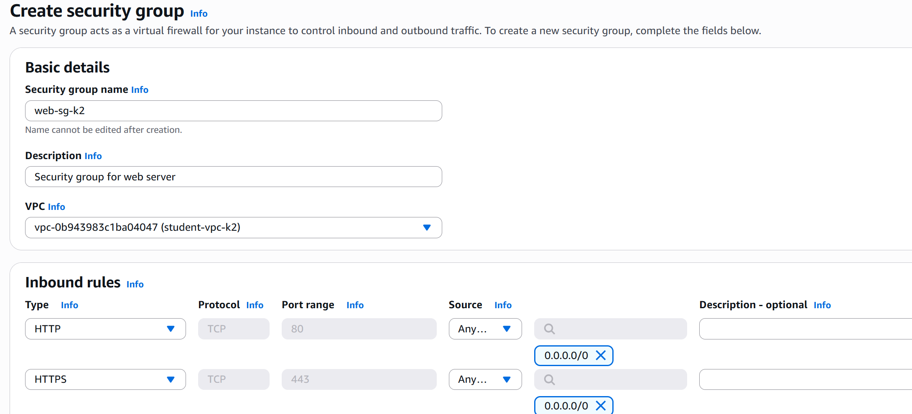
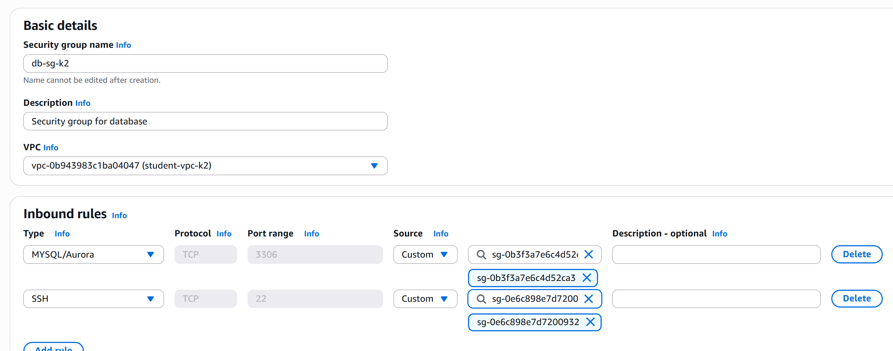
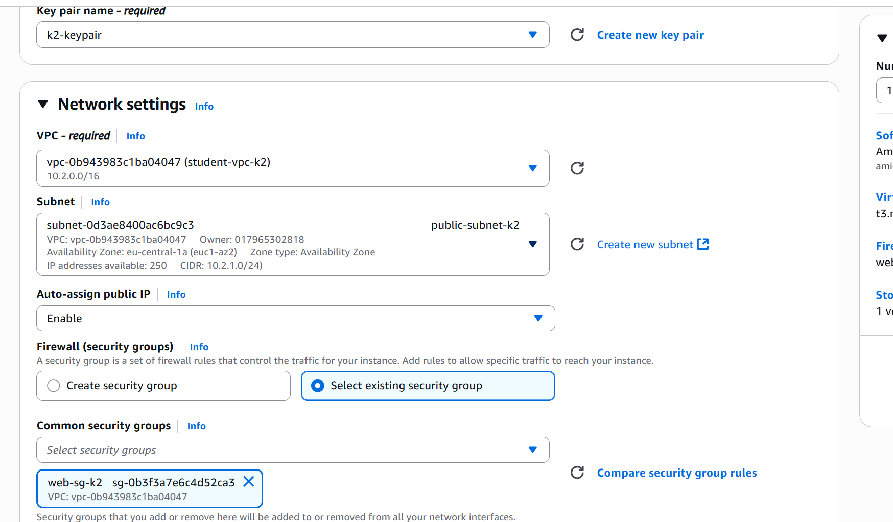
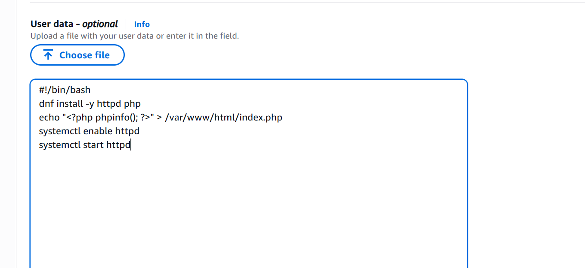

# Лабораторная работа №3. Облачные сети

## Цели работы

Научиться вручную создавать виртуальную сеть (VPC) в AWS, добавлять в неё подсети, таблицы маршрутов, интернет-шлюз (IGW) и NAT Gateway, а также настраивать взаимодействие между веб-сервером в публичной подсети и сервером базы данных в приватной.

После выполнения работы студент:

- понимает, как формируется изоляция сетей в AWS (VPC);
- умеет создавать и связывать компоненты сети;
- знает, как EC2-инстансы разных подсетей взаимодействуют друг с другом;
- различает публичные и приватные маршруты.

## Условия

_Amazon VPC (Virtual Private Cloud)_ — это ваша собственная виртуальная сеть в облаке AWS.
Она полностью изолирована от других пользователей и позволяет вам управлять адресным пространством, подсетями, шлюзами и безопасностью.

В типичном сценарии у нас есть:

- _Публичная подсеть_. Для веб-сервера (имеет выход в интернет).
- _Приватная подсеть_. Для базы данных (без прямого доступа извне).
- _NAT Gateway_. Чтобы приватные ресурсы имели доступ в интернет (например, для обновления ПО).
- _Route Tables_. Определяют, куда направлять трафик.
- _Security Groups_. Управляют входящими и исходящими соединениями на уровне инстансов.
- _EC2-инстансы_. Веб-сервер, сервер базы данных и bastion host.

Конечная архитектура сети, созданной в этой лабораторной работе, будет выглядеть следующим образом:


### Шаг 1. Подготовка среды

1. Войдите в AWS Management Console.
2. Убедитесь, что регион установлен на `Frankfurt` (eu-central-1).
3. В строке поиска введите _VPC_ и откройте консоль.

### Шаг 2. Создание VPC

1. В левой панели выберите `Your VPCs` → `Create VPC`.
2. Укажите:
   1. `Name tag`: `student-vpc-kXX` (где `XX` — ваш порядковый номер).
   2. `IPv4 CIDR block`: `10.(k%30).0.0/16`
      > Пример: если `k = 12`, используйте `10.12.0.0/16`. Если `k = 31`, используйте `10.1.0.0/16`.
   3. `Tenancy`: Default
      > Что обозначает маска `/16`? И почему нельзя использовать, например, `/8`?
3. Нажмите `Create VPC`.


_VPC_ — это “контейнер” для подсетей. Внутри одной VPC можно создавать десятки подсетей с разными маршрутами и правилами.

### Шаг 3. Создание Internet Gateway (IGW)

Internet Gateway позволяет ресурсам внутри VPC выходить в Интернет. _Без него публичные IP-адреса не будут работать_. Если вашей виртуальной машине (EC2) назначен публичный IP, но нет IGW, она не сможет общаться с внешним миром.

1. В левой панели выберите `Internet Gateways` → `Create internet gateway`.
2. Укажите имя: `student-igw-kXX`.

3. Теперь нужно “прикрепить” (Attach) шлюз к вашей сети:
   1. Выберите созданный IGW.
   2. Нажмите `Actions` → `Attach to VPC`.
   3. В списке выберите `student-vpc-kXX`.
   4. Подтвердите действие.


### Шаг 4. Создание подсетей

_Подсети (subnets)_ — это сегменты внутри VPC, которые позволяют изолировать ресурсы. То есть, подсети создаются для разделения ресурсов по функционалу и уровню доступа и для более гибкого управления трафиком.

#### Шаг 4.1. Создание публичной подсети

Теперь, когда у нас есть VPC и Internet Gateway, создадим первую подсеть — публичную.
Эта подсеть будет содержать ресурсы, которым нужен прямой доступ из Интернета.

1. В левой панели выберите `Subnets` → `Create subnet`.
2. Укажите:
   1. `VPC ID`: выберите вашу сеть `student-vpc-kXX`
   2. `Subnet name`: `public-subnet-kXX`
   3. `Availability Zone`: `us-central-1a`
      > AWS создаёт подсети в конкретных зонах доступности; в нашем случае выберем первую
   4. `IPv4 CIDR block`: `10.(k%30).1.0/24`
      > Диапазон IP-адресов, которые будут выданы ресурсам в этой подсети
3. Нажмите `Create subnet`.


> Является ли подсеть "публичной" на данный момент? Почему?

#### Шаг 4.2. Создание приватной подсети

Подсеть называется приватной, если её трафик не направляется напрямую в Интернет.

1. Нажмите `Create subnet` ещё раз.
2. Укажите:
   1. `VPC ID`: выберите вашу сеть `student-vpc-kXX`
      > Используем ту же VPC, чтобы обе подсети могли взаимодействовать между собой.
   2. `Subnet name`: `private-subnet-kXX`
   3. `Availability Zone`: _Выберите любую другую зону_
   4. `IPv4 CIDR block`: `10.(k%30).2.0/24`
      > Диапазон адресов не должен пересекаться с диапазоном публичной подсети.

3. Нажмите `Create subnet`.

> Является ли подсеть "приватной" на данный момент? Почему?

### Шаг 5. Создание таблиц маршрутов (Route Tables)

Теперь, когда у нас есть две подсети (публичная и приватная), необходимо настроить маршруты (Route Tables), которые определяют, как сетевой трафик будет двигаться внутри нашей VPC.

По умолчанию каждая новая VPC имеет одну основную таблицу маршрутов, и все новые подсети автоматически к ней подключаются. Если вы зайдете в `Route Tables`, вы увидите одну таблицу, связанную с вашей VPC.

Но для лучшей структуры и изоляции мы создадим:

- отдельную таблицу маршрутов для публичной подсети (с доступом к Интернету через IGW),
- отдельную таблицу маршрутов для приватной подсети (с доступом к Интернету через NAT Gateway).

#### Шаг 5.1. Создание публичной таблицы маршрутов

1. В левой панели выберите `Route Tables` → `Create route table`.
2. Укажите:
   1. `Name tag`: `public-rt-kXX`
   2. `VPC`: `student-vpc-kXX`
   3. Нажмите `Create route table`
   
   4. Перейдите на вкладку `Routes` и нажмите `Edit routes` → `Add route`.
   5. Заполните:
      1. `Destination`: 0.0.0.0/0
         > Это означает “весь остальной трафик, не относящийся к внутренним адресам VPC”.
      2. `Target`: выберите Internet Gateway (`student-igw-kXX`).
   6. Нажмите `Save changes`.
   
   7. Перейдите на вкладку `Subnet associations` → `Edit subnet associations`.
      > Зачем необходимо привязать таблицу маршрутов к подсети?
   8. Отметьте `public-subnet-kXX` и нажмите `Save associations`.


Теперь трафик из публичной подсети (например, от веб-сервера или NAT Gateway) будет отправляться наружу через Internet Gateway. Связь `“0.0.0.0/0 → IGW”` — именно то, что делает подсеть публичной.

#### Шаг 5.2. Создание приватной таблицы маршрутов

1. Нажмите `Create route table` ещё раз.
2. Укажите:
   1. `Name tag`: `private-rt-kXX`
   2. `VPC`: `student-vpc-kXX`
   3. Нажмите `Create route table`.

3. Перейдите на вкладку `Subnet associations` → `Edit subnet associations`.
4. Отметьте `private-subnet-kXX` и нажмите `Save associations`.


На данный момент все ресурсы, которые будут созданы в приватной подсети, не смогут выходить в Интернет, так как у нас нет NAT Gateway и соответствующего маршрута.

### Шаг 6. Создание NAT Gateway

NAT Gateway позволяет ресурсам в приватной подсети выходить в Интернет (например, для обновления ПО), при этом оставаясь недоступными извне.

> Как работает NAT Gateway?

#### Шаг 6.1. Создание Elastic IP

_Elastic IP_ — это статический публичный IPv4-адрес, закреплённый за вашим аккаунтом AWS.
Он используется для NAT Gateway, чтобы тот мог представлять собой “точку выхода” в Интернет от имени всех приватных инстансов.

1. В левой панели выберите `Elastic IPs` → `Allocate Elastic IP address`.
2. Нажмите Allocate.


#### Шаг 6.2. Создание NAT Gateway

1. В левой панели выберите `NAT Gateways` → `Create NAT gateway`.
2. Укажите:
   1. `Name tag`: `nat-gateway-kXX`
   2. `Subnet`: выберите публичную подсеть (`public-subnet-kXX`)
      > NAT Gateway всегда создаётся в публичной подсети, потому что ему нужен прямой выход в Интернет через IGW.
   3. `Connectivity type`: `Public`
   4. `Elastic IP allocation ID`: выберите EIP, созданный на предыдущем шаге.
3. Нажмите `Create NAT gateway`.


Подождите 2–3 минуты, пока статус изменится с `Pending` на `Available`. Это значит, что NAT Gateway готов к работе.


#### Шаг 6.3. Изменение приватной таблицы маршрутов

1. Вернитесь в `Route Tables` и выберите `private-rt-kXX`.
2. Перейдите на вкладку `Routes` и нажмите `Edit routes` → `Add route`.
3. Заполните:
   1. `Destination`: `0.0.0.0/0`
   2. `Target`: выберите NAT Gateway (`nat-gateway-kXX`).
4. Нажмите `Save changes`.


Теперь ресурсы в приватной подсети смогут выходить в Интернет через NAT Gateway.

### Шаг 7. Создание Security Groups

_Security Group (SG)_ — это виртуальный брандмауэр на уровне инстанса (EC2), который контролирует входящий (Inbound) и исходящий (Outbound) трафик.

1. В левой панели выберите `Security Groups` → `Create security group`.
2. Укажите:
   1. `Security group name`: `web-sg-kXX`
   2. `Description`: `Security group for web server`
   3. `VPC`: выберите вашу VPC (`student-vpc-kXX`)
3. В разделе Inbound rules добавьте правила разрешающее следующие типы трафика:
   1. Тип: `HTTP`, Протокол: `TCP`, Порт: `80`, Источник: `0.0.0.0/0`
   2. Тип: `HTTPS`, Протокол: `TCP`, Порт: `443`, Источник: `0.0.0.0/0`
   
4. Создайте еще две Security Groups:
   1. `bastion-sg-kXX` для bastion host с разрешением входящего трафика на порт `22` (SSH) только из вашего IP-адреса.
   
   2. `db-sg-kXX` для базы данных с разрешением входящего трафика:
      1. Тип: `MySQL/Aurora`, Протокол: `TCP`, Порт: `3306`, Источник: `web-sg-kXX` (разрешаем доступ только с веб-сервера)
      2. Тип: `SSH`, Протокол: `TCP`, Порт: `22`, Источник: `bastion-sg-kXX` (разрешаем доступ только с bastion host)
      

> Что такое _Bastion Host_ и зачем он нужен в архитектуре с приватными подсетями?

### Шаг 8. Создание EC2-инстансов

Создайте три EC2-инстанса, которые будут выполнять следующие роли:

- _Веб-сервер_ (`web-server`) - в публичной подсети, доступен из Интернета по HTTP.
- _Сервер базы данных_ (`db-server`) - в приватной подсети, недоступен напрямую извне.
- _Bastion Host_ (`bastion-host`) - в публичной подсети, для безопасного доступа к приватным ресурсам.

1. В строке поиска AWS Console введите `EC2` и откройте консоль.
2. Создадите 3 инстанса, следуя инструкциям ниже.

_Для всех инстансов используйте_:

- AMI: `Amazon Linux 2 AMI (HVM), SSD Volume Type`
- Тип инстанса: `t3.micro`
- Ключ доступа (Key Pair): создайте новый ключ `student-key-kXX` и скачайте его.
- Хранилище: оставьте по умолчанию (8 ГБ).
- Теги: добавьте тег `Name` с соответствующим именем инстанса.

Для `web-server`:

1. Выберите сеть `VPC`: `student-vpc-kXX`
2. Подсеть `Subnet`: `public-subnet-kXX`
3. `Auto-assign Public IP`: `Enable`
4. `Security Group`: выберите `web-sg-kXX`
5. В разделе `Advanced Details` в поле `User data` вставьте следующий скрипт для автоматической установки веб-сервера:

   ```bash
   #!/bin/bash
   dnf install -y httpd php
   echo "<?php phpinfo(); ?>" > /var/www/html/index.php
   systemctl enable httpd
   systemctl start httpd
   ```



Для `db-server`:

1. Выберите сеть `VPC`: `student-vpc-kXX`
2. Подсеть `Subnet`: `private-subnet-kXX`
3. `Auto-assign Public IP`: `Disable`
4. `Security Group`: выберите `db-sg-kXX`
5. В разделе `Advanced Details` в поле `User data` вставьте следующий скрипт для автоматической установки MySQL сервера:

   ```bash
   #!/bin/bash
   dnf install -y mariadb105-server
   systemctl enable mariadb
   systemctl start mariadb
   mysql -e "ALTER USER 'root'@'localhost' IDENTIFIED BY 'StrongPassword123!'; FLUSH PRIVILEGES;"
   ```


Для `bastion-host`:

1. Выберите сеть `VPC`: `student-vpc-kXX`
2. Подсеть `Subnet`: `public-subnet-kXX`
3. `Auto-assign Public IP`: `Enable`
4. `Security Group`: выберите `bastion-sg-kXX`
5. В разделе `Advanced Details` в поле `User data` вставьте следующий скрипт для автоматической установки MySQL клиента:

   ```bash
   #!/bin/bash
   dnf install -y mariadb105
   ```


### Шаг 9. Проверка работы

На этом этапе вы уже создали:

- виртуальную сеть (VPC)
- публичную и приватную подсети
- интернет-шлюз (IGW)
- NAT Gateway
- две таблицы маршрутов
- три экземпляра EC2 (Web, DB и Bastion)
- три Security Group

Теперь важно убедиться, что сеть функционирует корректно и что приватная подсеть действительно изолирована от внешнего мира.

1. Подождите, пока все инстансы запустятся (статус `running`).
2. Найдите публичный IP-адрес `web-server` и откройте его в браузере. Вы должны увидеть страницу с информацией о PHP.

3. Подключитесь к `bastion-host` по SSH:
   ```bash
   ssh -i <your-nickname>-key.pem ec2-user@<Bastion-Host-Public-IP>
   ```

4. Проверьте подключение к интернету с `bastion-host` выполнив `ping`:

   ```bash
      ping -c 4 google.com
   ```

   > Если пинги успешны, значит публичная подсеть и IGW настроены правильно.

5. С `bastion-host` попробуйте подключиться к `db-server`:
   ```bash
   mysql -h <DB-Server-Private-IP> -u root -p
   ```
   
   
   
   db-sg на bastion

   

   > Если подключение успешно, значит ваша приватная подсеть и NAT Gateway настроены правильно.
6. Выйдите из `db-server` и `bastion-host`.

### Шаг 10. Дополнительные задания. Подключение в приватную подсеть через Bastion Host

У пользователя нет прямого доступа к приватной подсети, но он может подключиться к `db-server` через `bastion-host`.

Используйте SSH Agent Forwarding для упрощения доступа:

1. На вашей локальной машине выполните. Это запустит SSH Agent и добавит ваш приватный ключ в агент:

   ```bash
   eval "$(ssh-agent -s)"
   ssh-add <your-nickname>-key.pem
   ```

2. Подключитесь к `bastion-host` с опцией `-A` и '-J':

   ```bash
   ssh -A -J ec2-user@<Bastion-Host-Public-IP> ec2-user@<DB-Server-Private-IP>
   ```

   > Что делает опция `-A` и `-J`?

3. Обновите систему на `db-server`:
   ```bash
   sudo dnf update -y
   ```
4. Установите `htop`:

   ```bash
   sudo dnf install -y htop
   ```

   > Если обновление и установка прошли успешно, значит NAT Gateway работает корректно.

5. Подключитесь к MySQL серверу:

   ```bash
   mysql -u root -p
   ```

   > Если не установлен mysql клиент, установите его командой `sudo dnf install -y mariadb105`.
   > Введите пароль `StrongPassword123!`.

6. Выйдите из MySQL и затем из `db-server` и `bastion-host`.
7. На локальном компьютере, завершите работу с SSH Agent:
   ```bash
   ssh-agent -k
   ```

## Завершение работы

После выполнения всех шагов, не забудьте удалить созданные ресурсы в AWS, чтобы избежать ненужных затрат. Выполняйте удаление в следующем порядке:

1. Удалите EC2-инстансы.
2. Удалите NAT Gateway (подождите, пока он будет удалён).
3. Удалите Elastic IP.
   1. `VPC` -> `Elastic IPs` -> выберите EIP -> `Actions` -> `Release Elastic IP addresses`.
4. Удалите Security Groups.
   1. `VPC` -> `Security Groups` -> выберите нужную группу -> `Actions` -> `Delete Security Group`.
5. Удалите Internet Gateway.
   1. `VPC` -> `Internet Gateways` -> выберите IGW -> `Actions` -> `Detach from VPC` -> подтвердите.
   2. Затем снова выберите IGW -> `Actions` -> `Delete internet gateway`.
6. Удалите созданную VPC.
   1. `VPC` -> `Your VPCs` -> выберите вашу VPC -> `Actions` -> `Delete VPC`.
   2. Подтвердите удаление.
   3. Если удаление не удаётся, проверьте, что все ресурсы (подсети, таблицы маршрутов и т.д.) были удалены.

> Удаление ресурсов в неправильном порядке может привести к ошибкам, так как некоторые ресурсы зависят от других.

Для того, чтобы кредины не снимались, то достаточно удалить EC2 инстансы, NAT Gateway и Elastic IP. Остальные ресурсы можно оставить, так как они не тарифицируются отдельно.

## Контрольные вопросы

Контрольные вопросы указаны выше в некоторых заданиях. Ответьте на них письменно во время выполнения лабораторной работы.

## Правила предоставления лабораторной работы

Необходимо написать отчёт по лабораторной работе. Отчет может быть предоставлен в 2 форматах:

- В формате PDF (Word). Максимальная оценка - _8_.
- Файл README.md, то есть в формате Markdown. Максимальная оценка - _10_.

### Отчет в формате Word (PDF) файла

1. Титульный лист
2. Теоретическая часть
   1. Формулировка задачи
   2. Описание цели и основные этапы работы
3. Практическая часть
   1. Пошаговое описание выполнения работы с пояснениями и скриншотами.
4. Вывод и ссылка на репозиторий Git
5. Ответы на контрольные вопросы
6. Список использованных источников

### Отчет в формате Markdown (README.md)

1. Описание лабораторной работы
   1. Постановка задачи
   2. Цель и основные этапы работы
2. Практическая часть
   1. Пошаговое описание выполнения лабораторной работы с пояснениями и скриншотами
   2. Ответы на контрольные вопросы (можно включить прямо в описание шагов)
3. Список использованных источников
4. Дополнительные важные аспекты, если применимо

