# Лабораторная работа №3. Облачные сети

## Цели работы

Научиться вручную создавать виртуальную сеть (VPC) в AWS, добавлять в неё подсети, таблицы маршрутов, интернет-шлюз (IGW) и NAT Gateway, а также настраивать взаимодействие между веб-сервером в публичной подсети и сервером базы данных в приватной.

## Ход работы

_Amazon VPC (Virtual Private Cloud)_ — это собственная виртуальная сеть в облаке AWS.
Она полностью изолирована от других пользователей и позволяет нам управлять адресным пространством, подсетями, шлюзами и безопасностью.

В типичном сценарии у нас есть:

- _Публичная подсеть_. Для веб-сервера (имеет выход в интернет).
- _Приватная подсеть_. Для базы данных (без прямого доступа извне).
- _NAT Gateway_. Чтобы приватные ресурсы имели доступ в интернет (например, для обновления ПО).
- _Route Tables_. Определяют, куда направлять трафик.
- _Security Groups_. Управляют входящими и исходящими соединениями на уровне инстансов.
- _EC2-инстансы_. Веб-сервер, сервер базы данных и bastion host.

### Шаг 1. Подготовка среды

1. Войти в AWS Management Console.
2. Убедиться, что регион установлен на `Frankfurt` (eu-central-1).
3. В строке поиска ввести _VPC_ и открыть консоль.

### Шаг 2. Создание VPC

1. В левой панели выбрать `Your VPCs` → `Create VPC`.
2. Указать:
   1. `Name tag`: `student-vpc-k2` .
   2. `IPv4 CIDR block`: `10.2.0.0/16`
   3. `Tenancy`: Default
      > Что обозначает маска `/16`? И почему нельзя использовать, например, `/8`?
      >`/16` — это маска подсети, показывающая, что первые 16 бит (из 32 в IPv4) зарезервированы под адрес сети, а оставшиеся 16 бит — для внутренних адресов. Это даёт сеть из 65536 IP-адресов. /16 — максимально возможная в AWS VPC, а /8 нельзя, потому что такая сеть слишком большая и неэффективна для маршрутизации и управления ресурсами.
3. Нажать `Create VPC`.

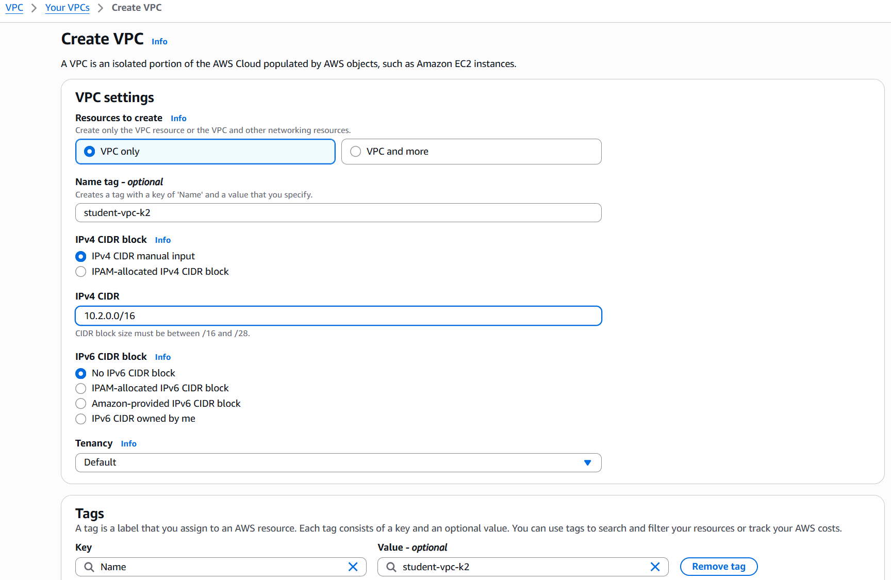

_VPC_ — это “контейнер” для подсетей. Внутри одной VPC можно создавать десятки подсетей с разными маршрутами и правилами.

### Шаг 3. Создание Internet Gateway (IGW)

Internet Gateway позволяет ресурсам внутри VPC выходить в Интернет. _Без него публичные IP-адреса не будут работать_. Если виртуальной машине (EC2) назначен публичный IP, но нет IGW, она не сможет общаться с внешним миром.

1. В левой панели выбрать `Internet Gateways` → `Create internet gateway`.
2. Указать имя: `student-igw-k2`.
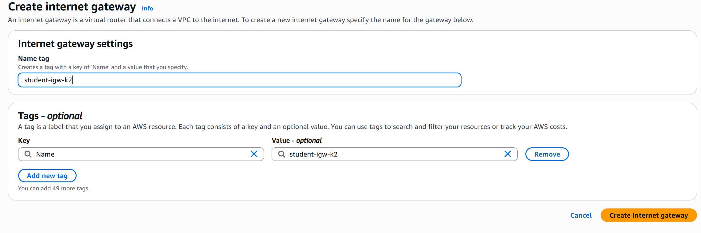

3. Теперь нужно “прикрепить” (Attach) шлюз к сети:
   1. Выбрать созданный IGW.
   2. Нажать `Actions` → `Attach to VPC`.
   3. В списке выбрать `student-vpc-k2`.
   4. Подтвердить действие.
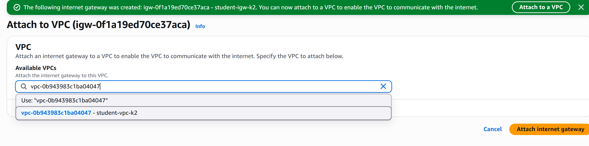

### Шаг 4. Создание подсетей

_Подсети (subnets)_ — это сегменты внутри VPC, которые позволяют изолировать ресурсы. То есть, подсети создаются для разделения ресурсов по функционалу и уровню доступа и для более гибкого управления трафиком.

#### Шаг 4.1. Создание публичной подсети

Теперь, когда у нас есть VPC и Internet Gateway, создадим первую подсеть — публичную.
Эта подсеть будет содержать ресурсы, которым нужен прямой доступ из Интернета.

1. В левой панели выбрать `Subnets` → `Create subnet`.
2. Указать:
   1. `VPC ID`: выберать нашу сеть `student-vpc-k2`
   2. `Subnet name`: `public-subnet-k2`
   3. `Availability Zone`: `us-central-1a`
      > AWS создаёт подсети в конкретных зонах доступности; в нашем случае выберем первую
   4. `IPv4 CIDR block`: `10.2.1.0/24`
      > Диапазон IP-адресов, которые будут выданы ресурсам в этой подсети
3. Нажать `Create subnet`.


> Является ли подсеть "публичной" на данный момент? Почему?
> Нет, подсеть пока не является публичной, так как у неё нет маршрута к Internet Gateway.
> Она станет публичной только после добавления такого маршрута в её таблицу маршрутизации.

#### Шаг 4.2. Создание приватной подсети

Подсеть называется приватной, если её трафик не направляется напрямую в Интернет.

1. Нажать `Create subnet` ещё раз.
2. Указать:
   1. `VPC ID`: выбрать нашу сеть `student-vpc-k2`
      > Используем ту же VPC, чтобы обе подсети могли взаимодействовать между собой.
   2. `Subnet name`: `private-subnet-k2`
   3. `Availability Zone`: _Выбираем другую зону_
   4. `IPv4 CIDR block`: `10.2.2.0/24`
      > Диапазон адресов не должен пересекаться с диапазоном публичной подсети.
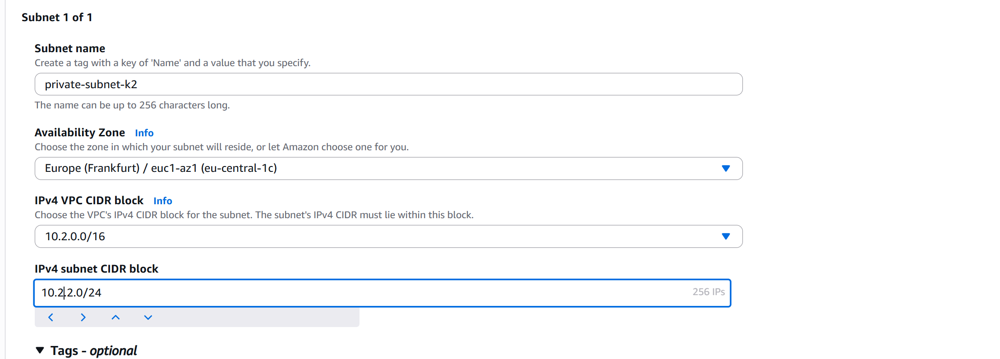

3. Нажимаем `Create subnet`.

> Является ли подсеть "приватной" на данный момент? Почему?
> На данном этапе подсеть не является приватной, так как трафик по умолчанию маршрутизируется через Internet Gateway, а значит, инстансы в этой подсети могут иметь прямой доступ к интернету. Подсеть станет приватной только после создания отдельной таблицы маршрутов без IGW и добавления маршрута через NAT Gateway.

### Шаг 5. Создание таблиц маршрутов (Route Tables)

Теперь, когда у нас есть две подсети (публичная и приватная), необходимо настроить маршруты (Route Tables), которые определяют, как сетевой трафик будет двигаться внутри нашей VPC.

По умолчанию каждая новая VPC имеет одну основную таблицу маршрутов, и все новые подсети автоматически к ней подключаются. Если зайти в `Route Tables`, увидим одну таблицу, связанную с нашей VPC.

Но для лучшей структуры и изоляции мы создадим:

- отдельную таблицу маршрутов для публичной подсети (с доступом к Интернету через IGW),
- отдельную таблицу маршрутов для приватной подсети (с доступом к Интернету через NAT Gateway).

#### Шаг 5.1. Создание публичной таблицы маршрутов

1. В левой панели выбрать `Route Tables` → `Create route table`.
2. Указать:
   1. `Name tag`: `public-rt-k2`
   2. `VPC`: `student-vpc-k2`
   3. Нажимаем `Create route table`
   

   4. Переходим на вкладку `Routes` и нажмимаем `Edit routes` → `Add route`.
   5. Заполнить:
      1. `Destination`: 0.0.0.0/0
         > Это означает “весь остальной трафик, не относящийся к внутренним адресам VPC”.
      2. `Target`: выбераем Internet Gateway (`student-igw-k2`).
   6. Нажмимаем `Save changes`.
   

   7. Переходим на вкладку `Subnet associations` → `Edit subnet associations`.
      > Зачем необходимо привязать таблицу маршрутов к подсети?
      > Привязка таблицы маршрутов к подсети нужна, чтобы определить, по каким маршрутам будет идти сетевой трафик из этой подсети.
      >Без привязки подсеть не знает, куда направлять пакеты, и не сможет использовать маршрут к Internet Gateway. То есть именно ассоциация связывает подсеть с нужными правилами маршрутизации.
   8. Отмечаю `public-subnet-k2` и нажимаю `Save associations`.
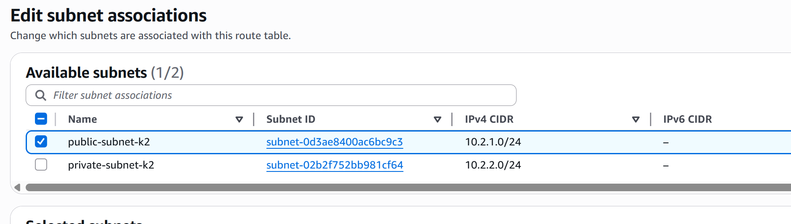

Теперь трафик из публичной подсети (например, от веб-сервера или NAT Gateway) будет отправляться наружу через Internet Gateway. Связь `“0.0.0.0/0 → IGW”` — именно то, что делает подсеть публичной.

#### Шаг 5.2. Создание приватной таблицы маршрутов

1. Нажмимаю `Create route table` ещё раз.
2. Указываю:
   1. `Name tag`: `private-rt-k2`
   2. `VPC`: `student-vpc-k2`
   3. Нажмаю `Create route table`.
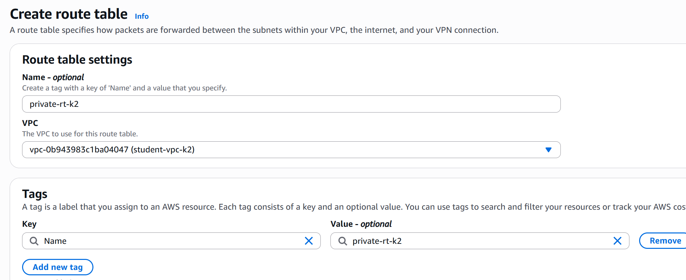

3. Перехожу на вкладку `Subnet associations` → `Edit subnet associations`.
4. Отмечаю `private-subnet-k2` и нажимаю `Save associations`.
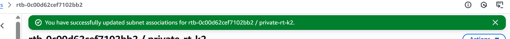

На данный момент все ресурсы, которые будут созданы в приватной подсети, не смогут выходить в Интернет, так как у нас нет NAT Gateway и соответствующего маршрута.

### Шаг 6. Создание NAT Gateway

NAT Gateway позволяет ресурсам в приватной подсети выходить в Интернет (например, для обновления ПО), при этом оставаясь недоступными извне.

> Как работает NAT Gateway?
> `NAT Gateway` — это управляемый сервис AWS, который размещается в публичной подсети и имеет публичный IP.
> Приватные экземпляры из приватной подсети отправляют пакеты в Интернет через NAT Gateway, который находится в публичной подсети и имеет публичный IP.
> NAT подменяет исходный частный IP на свой публичный и пересылает пакеты через Internet Gateway.
> Ответные пакеты возвращаются на NAT, который перенаправляет их к нужному приватному экземпляру, обеспечивая доступ только исходящим соединениям.

#### Шаг 6.1. Создание Elastic IP

_Elastic IP_ — это статический публичный IPv4-адрес, закреплённый за аккаунтом AWS.
Он используется для `NAT Gateway`, чтобы тот мог представлять собой “точку выхода” в Интернет от имени всех приватных инстансов.

1. В левой панели выбbhftv `Elastic IPs` → `Allocate Elastic IP address`.
2. Нажbvftv Allocate.
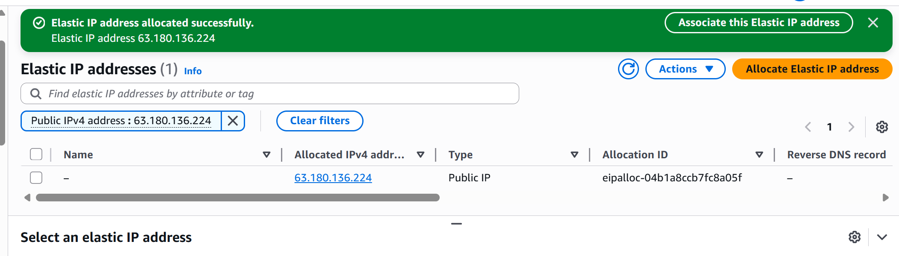

#### Шаг 6.2. Создание NAT Gateway

1. В левой панели выбираем `NAT Gateways` → `Create NAT gateway`.
2. Указываем:
   1. `Name tag`: `nat-gateway-k2`
   2. `Subnet`: выбираем публичную подсеть (`public-subnet-k2`)
      > NAT Gateway всегда создаётся в публичной подсети, потому что ему нужен прямой выход в Интернет через IGW.
   3. `Connectivity type`: `Public`
   4. `Elastic IP allocation ID`: выбираем EIP, созданный на предыдущем шаге.
3. Нажмимаем `Create NAT gateway`.
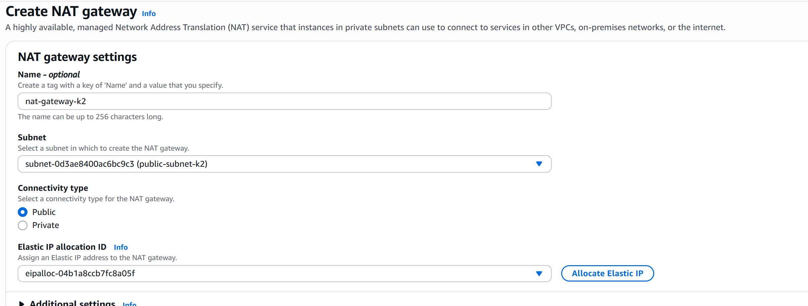

Ждем 2–3 минуты, пока статус изменится с `Pending` на `Available`. Это значит, что NAT Gateway готов к работе.
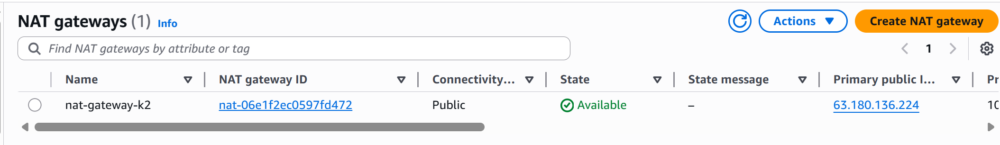

#### Шаг 6.3. Изменение приватной таблицы маршрутов

1. Возвращаемся в `Route Tables` и выбираем `private-rt-k2`.
2. Переходим на вкладку `Routes` и нажимаем `Edit routes` → `Add route`.
3. Заполняем:
   1. `Destination`: `0.0.0.0/0`
   2. `Target`: выбираем NAT Gateway (`nat-gateway-k2`).
4. Нажмите `Save changes`.

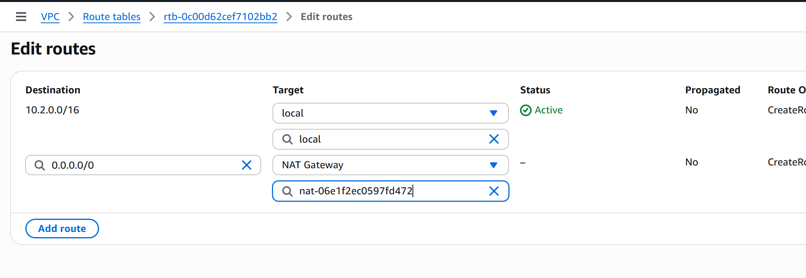
Теперь ресурсы в приватной подсети смогут выходить в Интернет через NAT Gateway.

### Шаг 7. Создание Security Groups

_Security Group (SG)_ — это виртуальный брандмауэр на уровне инстанса (EC2), который контролирует входящий (Inbound) и исходящий (Outbound) трафик.

1. В левой панели выбираем `Security Groups` → `Create security group`.
2. Указываем:
   1. `Security group name`: `web-sg-k2`
   2. `Description`: `Security group for web server`
   3. `VPC`: выбираем нашу VPC (`student-vpc-k2`)
3. В разделе Inbound rules добавляем правила разрешающее следующие типы трафика:
   1. Тип: `HTTP`, Протокол: `TCP`, Порт: `80`, Источник: `0.0.0.0/0`
   2. Тип: `HTTPS`, Протокол: `TCP`, Порт: `443`, Источник: `0.0.0.0/0`
   

4. Создаем еще две Security Groups:
   1. `bastion-sg-k2` для bastion host с разрешением входящего трафика на порт `22` (SSH) только из своего IP-адреса.
   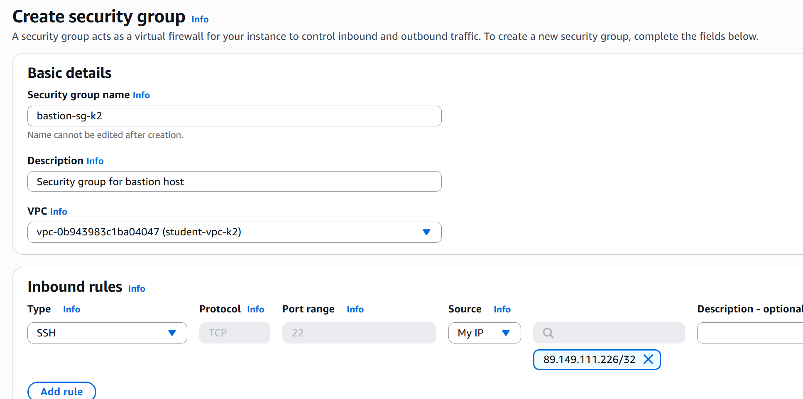
   2. `db-sg-k2` для базы данных с разрешением входящего трафика:
      1. Тип: `MySQL/Aurora`, Протокол: `TCP`, Порт: `3306`, Источник: `web-sg-k2` (разрешаем доступ только с веб-сервера)
      2. Тип: `SSH`, Протокол: `TCP`, Порт: `22`, Источник: `bastion-sg-k2` (разрешаем доступ только с bastion host)
      

> Что такое _Bastion Host_ и зачем он нужен в архитектуре с приватными подсетями?
> Bastion Host — это специальный сервер в публичной подсети, через который администраторы получают безопасный доступ к ресурсам в приватных подсетях.
> Он нужен, чтобы напрямую не открывать приватные инстансы в Интернет, а управлять ими через один контролируемый и защищённый узел.
> Таким образом, доступ к приватным ресурсам осуществляется безопасно, обычно по SSH, через Bastion Host.

### Шаг 8. Создание EC2-инстансов

Создать три EC2-инстанса, которые будут выполнять следующие роли:

- _Веб-сервер_ (`web-server`) - в публичной подсети, доступен из Интернета по HTTP.
- _Сервер базы данных_ (`db-server`) - в приватной подсети, недоступен напрямую извне.
- _Bastion Host_ (`bastion-host`) - в публичной подсети, для безопасного доступа к приватным ресурсам.

1. В строке поиска AWS Console вводим `EC2` и открываем консоль.
2. Создаём 3 инстанса, следуя инструкциям.

_Для всех инстансов использовано_:

- AMI: `Amazon Linux 2 AMI (HVM), SSD Volume Type`
- Тип инстанса: `t3.micro`
- Ключ доступа (Key Pair): создайте новый ключ `student-key-k2` и скачали его.
- Хранилище: оставить по умолчанию (8 ГБ).
- Теги: добавили тег `Name` с соответствующим именем инстанса.

Для `web-server`:

1. Выбрать сеть `VPC`: `student-vpc-k2`
2. Подсеть `Subnet`: `public-subnet-k2`
3. `Auto-assign Public IP`: `Enable`
4. `Security Group`: выберите `web-sg-k2`
5. В разделе `Advanced Details` в поле `User data` вставляем следующий скрипт для автоматической установки веб-сервера:

   ```bash
   #!/bin/bash
   dnf install -y httpd php
   echo "<?php phpinfo(); ?>" > /var/www/html/index.php
   systemctl enable httpd
   systemctl start httpd
   ```


Для `db-server`:

1. Выбираем сеть `VPC`: `student-vpc-kXX`
2. Подсеть `Subnet`: `private-subnet-kXX`
3. `Auto-assign Public IP`: `Disable`
4. `Security Group`: выбираем `db-sg-kXX`
5. В разделе `Advanced Details` в поле `User data` вставляем следующий скрипт для автоматической установки MySQL сервера:

   ```bash
   #!/bin/bash
   dnf install -y mariadb105-server
   systemctl enable mariadb
   systemctl start mariadb
   mysql -e "ALTER USER 'root'@'localhost' IDENTIFIED BY 'StrongPassword123!'; FLUSH PRIVILEGES;"
   ```
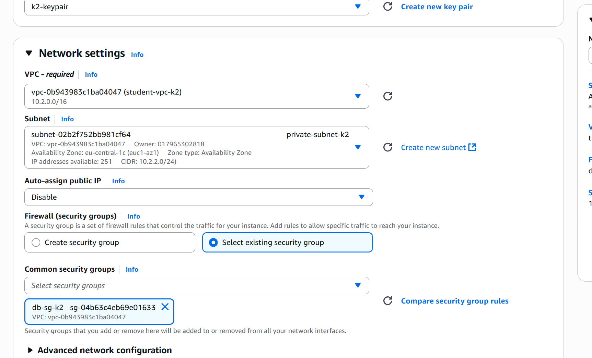

Для `bastion-host`:

1. Выбираем сеть `VPC`: `student-vpc-kXX`
2. Подсеть `Subnet`: `public-subnet-kXX`
3. `Auto-assign Public IP`: `Enable`
4. `Security Group`: выбираем `bastion-sg-kXX`
5. В разделе `Advanced Details` в поле `User data` вставляем следующий скрипт для автоматической установки MySQL клиента:

   ```bash
   #!/bin/bash
   dnf install -y mariadb105
   ```
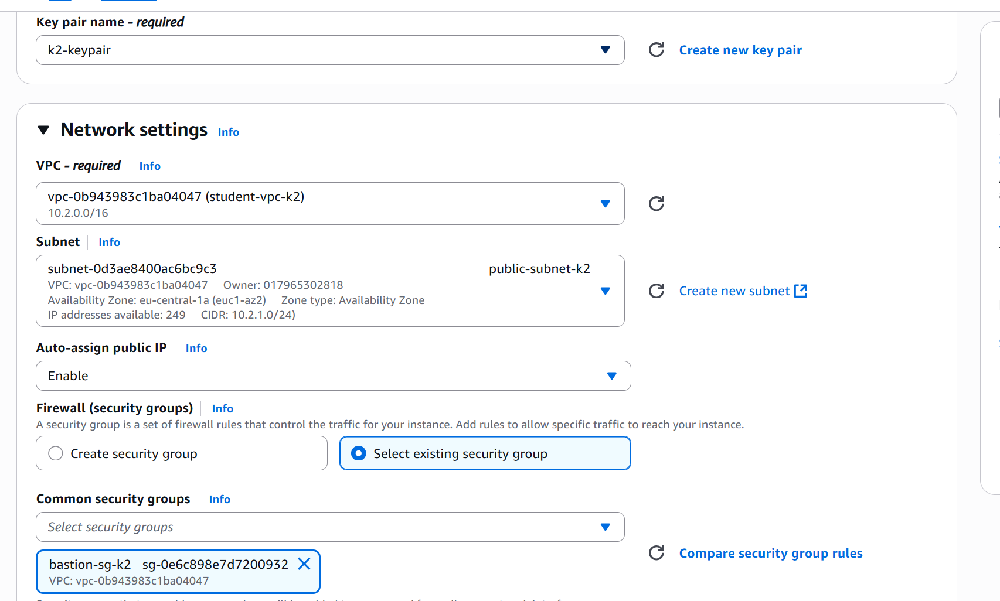
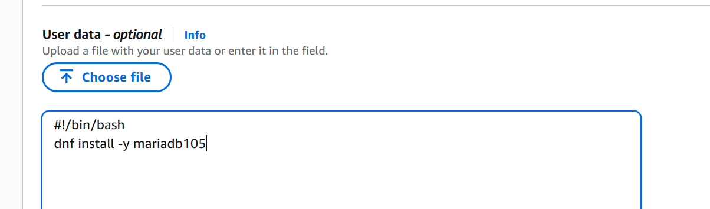

### Шаг 9. Проверка работы

На этом этапе уже созданы:

- виртуальная сеть (VPC)
- публичная и приватная подсети
- интернет-шлюз (IGW)
- NAT Gateway
- две таблицы маршрутов
- три экземпляра EC2 (Web, DB и Bastion)
- три Security Group

Теперь важно убедиться, что сеть функционирует корректно и что приватная подсеть действительно изолирована от внешнего мира.

1. Ждем, пока все инстансы запустятся (статус `running`).
2. Найходим публичный IP-адрес `web-server` и открываем его в браузере. Видим страницу с информацией о PHP.
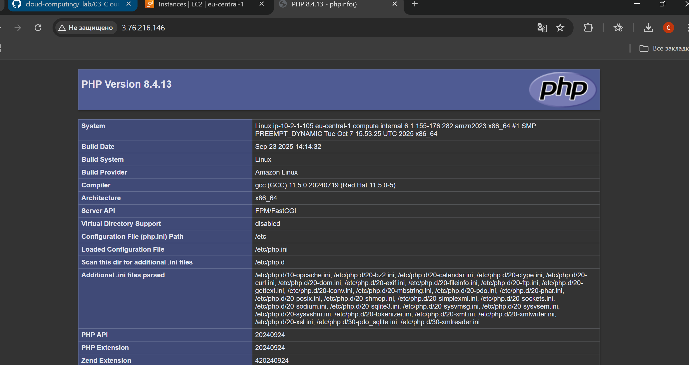

3. Подключаемся к `bastion-host` по SSH:

   ```bash
   ssh -i <your-nickname>-key.pem ec2-user@<Bastion-Host-Public-IP>
   ```
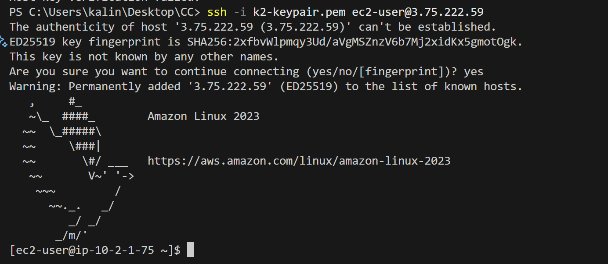

4. Проверяем подключение к интернету с `bastion-host` выполнив `ping`:

   ```bash
      ping -c 4 google.com
   ```
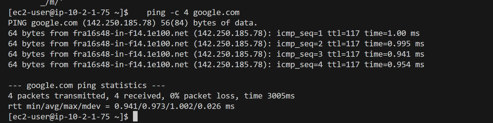
   > Если пинги успешны, значит публичная подсеть и IGW настроены правильно.

5. С `bastion-host` пробуем подключиться к `db-server`:
   ```bash
   mysql -h <DB-Server-Private-IP> -u root -p
   ```
   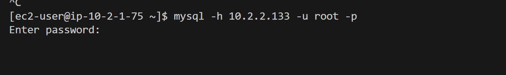
   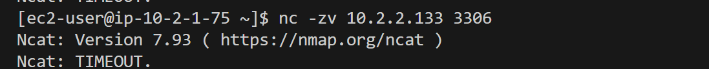
   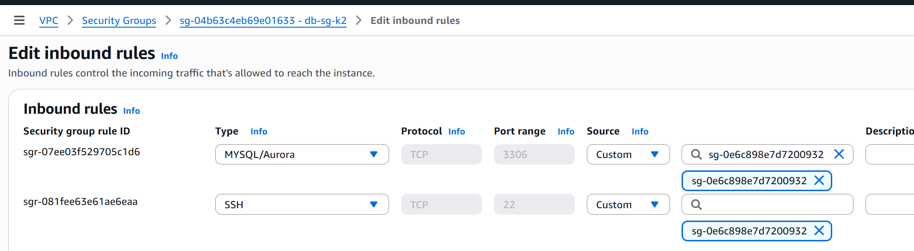
   db-sg на bastion

   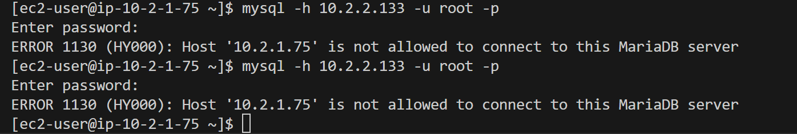

   

   > Если подключение успешно, значит ваша приватная подсеть и NAT Gateway настроены правильно.
   > не совсем

6. Выходим из `db-server` и `bastion-host`.

### Шаг 10. Дополнительные задания. Подключение в приватную подсеть через Bastion Host

У пользователя нет прямого доступа к приватной подсети, но он может подключиться к `db-server` через `bastion-host`.

Используем SSH Agent Forwarding для упрощения доступа:

1. На нашей локальной машине выполняем команды. Это запустит SSH Agent и добавит мой приватный ключ в агент:

   ```bash
   eval "$(ssh-agent -s)"
   ssh-add <your-nickname>-key.pem
   ```
   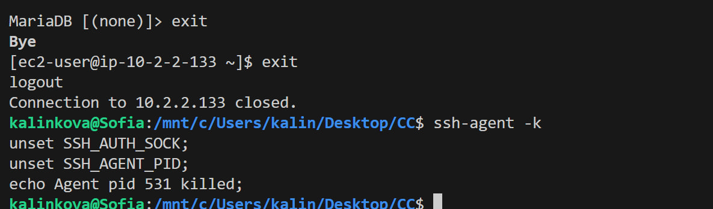

2. Подключаемся к `bastion-host` с опцией `-A` и `-J`:

   ```bash
   ssh -A -J ec2-user@<Bastion-Host-Public-IP> ec2-user@<DB-Server-Private-IP>
   ```
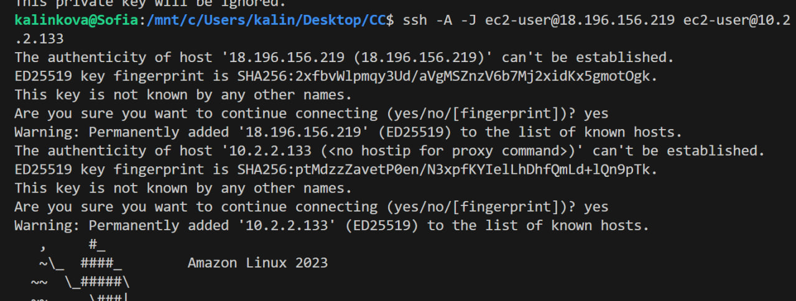
   > Что делает опция `-A` и `-J`?
   > Опция -A включает Agent Forwarding, позволяя использовать наши SSH-ключи на промежуточном Bastion Host без копирования их на него.
   > Опция -J задаёт Jump Host (прыжковый сервер), через который устанавливается соединение с конечным приватным сервером.

3. Обновляем систему на `db-server`:
   ```bash
   sudo dnf update -y
   ```

4. Устанавливаем `htop`:

   ```bash
   sudo dnf install -y htop
   ```
  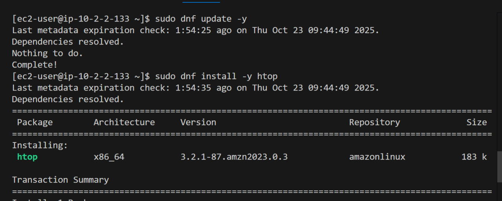
   > Если обновление и установка прошли успешно, значит NAT Gateway работает корректно.

5. Подключвемся к MySQL серверу:

   ```bash
   mysql -u root -p
   ```

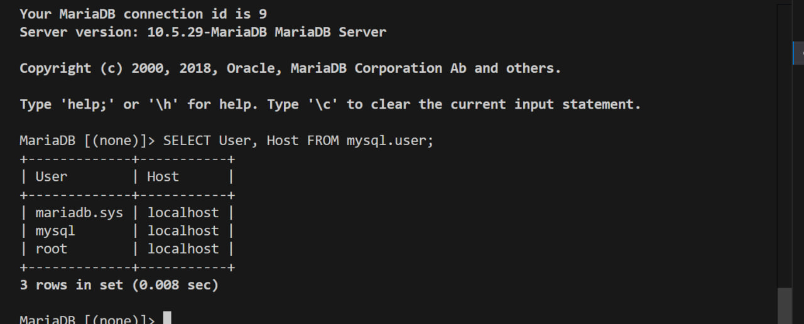

6. Выходим из MySQL и затем из `db-server` и `bastion-host`.
7. На локальном компьютере, завершаем работу с SSH Agent:
   ```bash
   ssh-agent -k
   ```
   

## Завершение работы

После выполнения всех шагов, удаляем созданные ресурсы в AWS, чтобы избежать ненужных затрат. Выполняем удаление в следующем порядке:

1. Удаляем EC2-инстансы.
2. Удаляем NAT Gateway.
3. Удаляем Elastic IP.
   1. `VPC` -> `Elastic IPs` -> выбераем EIP -> `Actions` -> `Release Elastic IP addresses`.
4. Удаляем Security Groups.
   1. `VPC` -> `Security Groups` -> выбераем нужную группу -> `Actions` -> `Delete Security Group`.
5. Удаляем Internet Gateway.
   1. `VPC` -> `Internet Gateways` -> выбераем IGW -> `Actions` -> `Detach from VPC` -> подтверждаем.
   2. Затем снова выбераем IGW -> `Actions` -> `Delete internet gateway`.
6. Удаляем созданную VPC.
   1. `VPC` -> `Your VPCs` -> выбераем вашу VPC -> `Actions` -> `Delete VPC`.
   2. Подтверждаем удаление.
   3. Если удаление не удаётся, проверьте, что все ресурсы (подсети, таблицы маршрутов и т.д.) были удалены.

> Удаление ресурсов в неправильном порядке может привести к ошибкам, так как некоторые ресурсы зависят от других.

Для того, чтобы кредины не снимались, то достаточно удалить EC2 инстансы, NAT Gateway и Elastic IP. Остальные ресурсы можно оставить, так как они не тарифицируются отдельно.

## Вывод

В ходе лабораторной работы мы научились создавать собственную виртуальную сеть (VPC) в AWS, разделять её на публичные и приватные подсети, настраивать маршрутизацию через Internet Gateway и NAT Gateway, а также обеспечивать безопасный доступ к ресурсам с помощью Security Groups и Bastion Host. Практическая настройка показала, как изолировать ресурсы и при этом позволить приватным инстансам безопасно выходить в Интернет для обновлений и работы с внешними сервисами.

Мы убедились, что веб-сервер в публичной подсети доступен извне, а сервер базы данных в приватной подсети защищён от прямого внешнего доступа. Полученные навыки закладывают основу для проектирования безопасных и масштабируемых облачных инфраструктур, что важно как для учебных проектов, так и для реальных корпоративных решений.

## Список используемых источников

1. [Виртуальные сети в облаке. Amazon VPC](https://github.com/MSU-Courses/cloud-computing/tree/main/05_AWS_Virtual_Networks)
2. [AWS Documentation](https://docs.aws.amazon.com/)
3. [Amazon VPC User Guide](https://docs.aws.amazon.com/vpc/latest/userguide/what-is-amazon-vpc.html) 
4. [AWS NAT Gateway Documentation](https://docs.aws.amazon.com/vpc/latest/userguide/vpc-nat-gateway.html)