# Лабораторная работа №4. Облачное хранилище данных. Amazon S3

 - **Калинкова София, I2302** 
 - **02.11.2025** 

## Цель работы

Целью работы является познакомиться с сервисом Amazon S3 (Simple Storage Service) и отработать основные операции:

- создание публичного и приватного бакетов;
- загрузку и организацию объектов;
- работу с S3 через AWS CLI (копирование, перемещение, синхронизация);
- настройку версионирования и шифрования;
- использование S3 Static Website Hosting;
- применение Lifecycle-правил для архивирования старых данных.

## Условие

_Amazon S3_ — это объектное хранилище AWS, предназначенное для хранения файлов любого типа: изображений, резервных копий, документов, логов и т.д. Каждый объект хранится внутри _бакета_ (bucket) и имеет _уникальный ключ_ (key). "Папки" в консоли — это лишь префиксы ключей, а не настоящие директории.

В этой лабораторной были созданы два бакета:

- _Публичный бакет_ - для хранения аватаров пользователей и статического контента;
- _Приватный бакет_ - для логов и служебных файлов (с Lifecycle-политикой).

### Шаг 1. Подготовка

1. Регион: `eu-central-1` (Frankfurt).
2. Формат имён бакетов:
   1. _Публичный_: `cc-lab4-pub-k2`
   2. _Приватный_: `cc-lab4-priv-k2`
3. Локально создана структуру каталогов и файлов:

   ```
   s3-lab/
    ├── public/
    │   ├── avatars/
    │   │   ├── user1.jpg
    │   │   └── user2.jpg
    │   └── content/logo.png
    ├── private/
    │   └── logs/
    │       └── activity.csv
    └── README.md
   ```

   > Данные файлы в дальнейшем будут загружены в соответствующие бакеты.

   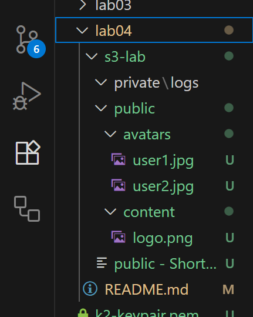

   В public будут храниться открытые изображения и статический контент,
   а в private — служебные файлы и логи. 

### Шаг 2. Создание бакетов

#### Вариант B: Object Ownership Enforced (без ACL)

В этом варианте выполняется создание бакета с использованием современной модели доступа AWS S3, где ACL полностью отключены.

Все разрешения на доступ реализуются через Bucket Policy и IAM-пользователя.

Это тот подход, который используется в реальных корпоративных проектах: он безопаснее, масштабируемее и лучше контролируется через централизованные политики.

   > Контрольный вопрос : Чем отличаются два способа управления доступом к бакетам в S3 — через ACL и через > Object Ownership (Bucket owner enforced)?
   > Ответ:
   > В режиме ACLs enabled доступ к объектам можно настраивать для каждого файла через Access Control List, что удобно для экспериментов, но менее безопасно.
   > В режиме Object Ownership (Bucket owner enforced) все объекты принадлежат владельцу бакета, ACL отключены, а доступ управляется через IAM и Bucket Policy. Это современный и более защищённый подход.

#### Шаг 2.1 Создание бакетов без ACL

*Публичный бакет:*

Переходим в AWS `Console → S3 → Create bucket`.
Имя: `cc-lab4-pub-k2`
Регион: `eu-central-1`
Object Ownership: выбераем Bucket owner enforced (`ACLs disabled`)
Block all public access: пока включён
`Create bucket`

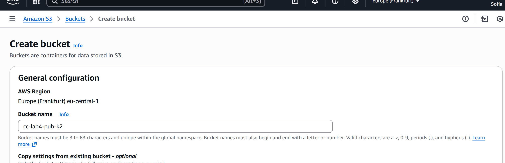
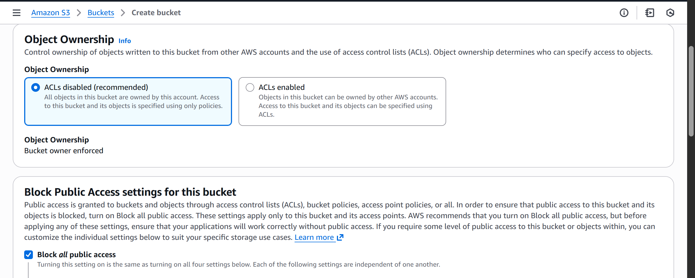
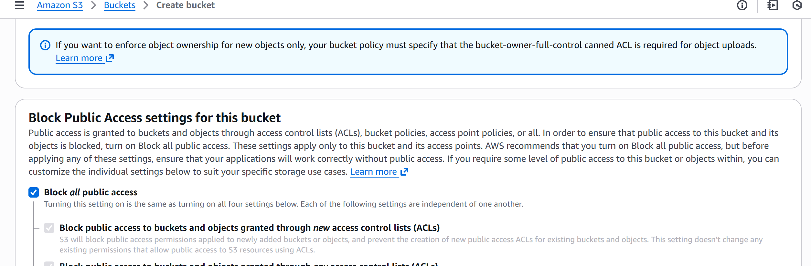

*Приватный бакет:*

Повторяемте же шаги для второго бакета, за исключением имени: `cc-lab4-priv-k2`.

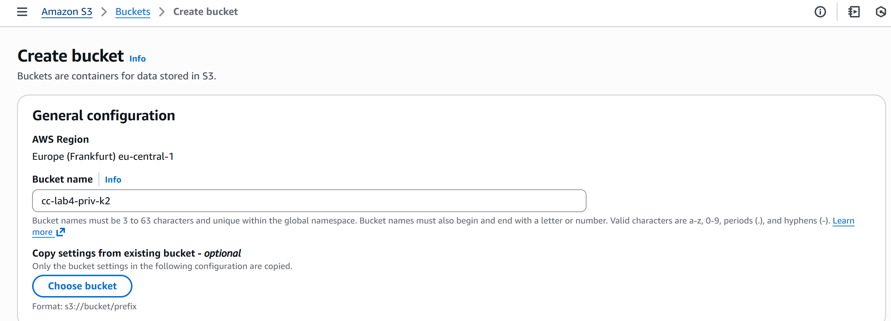

После создания есть 2 бакета :

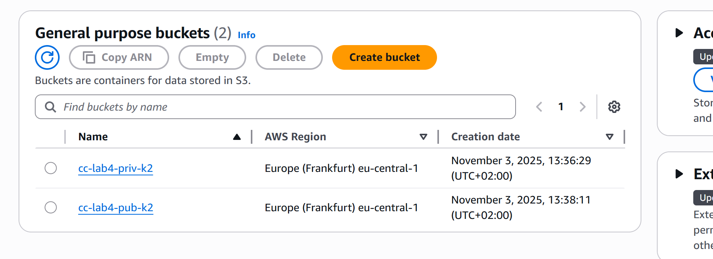

В этом режиме все объекты принадлежат владельцу бакета, а ACL полностью игнорируются. Управление доступом выполняется через `IAM` и `Bucket Policy`.

### Шаг 3. Создание IAM-пользователя и выдача прав

В этом варианте мы создаём отдельного пользователя AWS (`s3-uploader`) и даём ему минимальные права работы с нашими бакетами.

Это иллюстрирует, как в AWS разделяют роли и принципы минимально необходимых прав (`Least Privilege`).

#### Шаг 3.1. Создание пользователя
Переходим в `IAM → Users → Create user`.
Создайте пользователя с именем `s3-uploader`.

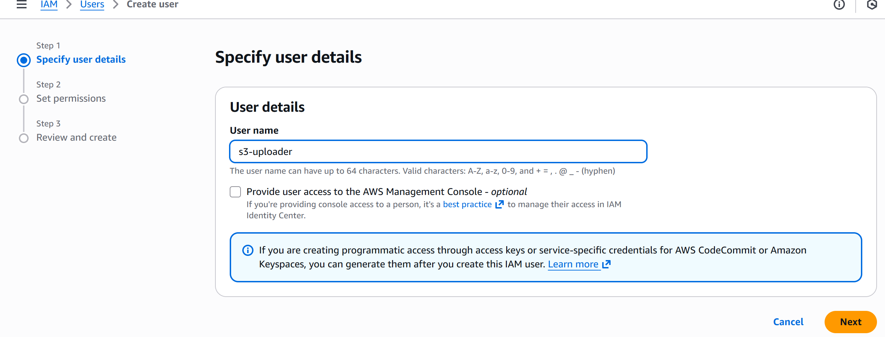

Console access не включен. (Данному пользователю не нужен доступ в консоль, так как он будет работать только через API (CLI/SDK).)
На странице пользователя → вкладка `Security credentials → Create access key`.
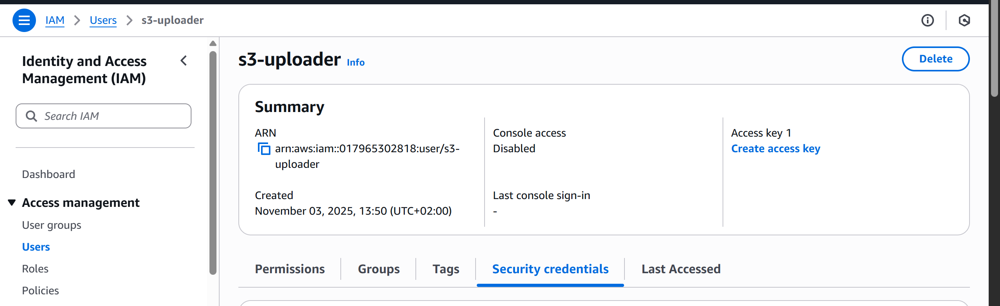

Тип доступа: `Command Line Interface (CLI)`.
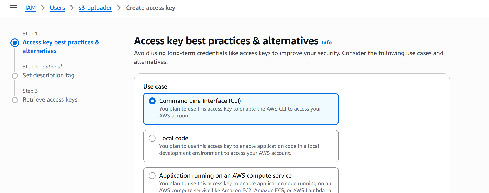

Скачиваем файл .csv, в котором Access key ID и Secret access key (понадобятся для CLI).
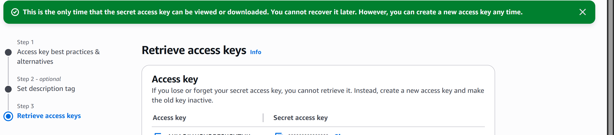

Такой пользователь используется для автоматизации (CLI, PHP SDK, Python boto3). Ключи аутентификации позволяют безопасно взаимодействовать с AWS-программно, без использования root-доступа.

#### Шаг 3.2. Создание IAM-политики (минимальные права)

*Политика* - это JSON-документ, который определяет, какие действия разрешены или запрещены для пользователя.

*Наша цель:* дать пользователю `s3-uploader` права на загрузку и чтение объектов в публичном бакете и только чтение в приватном бакете.

Перейдите в IAM → `Policies → Create policy → JSON`.

Вставляем следующий JSON:

```json
{
  "Version": "2012-10-17",
  "Statement": [
    {
      "Sid": "ListOnlyTheseBuckets",
      "Effect": "Allow",
      "Action": ["s3:ListBucket"],
      "Resource": [
        "arn:aws:s3:::cc-lab4-pub-k2",
        "arn:aws:s3:::cc-lab4-priv-k2"
      ]
    },
    {
      "Sid": "ReadWritePublicBucketLimited",
      "Effect": "Allow",
      "Action": ["s3:GetObject", "s3:PutObject", "s3:DeleteObject"],
      "Resource": "arn:aws:s3:::cc-lab4-pub-k2/*"
    },
    {
      "Sid": "LogsRWButOnlyUnderLogsPrefix",
      "Effect": "Allow",
      "Action": ["s3:GetObject", "s3:PutObject", "s3:DeleteObject"],
      "Resource": "arn:aws:s3:::cc-lab4-priv-k2/logs/*"
    }
  ]
}
```
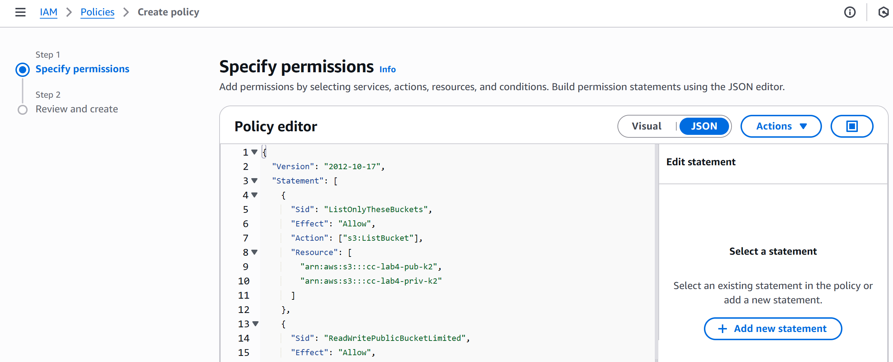

- *Version:* версия языка политики, оставьте как есть.
- *Statement:* массив правил.
- *Effect:* действие правила - Allow (разрешить) или Deny (запретить).
- *Action:* список разрешённых действий (например, s3:PutObject для загрузки объектов).
- *Resource:* ARN (Amazon Resource Name) ресурсов, к которым применяется правило. ARN - это уникальный идентификатор ресурса в AWS, каждый ресурс имеет свой ARN. В данном случае, данные правила применяются к нашим бакетом. То есть это значит, что пользователь сможет выполнять указанные действия только с этими бакетами.

Данная политика позволяет следующее:

   | Раздел                       | Назначение                                             | Объяснение                                                                                       |
   | ---------------------------- | ------------------------------------------------------ | ------------------------------------------------------------------------------------------------ |
   | ListOnlyTheseBuckets         | Разрешает команду `ListBucket` только для двух бакетов | Без неё пользователь не сможет увидеть содержимое бакета                                         |
   | ReadWritePublicBucketLimited | Полный доступ к публичному бакету                      | Пользователь может загружать, читать и удалять объекты                                           |
   | LogsRWButOnlyUnderLogsPrefix | Даёт доступ только к logs/ внутри приватного бакетаю   | Пример принципа “минимальных прав”: пользователь не может выйти за пределы разрешённого префикса |

Нажмем `Next: Tags → Next: Review`.

Задаем имя политики, `S3UploaderPolicy`, и нажмите `Create policy`.
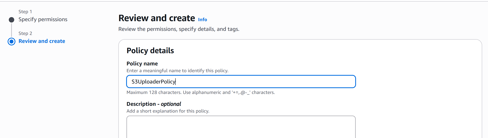
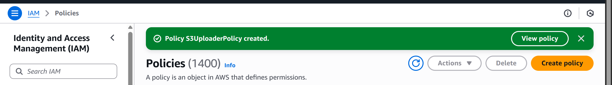

#### Шаг 3.3. Привязка политики к пользователю

Передим в `IAM → Users → s3-uploader → Permissions → Add permissions`.
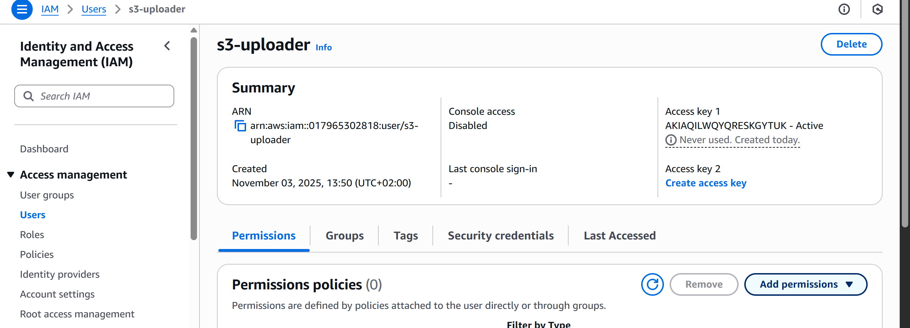

Выбираем `Attach policies directly`.
Найдим и выбераем созданную ранее политику `S3UploaderPolicy`.
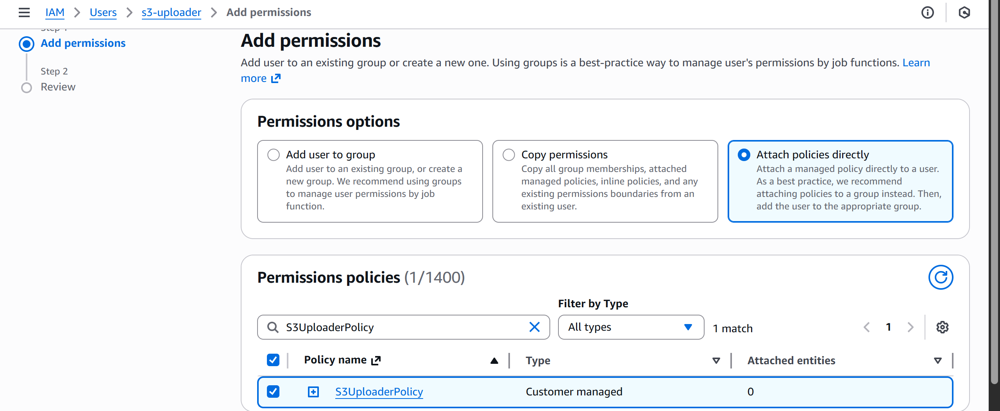

Нажмаем `Next: Review → Add permissions`.
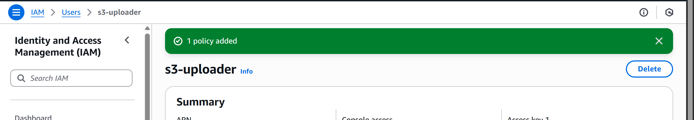

Теперь пользователь `s3-uploader` имеет необходимые права для работы с нашими бакетами.
Только теперь пользователь получает доступ к S3. До этого момента AWS по умолчанию всё запрещает ("deny by default").

### Шаг 4. Разрешение чтения из публичного бакета

Чтобы сделать файлы в _публичном бакете_ доступными для всех (например, для отображения аватаров на сайте), нам нужно создать _Bucket Policy_, которая разрешит публичный доступ на чтение.

1. В публичном бакете отключаем защиту:
   1. Permissions → Block public access (BPA) → снимаем “Block all public access” → Save.
   
2. Ниже открываем Bucket policy → Edit и вставляем:

   ```json
   {
     "Version": "2012-10-17",
     "Statement": [
       {
         "Sid": "AllowPublicRead",
         "Effect": "Allow",
         "Principal": "*",
         "Action": "s3:GetObject",
         "Resource": [
           "arn:aws:s3:::cc-lab4-pub-k2/avatars/*",
           "arn:aws:s3:::cc-lab4-pub-k2/content/*"
         ]
       }
     ]
   }
   ```

   _В данном случае_:

   - `Principal: "*"` означает, что любой пользователь Интернета может читать объекты (но не изменять).
   - `Action: s3:GetObject` - разрешено только чтение.
   - `Resource` - указаны префиксы (папки) `avatars/` и `content/`, доступные для чтения.

   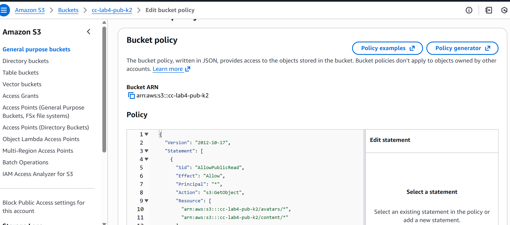

3. Сохранить изменения.

Теперь файлы внутри `avatars/` и `content/` будут доступны публично по URL.

### Шаг 5. Проверка работы

1. Установим и настроим `AWS CLI` на компьютере, используя ключи пользователя `s3-uploader`.
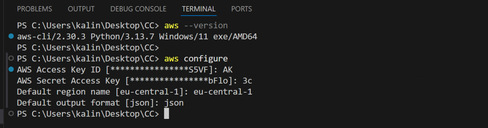

2. Пробуем залить файл в публичный бакет.
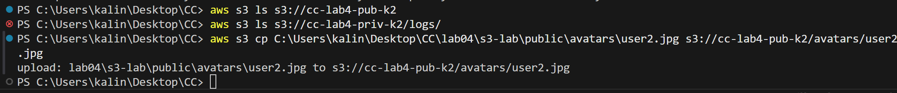

```
aws s3 cp C:\Users\kalin\Desktop\CC\lab04\s3-lab\public\avatars\user2.jpg s3://cc-lab4-pub-k2/avatars/user2.jpg
```
- `aws s3 cp` — команда AWS CLI для копирования файлов между локальной системой и бакетами S3,
берёт файл user2.jpg с локального пути и загружает его в бакет cc-lab4-pub-k2, в “папку” (префикс) avatars/ под именем user2.jpg.

После этого его можно открыть в браузере через URL:

https://cc-lab4-pub-k2.s3.eu-central-1.amazonaws.com/avatars/user2.jpg

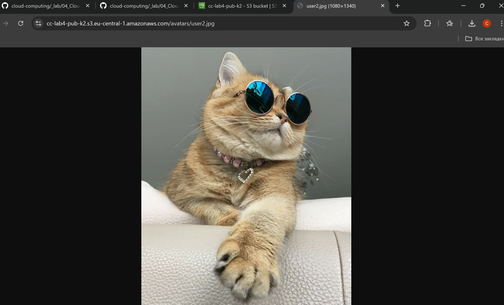

ну и остальные так же:
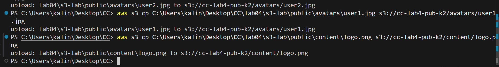
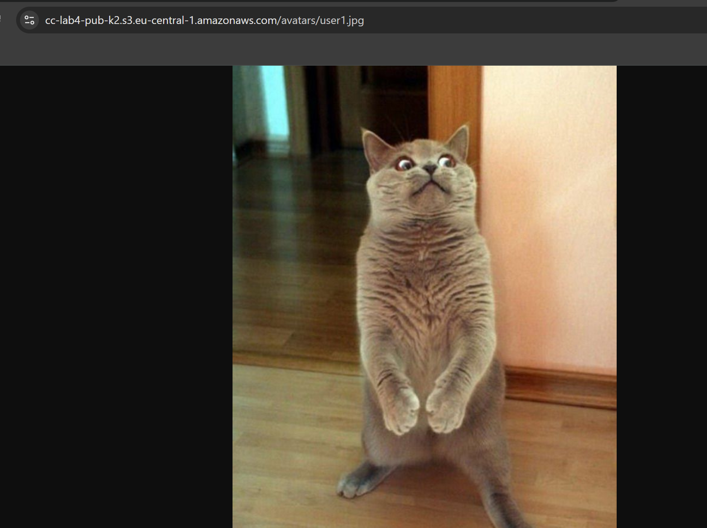
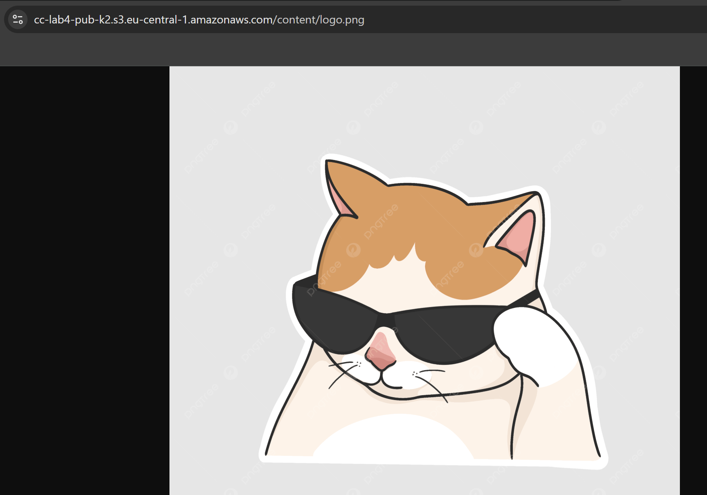

Также в приватный бакет добавила файл с логами
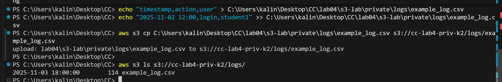

Пробовали открыть приватный лог `example_log.csv` анонимно через браузер по ссылке:

В браузере получена ошибка `AccessDenied`. Это подтверждает, что файл приватный и недоступен для публичного просмотра.

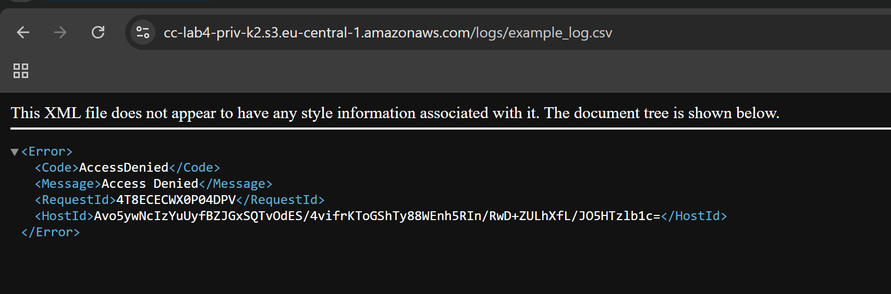

### Шаг 6. Версионирование объектов

Включаем версионирование для обоих бакетов через вкладку `Properties` → `Bucket Versioning` → `Enable`.

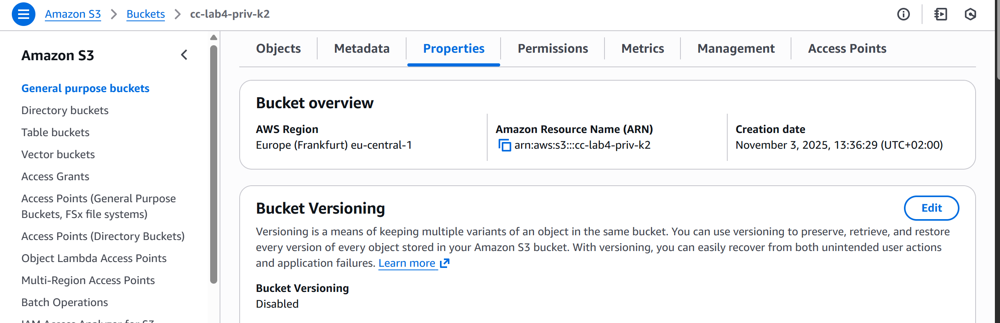
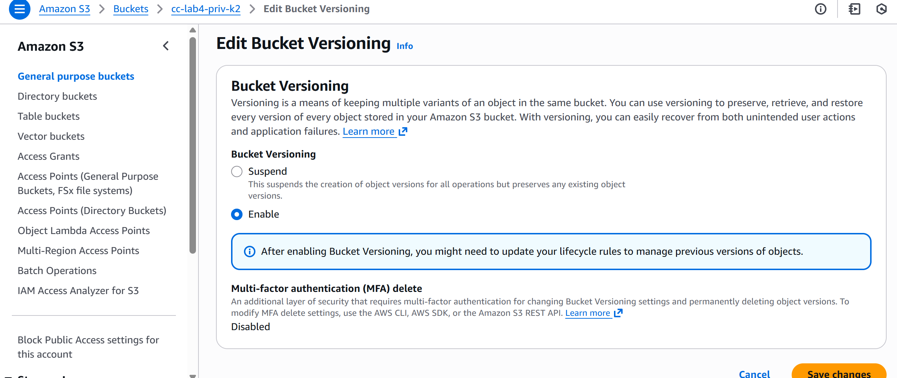

*Для второго так же.*

1. Меняем файл `logo.png`, чтобы увидеть создание новой версии.

Скачала другой файл с тем же именем и заменила существующий на новый.

Потом выполни команду:

```
aws s3 cp C:\Users\kalin\Desktop\CC\lab04\s3-lab\public\content\logo.png s3://cc-lab4-pub-k2/content/logo.png
```

После этого AWS S3 создаст новую версию того же объекта `logo.png`.
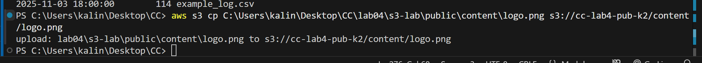
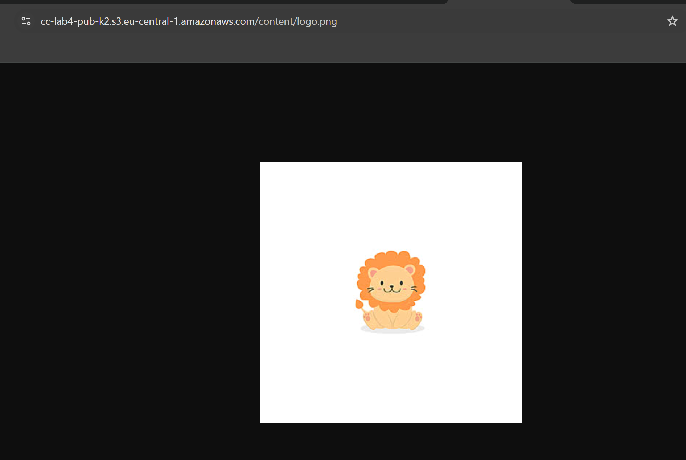

2. Смотрим вкладку `Versions`, там будут отображаться все версии объекта.

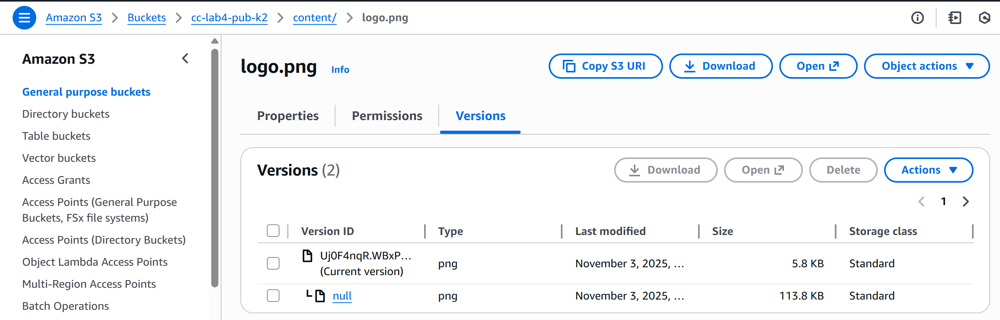

После загрузки двух изображений с одинаковым именем `logo.png` в публичный бакет AWS S3, при включённом `versioning`, в списке версий отображаются два объекта.
Каждый объект имеет собственный идентификатор версии (`Version ID`), который присваивается автоматически при каждой загрузке файла с тем же именем.

- текущая активная версия файла (`Current version`) имеет уникальный Version ID;
- предыдущая версия помечена как `null`, так как была создана до включения версионности.

Таким образом, AWS S3 сохраняет обе версии файла и позволяет при необходимости вернуть старую копию.
Это демонстрирует возможность восстановления предыдущих версий объектов.

> Вопрос: Что произойдёт, если выключить версионирование после его включения?
> Ответ:
> Если выключить версионирование после его включения, существующие версии объектов сохранятся, но новые версии создаваться не будут.
>    - Это значит, что все файлы, загруженные до выключения versioning, по-прежнему будут иметь свои идентификаторы версий и останутся доступными;
>    - после отключения versioning новые загрузки файлов просто перезапишут старые, как в обычном бакете без версионирования;
>    - при повторном включении versioning система продолжит нумерацию с новых Version ID, не теряя старые данные.

### Шаг 7. Создание Lifecycle-правил для приватного бакета

1. В приватном бакете заходим в `Management` → `Lifecycle rules` → `Create rule`.
   1. Имя: `logs-archive`
   2. Префикс: `logs/`
   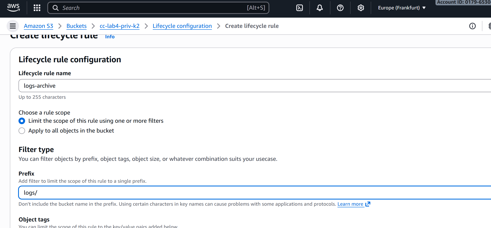
   3. Actions:
      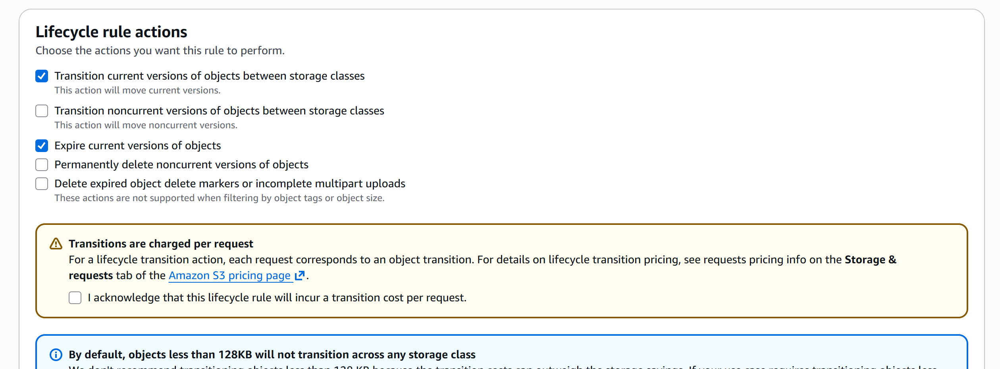
      1. `Transition → Standard-IA` через 30 дней
      2. `Transition → Glacier Deep Archive` через 365 дней
      3. `Expiration → удалить` через 1825 дней (5 лет)
      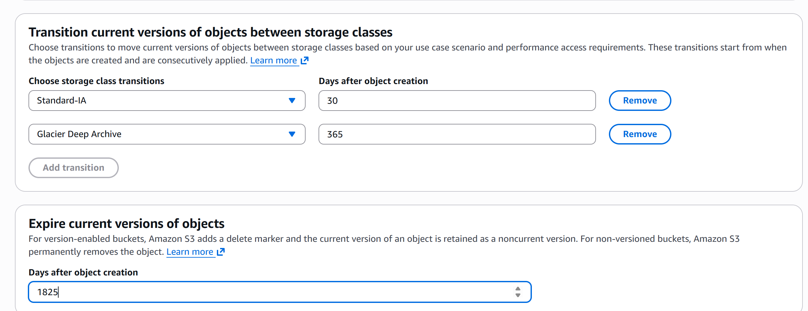
      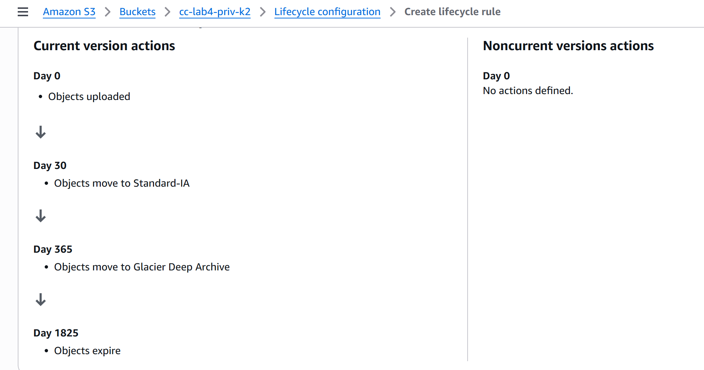
2. Сохраните правило: `Create rule`.

> Вопрос: Что такое Storage Class в Amazon S3 и зачем они нужны?
> Ответ:
> Storage Class в Amazon S3 — это тип хранилища, который определяет стоимость, доступность и скорость доступа к объектам. Разные классы позволяют оптимизировать расходы в зависимости от того, как часто и как быстро нужно получать данные: 
>    - стандартный класс (Standard) подходит для часто используемых файлов с быстрым доступом, 
>    - Standard-IA (Infrequent Access) — для редко используемых данных с более низкой стоимостью хранения, 
>    - Glacier и Glacier Deep Archive — для долгосрочного архивного хранения с минимальной стоимостью, но медленным доступом. 
>    Использование различных Storage Class позволяет автоматизировать перевод файлов между уровнями хранения, снижать затраты и управлять жизненным циклом данных, например, архивировать старые логи или удалять устаревшие файлы.

### Шаг 8. Создание статического веб-сайта на базе S3

Создаем бакет `cc-lab4-web-kXX` для хостинга статического сайта:

1.  Имя: `cc-lab4-web-kXX`
2.  Region: `eu-central-1`
3.  Object Ownership: `ACLs enabled` (Can be configured using ACLs)
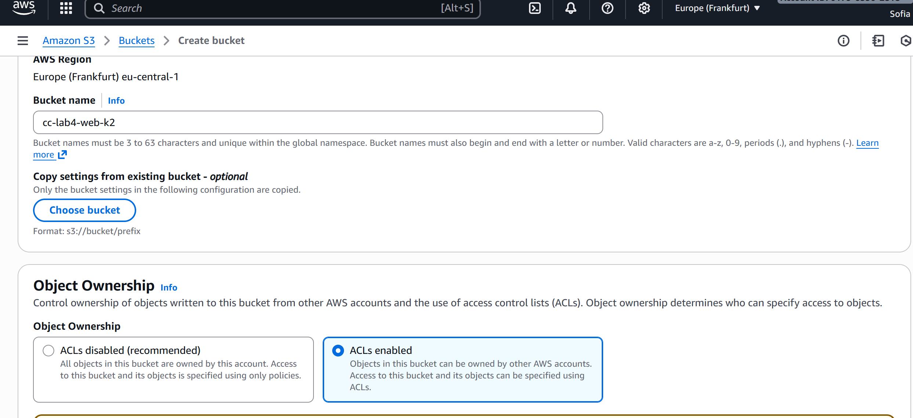

4.  _Block all public access_: снять галочку (разрешить публичность)
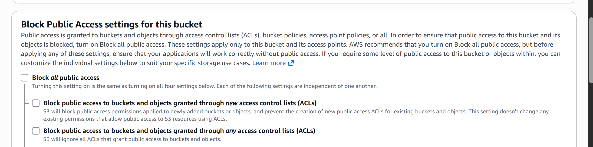

5.  Нажимаем `Create bucket`
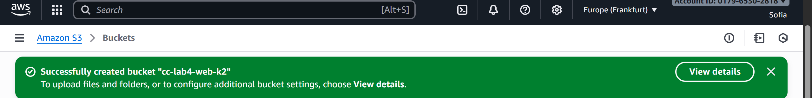

6. После создания настраиваем хостинг (через консоль):

7. Переходим в бакет → вкладка `Properties` → `Static website hosting` → `Edit` -> `Enable`.
8. Выбыраем следующие параметры:

   1. _Hosting type_: `Host a static website`.
   2. _Index document_: `index.html`.
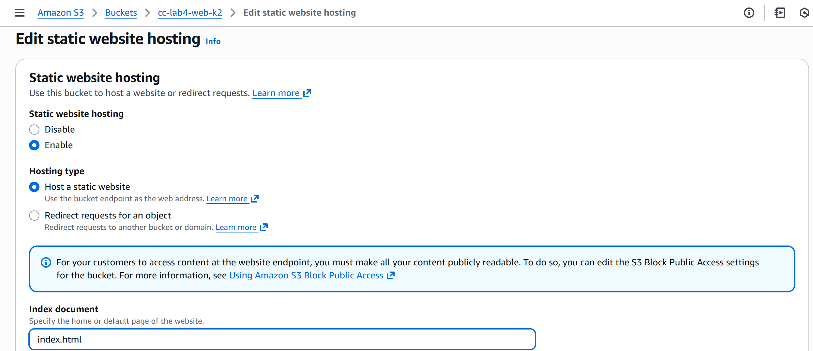
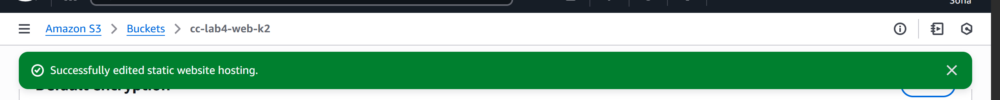

9. Для эксперемента берем веб-сайт, прикрепленный к данной лабораторной работе, загружаем их в бакет (правда сначала загрузила не в корневую папку, а в доп. папку web, потом исправлю):
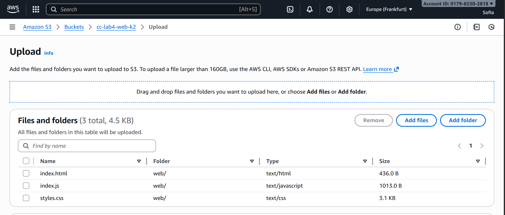

10. Проверяю файлы, делаю их публичными, применяя bucket policy 
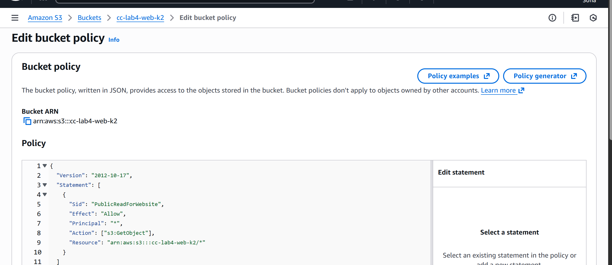

11. Сайт открывается только при переходе на http://cc-lab4-web-kXX.s3-website.eu-central-1.amazonaws.com/web/index.html (т.к. файл index не в корне проекта)
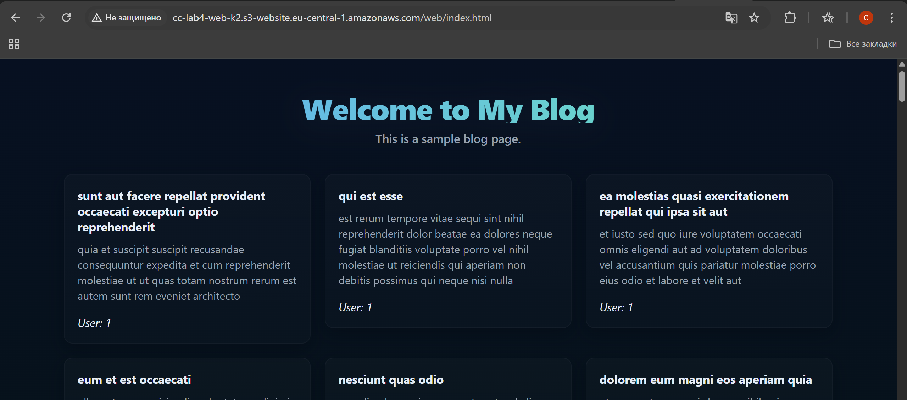

12. решаю переместить файлы в корень проекта
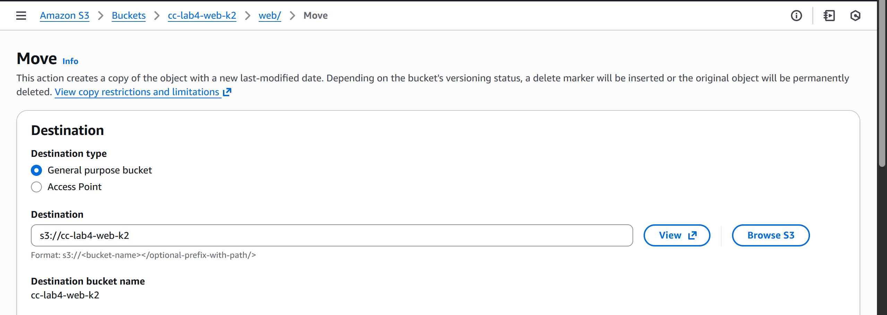
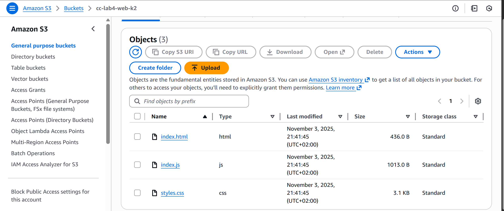
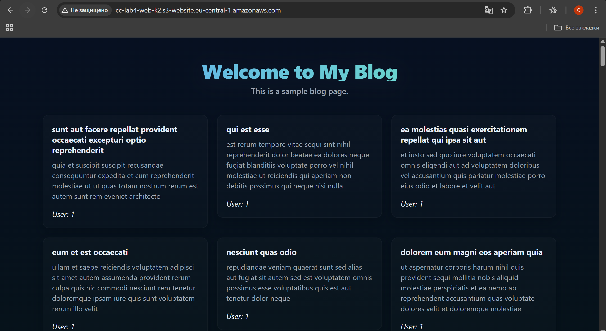

С помощью S3 можно быстро и просто развернуть статический сайт без необходимости использования серверов. Например, если есть React-приложение, его собранные файлы можно загрузить в такой бакет для хостинга.

## Вывод

В ходе лабораторной работы были изучены основные возможности Amazon S3: создание публичных и приватных бакетов, загрузка и управление объектами через консоль и CLI, настройка версионирования и Lifecycle-правил, а также развертывание статического веб-сайта. Практические задания позволили на практике увидеть разницу между публичным и приватным доступом, автоматическое хранение старых данных и оптимизацию расходов с помощью разных классов хранения.

Полученные навыки показывают, как эффективно использовать объектное хранилище для хранения файлов, организации контента и интеграции с веб-приложениями через AWS SDK, что является важной частью работы с облачными технологиями.

## Список использованных источников

1. [Хранилища в облаке. Amazon S3, EBS, EFS](https://github.com/MSU-Courses/cloud-computing/blob/main/06_AWS_Storage/readme.md)
2. [Amazon S3 – Object Storage](https://aws.amazon.com/s3/)    
3. [Amazon S3 Versioning](https://docs.aws.amazon.com/AmazonS3/latest/userguide/Versioning.html) 
4. [Hosting a Static Website on Amazon S3](https://docs.aws.amazon.com/AmazonS3/latest/userguide/WebsiteHosting.html)  

