# Лабораторная работа №5. Облачные базы данных. Amazon RDS, DynamoDB

## Цель работы

Целью работы является ознакомиться с сервисами `Amazon RDS` (Relational Database Service) и `Amazon DynamoDB`, а также научиться:

- Создавать и настраивать экземпляры реляционных баз данных в облаке AWS с использованием Amazon RDS.
- Понимать концепцию Read Replicas и применять их для повышения производительности и отказоустойчивости баз данных.
- Подключаться к базе данных Amazon RDS с виртуальной машины EC2 и выполнять базовые операции с данными (создание, чтение, обновление, удаление записей - CRUD).
- (_Дополнительно_) Ознакомиться с сервисом Amazon DynamoDB и освоить работу с хранением данных в NoSQL-формате.

## Ход работы

### Шаг 1. Подготовка среды (VPC/подсети/SG)

1. Создаем VPC (`project-vpc`) с _двумя публичными_ и _двумя приватными_ подсетями в разных зонах доступности (AZ). В данной подсети будут развернуты базы данных и приложение.
   1. Для создания подсетей воспользовались _мастером создания VPC_ (`Create VPC -> VPC and more`) в консоли AWS.

   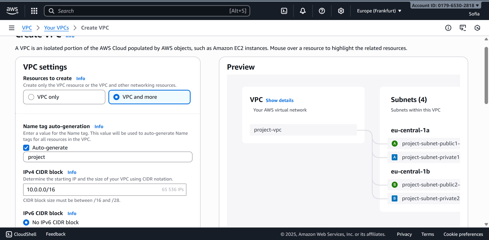

2. Создаем группу безопасности (`web-security-group`) для приложения, разрешающий следующий трафик:
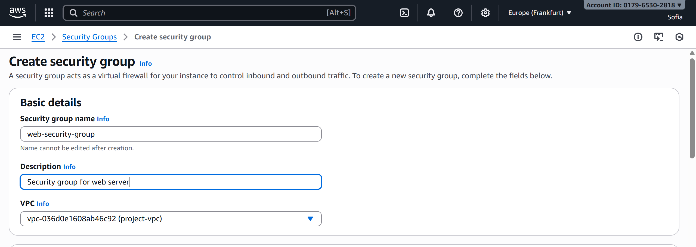
   - Входящий: HTTP (порт 80) от любого источника;
   - Входящий: SSH (порт 22) от моего IP-адреса;
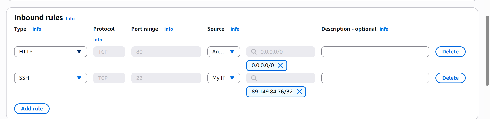

3. Создаем группу безопасности (`db-mysql-security-group`) для базы данных, разрешающий следующий трафик:
   - Входящий: MySQL/Aurora (порт 3306) от `web-security-group` (т.е. только ресурсы, принадлежащие этой группе безопасности, смогут подключаться к базе данных);
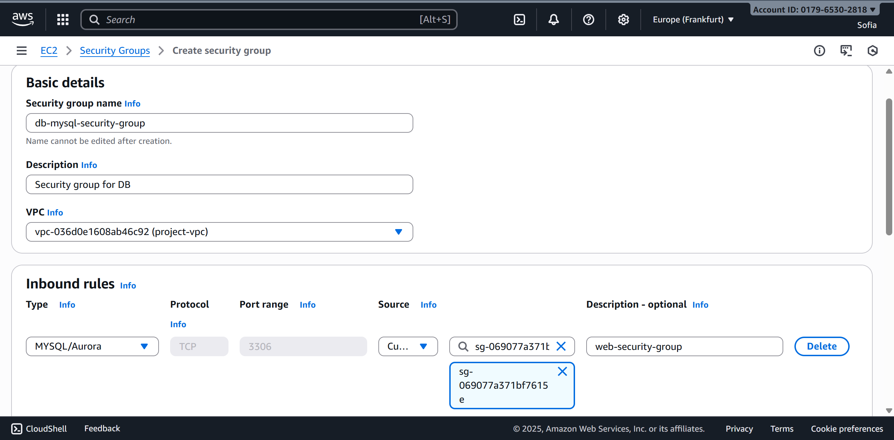
4. Изменяем `web-security-group`, добавив правило для исходящего трафика:
   - Исходящий: MySQL/Aurora (порт 3306) к `db-mysql-security-group` (т.е. приложение сможет инициализировать соединение с базой данных).


### Шаг 2. Развертывание Amazon RDS

1. Переходим в консоль Amazon Aurora and RDS.
2. Создаем `Subnet Group` для базы данных.

   > Что такое Subnet Group? И зачем необходимо создавать Subnet Group для базы данных?
   >
   >Subnet Group — это группа подсетей в VPC, в которых можно размещать экземпляры базы данных. Она нужна, чтобы RDS знал, где создавать инстансы и чтобы базы данных можно было безопасно разместить в приватных подсетях.

   - Название: `project-rds-subnet-group`
   - Выбераем созданный ранее VPC и добавляем 2 приватные подсети из 2 разных AZ.


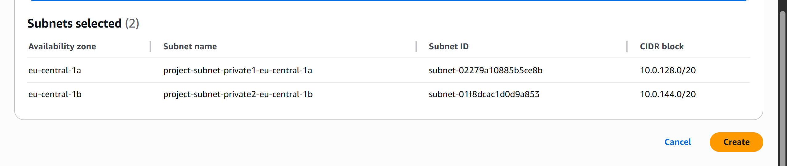

3. Создаем экземпляр базы данных Amazon RDS (`Databases -> Create database`).
4. В разделе `Choose a database creation method` выбераем `Standard Create`. Это позволит настроить все параметры базы данных вручную.
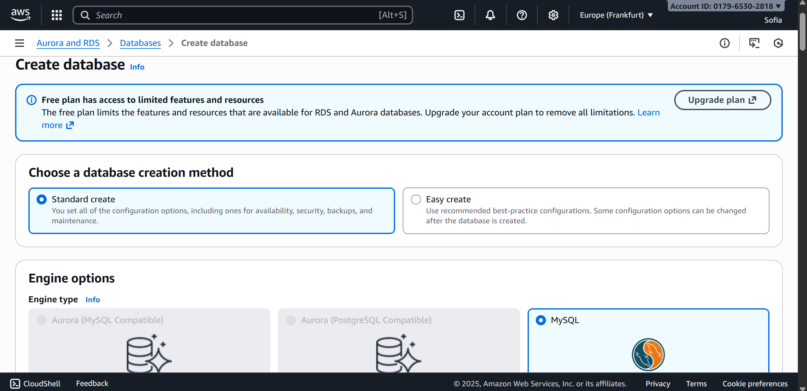

5. Выбераем следующие параметры базы данных:
   - Engine type: `MySQL`
   - Version: `MySQL 8.0.42` (или последнюю доступную версию)
   - Templater: `Free tier` (так как это учебная среда)
   - Availability and durability: `Single-AZ DB instance deployment`
   
   - DB instance identifier (название сервера базы данных): `project-rds-mysql-prod`
   - Master username: `admin` (имя пользователя администратора базы данных)
   
   - _Master password_ введите и подтвердите пароль для пользователя администратора .
   - DB instance class: `Burstable classes (includes t classes)`, `db.t3.micro` (подходит для учебных целей)
   - Storage:
     - Storage type: `General Purpose SSD (gp3)`
     - Allocated storage: `20 GB` (минимально доступный размер для учебных целей)
     - Enable storage autoscaling: `Checked` (это позволит базе данных автоматически увеличивать размер хранилища при необходимости)
     - Maximum storage threshold: `100 GB`
     
   - Connectivity (подключение)
     - Выбираем `Don’t connect to an EC2 compute resource`
     - Virtual private cloud (VPC) выбираем созданный ранее VPC
     - DB subnet group: выбираем созданную ранее Subnet Group `project-rds-subnet-group`
     - Public access: `No` (база данных не будет доступна из интернета)
     - Existing VPC security groups: выбираем созданную ранее группу безопасности `db-mysql-security-group`
     - Availability zone: `No preference` (AWS выберет зону автоматически)
     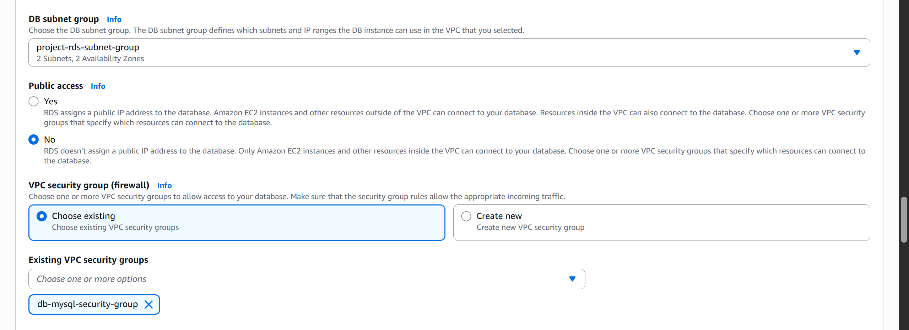
   - Additional configuration
     - Initial database name: `project_db` (название базы данных, которая будет создана при инициализации)
     - Backup (Enable automated backup) ставим галочку (_для создания read replica необходимы бэкапы_)
     
     - Backup (Enable encryption) снимаем галочку (_для учебных целей шифрование не требуется_)
     - Maintanance (Enable auto minor version upgrade) снимаем галочку (_для учебных целей автоматическое обновление не требуется_)

     
   - Нажимаем `Create database` для создания базы данных.
6. Дожидаемся завершения создания базы данных (статус должен измениться на `Available`).
7. Копируем `Endpoint` базы данных (он понадобится для подключения).

### Шаг 3. Создание виртуальной машины для подключения к базе данных

Создаем виртуальную машину EC2 в публичной подсети VPC, чтобы использовать её для подключения к базе данных RDS.

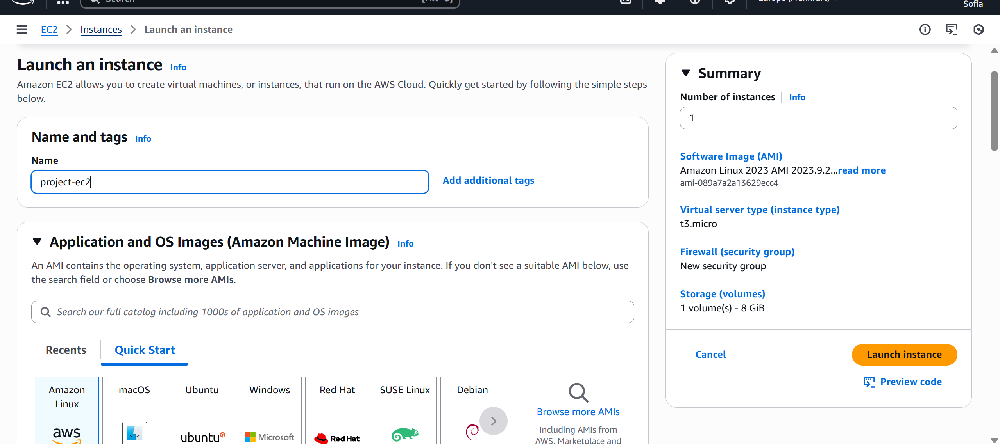

Для виртуальной машины, используем группу безопасности `web-security-group`, созданную ранее.

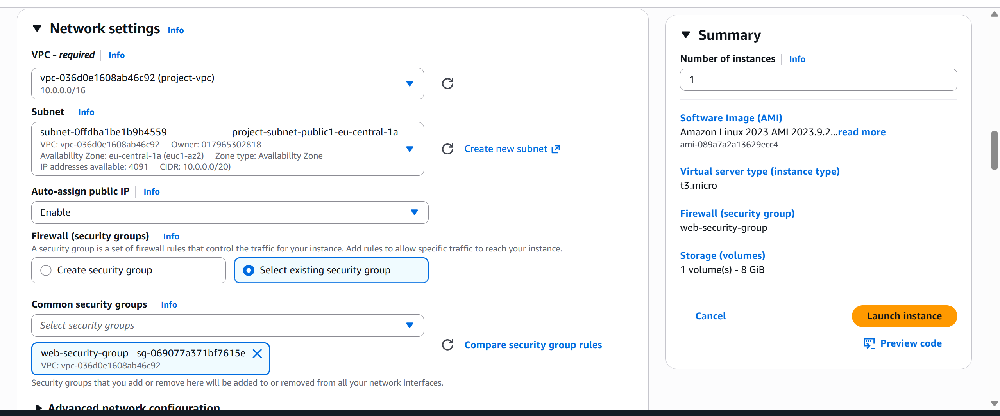

При инициализации виртуальной машины устанавливаем MySQL клиент, чтобы упростить подключение к базе данных RDS.

```bash
#!/bin/bash
dnf update -y
dnf install -y mariadb105 # Установка MariaDB/MySQL клиента
```

### Шаг 4. Подключение к базе данных и выполнение базовых операций

1. Подключаемся к виртуальной машине EC2 по SSH.
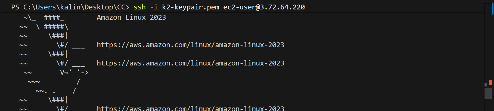

Pre 2. Для начала необходимо установить mariadb105, а для этого нужен выход в интернет, поэтому исправляем выходящий трафик, просто добавила 0.0.0.0/0


После этого в терминале выполняю команду для ручной установки на EC2 и проверяю версию:

```
sudo dnf install -y mariadb105
mysql --version
```


2. Подключаемся к базе данных RDS с помощью MySQL клиента:
   ```bash
   mysql -h <RDS_ENDPOINT> -u admin -p
   ```
   где, `<RDS_ENDPOINT>` - это скопированный ранее endpoint  базы данных RDS.
   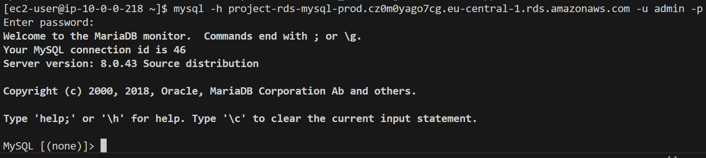

3. Ввожу пароль администратора базы данных, который был указан при создании базы данных.
4. После успешного подключения выбераю базу данных:
   ```sql
   USE project_db;
   ```
   

5. Создаю две таблицы. Между таблицами обязательно должна быть связь 1 ко многим (one-to-many).
   - Например: таблица `categories (id, name)` и таблица `todos (id, title, category_id, status)`, где `category_id` - внешний ключ, ссылающийся на `categories.id`.

```sql
-- Таблица категорий
CREATE TABLE categories (
    id INT AUTO_INCREMENT PRIMARY KEY,
    name VARCHAR(50) NOT NULL
);

-- Таблица задач (todos)
CREATE TABLE todos (
    id INT AUTO_INCREMENT PRIMARY KEY,
    title VARCHAR(100) NOT NULL,
    category_id INT NOT NULL,
    status VARCHAR(20) DEFAULT 'pending',
    FOREIGN KEY (category_id) REFERENCES categories(id)
);
```

   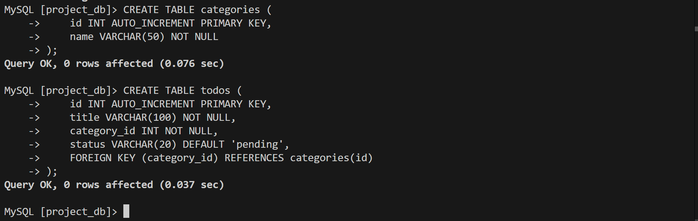

6. Вставляем несколько записей в каждую таблицу.

```sql
INSERT INTO categories (name) VALUES
('Work'),
('Personal'),
('Hobby');

INSERT INTO todos (title, category_id, status) VALUES
('Finish report', 1, 'pending'),
('Buy groceries', 2, 'done'),
('Paint landscape', 3, 'pending');
```

7. Выполняем несколько запросов на выборку данных.

- Выбор всех задач с категориями (JOIN)
```sql
SELECT t.id, t.title, t.status, c.name AS category
FROM todos t
JOIN categories c ON t.category_id = c.id;
```
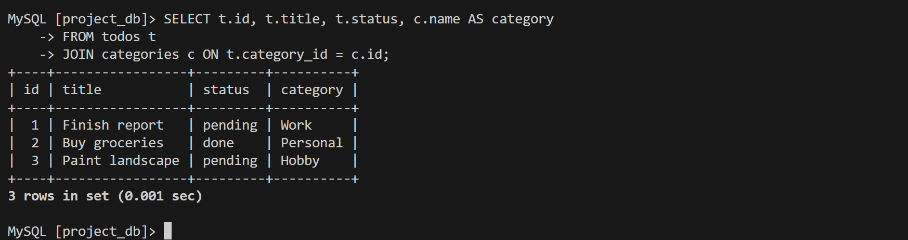
- Простой SELECT
```sql
SELECT * FROM todos WHERE status='pending';
```
- Обновление данных
```sql
UPDATE todos SET status='done' WHERE id=1;
```


### Шаг 5. Создание Read Replica

1. Выбираем базу данных RDS в консоли AWS.
2. Нажимаем на кнопку `Actions` и выбираем `Create read replica`.
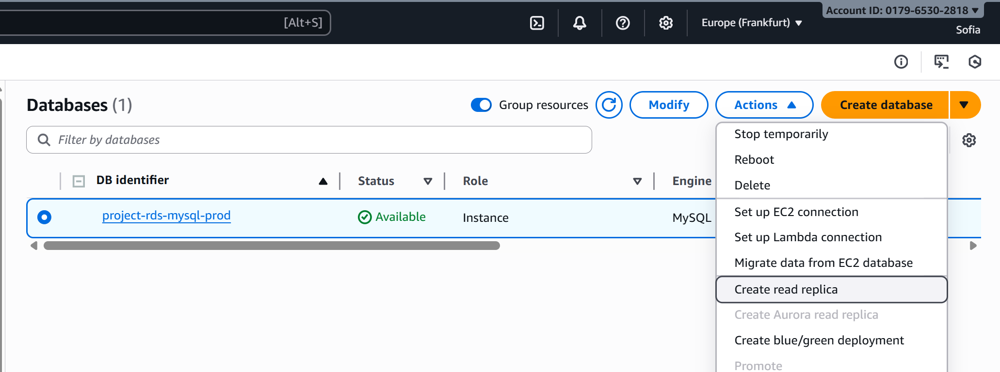

3. Указываем следующие параметры для Read Replica:
   - DB instance identifier: `project-rds-mysql-read-replica`
   - Instance class: `db.t3.micro`
   - Storage type: `General Purpose SSD (gp3)`
   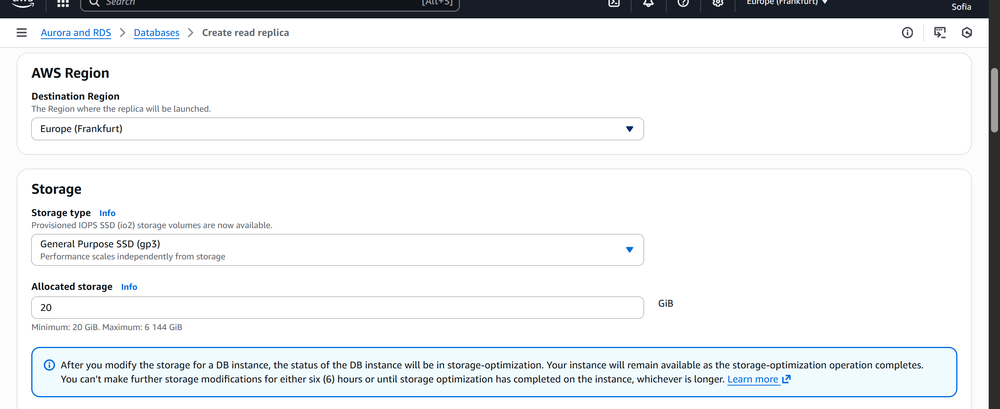
   - Monitoring
     - Enable Enhanced monitoring: _снимите галочку_ (для учебных целей не требуется)
   - Public access: `No`
   - VPC security groups: выберите ту же группу безопасности `db-mysql-security-group`
   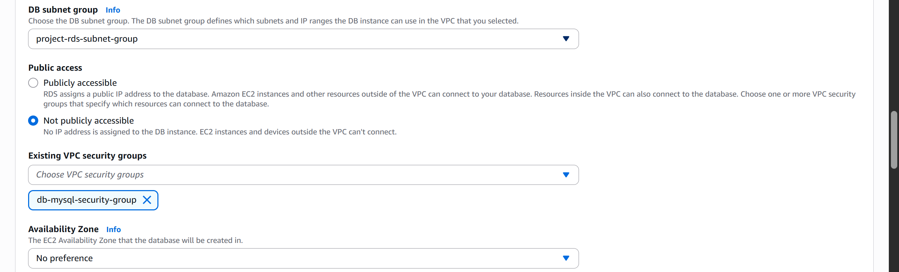
4. Дождидаемся, пока реплика перейдёт в `Available`. У неё будет свой `endpoint` (_только для чтения_).
5. Подключитесь к Read Replica с нашей виртуальной машины EC2 и выполняем запросы на чтение данных (SELECT) из таблиц, созданных на основном экземпляре базы данных.
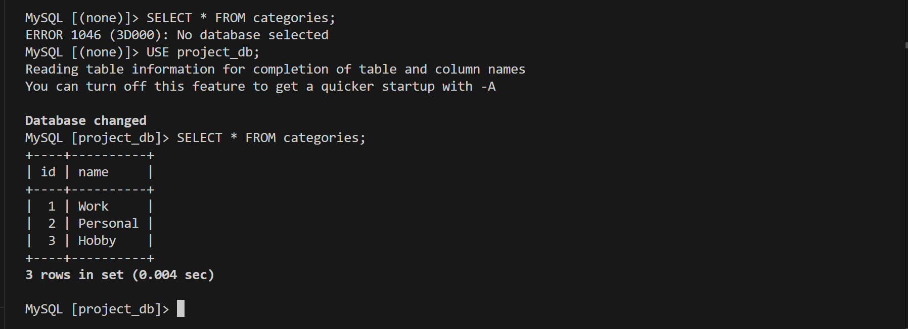
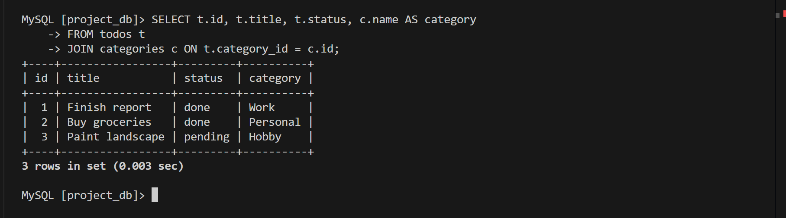

   > Какие данные вы видите? 
   >
   >Все записи, которые были на основном экземпляре на момент создания реплики.
   >Реплика синхронизирована с основным экземпляром, поэтому данные совпадают.
   >Почему? Read Replica копирует данные с основного экземпляра через асинхронную репликацию.

6. Пробуем выполнить запрос на запись (INSERT/UPDATE) на реплике.

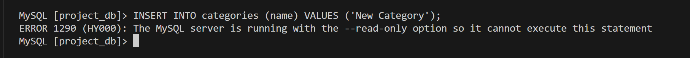

   > Получилось ли выполнить запись на Read Replica? Почему?
   > Ошибка, Read Replica только для чтения. Запись на реплике невозможна, чтобы не нарушить консистентность данных. Все изменения должны выполняться на основном экземпляре.

7. Переходим на основной экземпляр базы данных и добавляем новую запись в одну из таблиц.
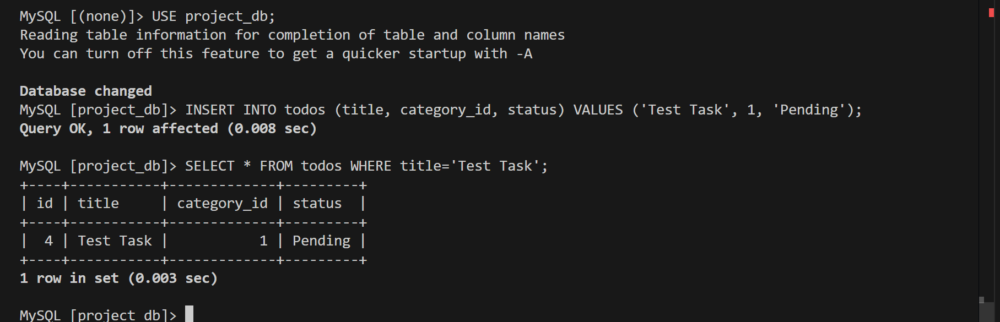

8. Вернулись к подключению к Read Replica и выполняем запрос на чтение.

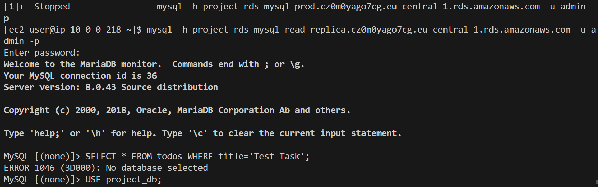
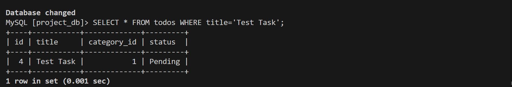

   > Отобразилась ли новая запись на реплике?.
   > Новая запись отображается на реплике.
   > Почему? Реплика асинхронно получает изменения от основного экземпляра. Иногда синхронизация занимает несколько секунд.

9. **Зачем нужны Read Replicas и в каких сценариях их использование будет полезным.**

Основные сценарии использования:
- Масштабирование чтения (Можно перенаправлять SELECT-запросы на реплики, уменьшая нагрузку на основной экземпляр.)
- Отказоустойчивость (В случае проблем с основным экземпляром можно быстро переключиться на реплику (часто с использованием failover)).
- Бэкапы и аналитика (На репликах можно запускать отчёты и сложные запросы без влияния на производительность основной базы.)
- НО! Write (INSERT/UPDATE/DELETE) всегда выполняются на основном экземпляре.

### Шаг 6. Подключение приложения к базе данных

#### Шаг 6a. Развертывание CRUD приложения

Для начала подключилась к мастер бд и удалила старые записи
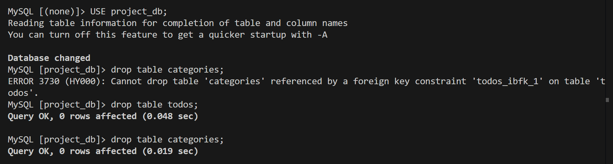

Устанавливаем Apache и PHP на EC2 и создаем рабочую папку:

```
sudo dnf install -y httpd php php-mysqlnd
sudo systemctl enable --now httpd
sudo mkdir -p /var/www/html/app
cd /var/www/html/app
```
После этого был создан минимальный PHP CRUD состоящий из след файлов:

- index.php — показывает список заказов (SELECT → Read Replica)
- create.php — форма создания заказа (INSERT → Master)
- delete.php — удаление заказа (DELETE → Master)
- db_master.php — подключение к Master RDS
- db_read.php — подключение к Read Replica

Приложение доступно по адресу инстанса

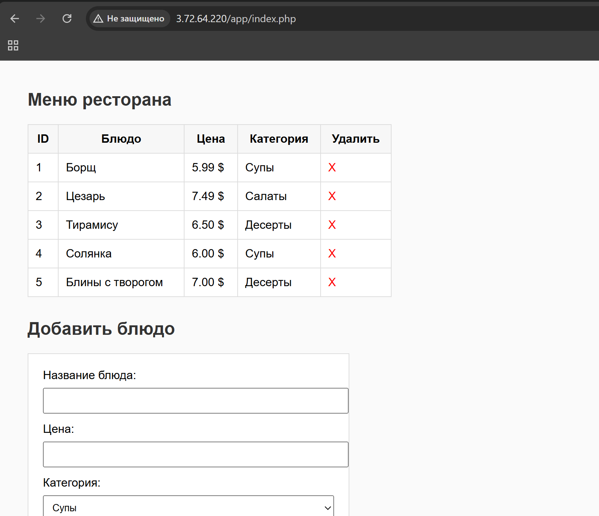

### Шаг 7. Дополнительное задание. Использование DynamoDB

Создаем политику AWS → IAM → Roles → Create role

- Выбор типа сущности: EC2
- Trusted entity type: AWS service , EC2

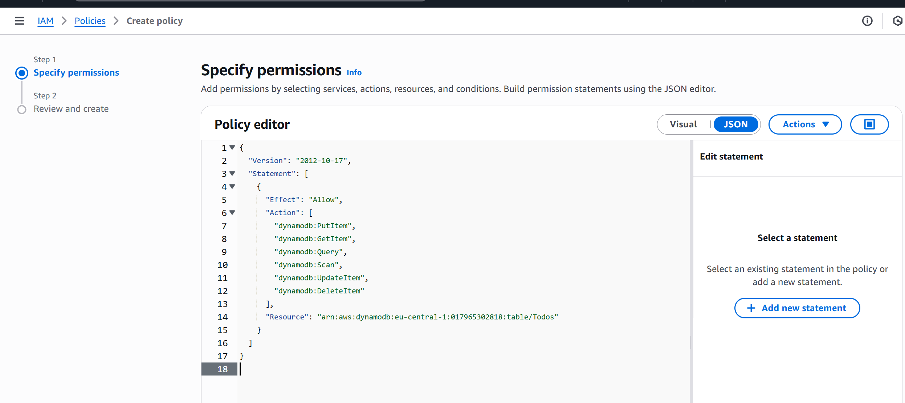
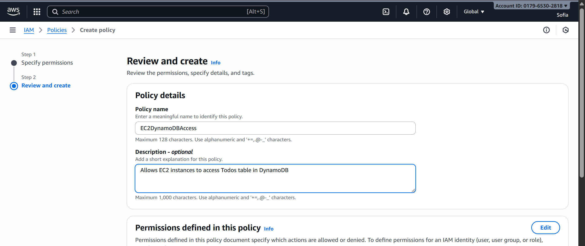

Создаем роль `IAM → Roles`

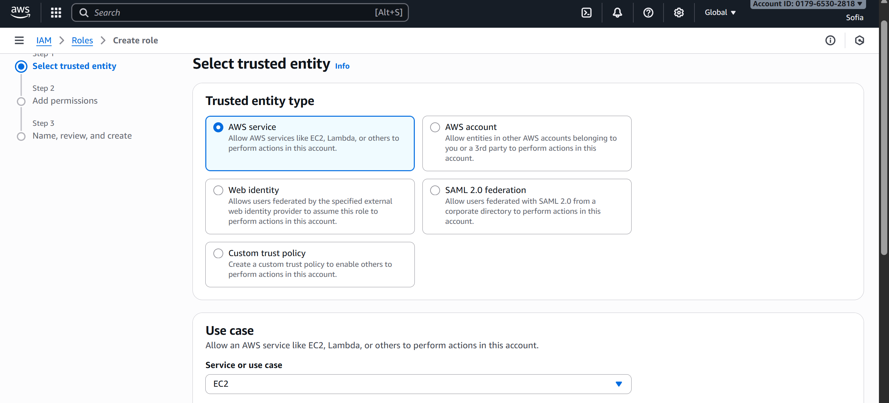


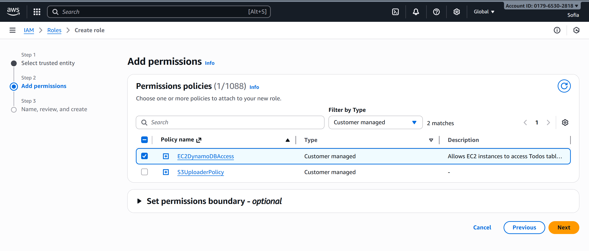

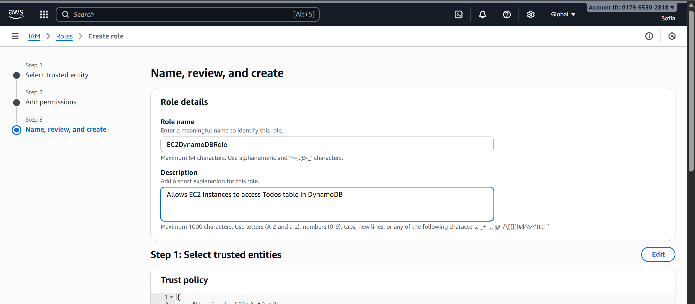

После этого нужно прикрепить эту роль к твоему EC2 инстансу:

`EC2 → Instances → наш инстанс`

`Actions → Security → Modify IAM Role`

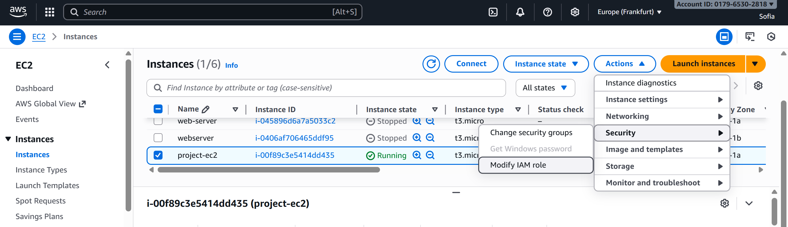

Выбираем `EC2DynamoDBRole` и `Save`

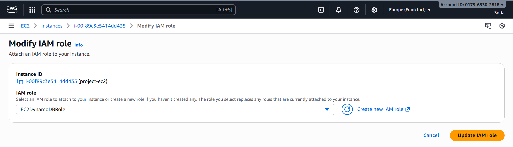

Теперь EC2 сможет использовать DynamoDB без ключей!

Шаг 1. Заходим в DynamoDB : На левой панели выбаем Tables потом Create table

Шаг 2. Настройки таблицы

- Table name: Dishes
- Partition key (PK): Category → Type: String
- Sort key (SK): DishID → Type: String
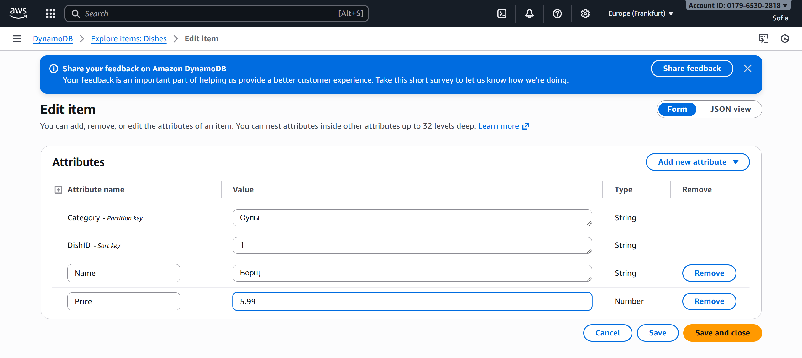

проверила через AWS CLI что возвращает 

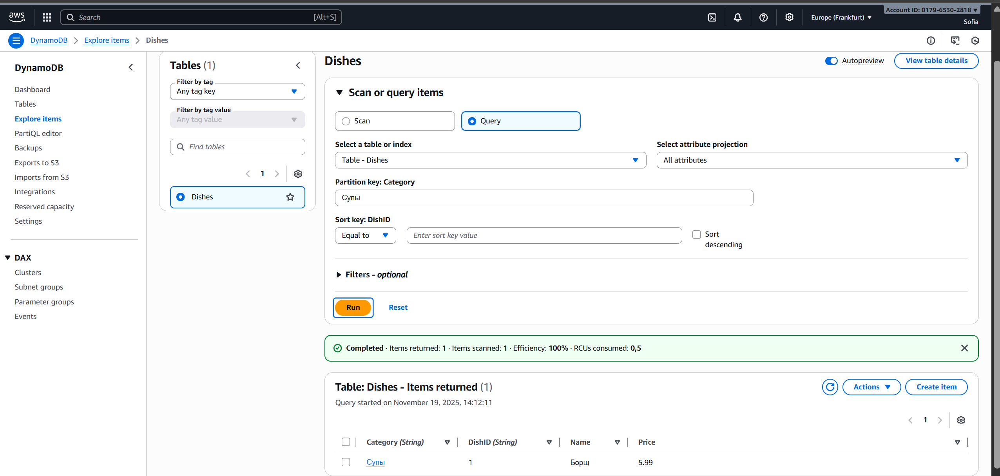

Теперь скачиваем AWS SDK для PHP Через Composer на EC2:

```
curl -sS https://getcomposer.org/installer | php
sudo mv composer.phar /usr/local/bin/composer
```

Переходим в папку проекта /app:
```
cd /var/www/html/app
```

Установим SDK:

```
composer require aws/aws-sdk-php
```
появилась папка `vendor` и файлы `composer`
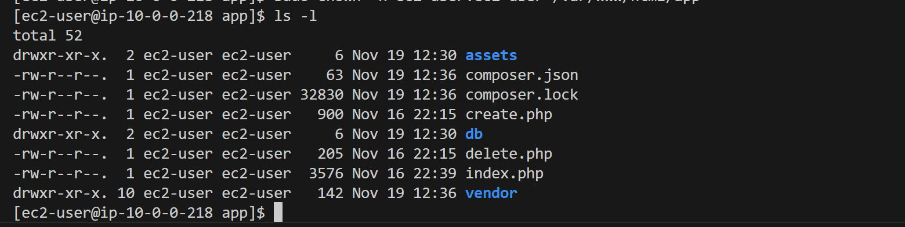

также поменяла  приложение (из Шага 6), добавив функциональность для взаимодействия с таблицей DynamoDB:
   - Реализовали операции создания, чтения, обновления и удаления записей в таблице;


   > Какие сложности вы столкнулись при проектировании данных для DynamoDB по сравнению с реляционной моделью данных в Amazon RDS?
   > Сложности были в том, что DynamoDB требует дизайна под конкретные запросы: нужно заранее продумывать ключи и индексы. В отличие от RDS, где легко делать JOIN и нормализовать данные, здесь приходится денормализовать данные и хранить повторяющуюся информацию, чтобы быстро получать нужные данные.


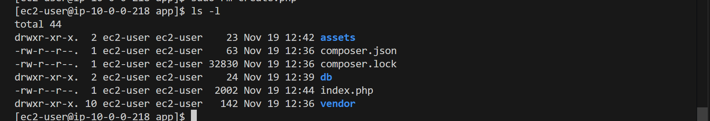

по пути к успеху встретился фатал
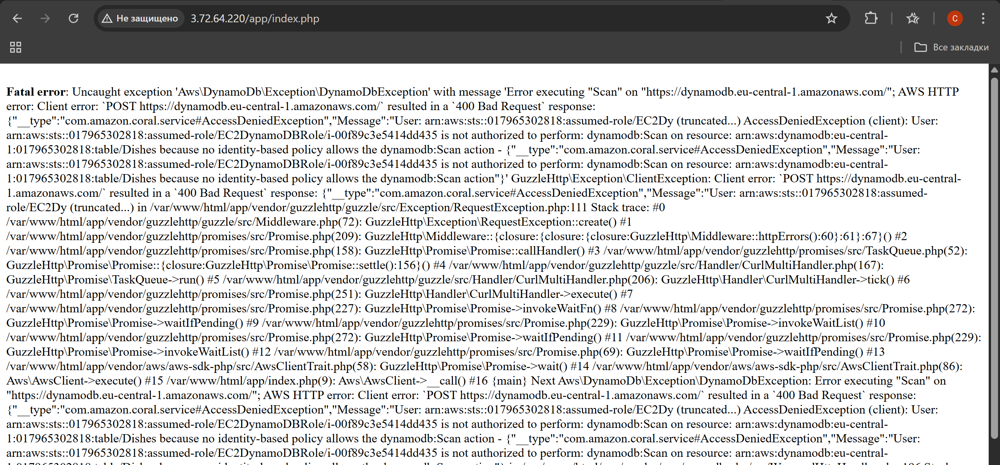

Причина этому EC2DynamoDBRole, не имеет прав на выполнение действия dynamodb:Scan для таблицы Dishes, поэтому добавляем политику с разрешением на чтение таблицы DynamoDB, посл еэтого заработало:

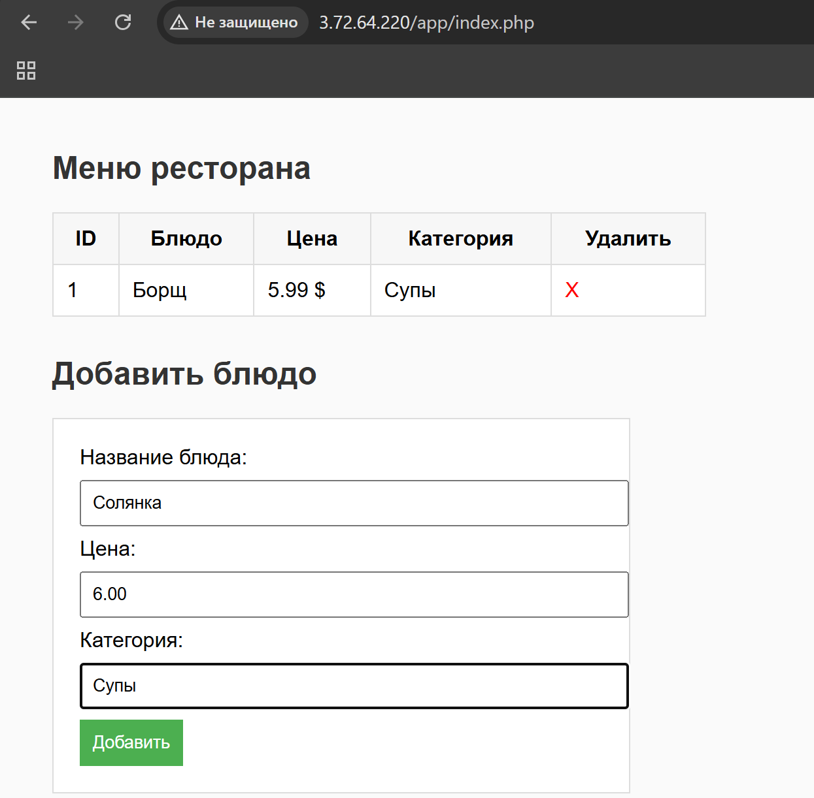
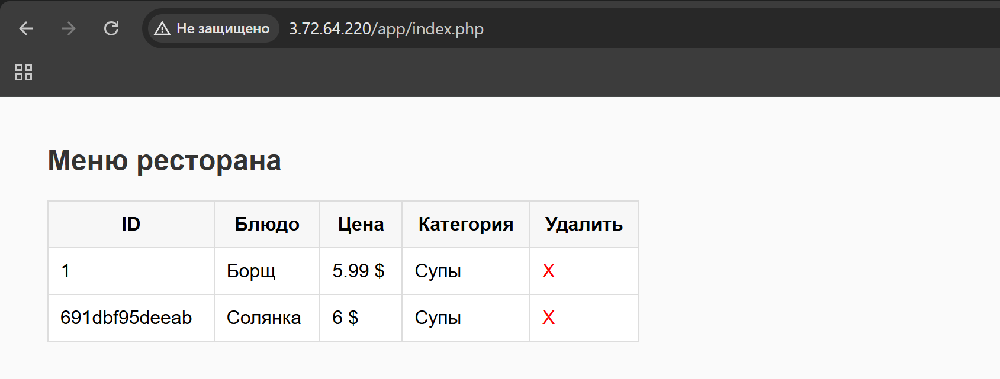

добавила через AWS CLI еще одну запись с новой катогрией
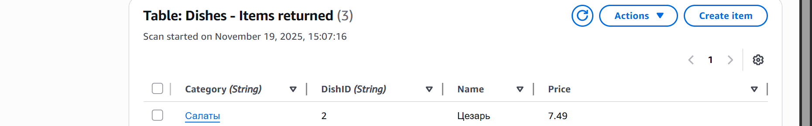

теперь наоборот из приложения добавила в авс консоли сразу появляется
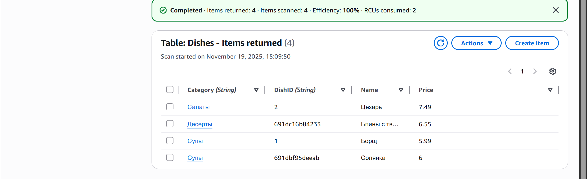

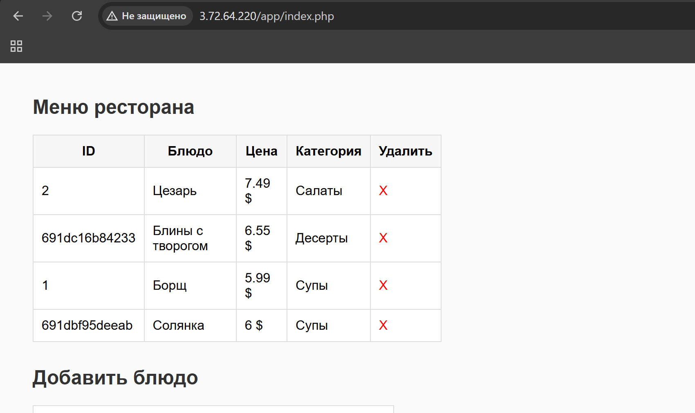

*Про «красивые числовые ID»*

В DynamoDB нет автоинкремента, поэтому uniqid() — это стандартный способ уникального ключа, и он имеет такой вид, но он портит вид, поэтому решено вообще не отображать :D

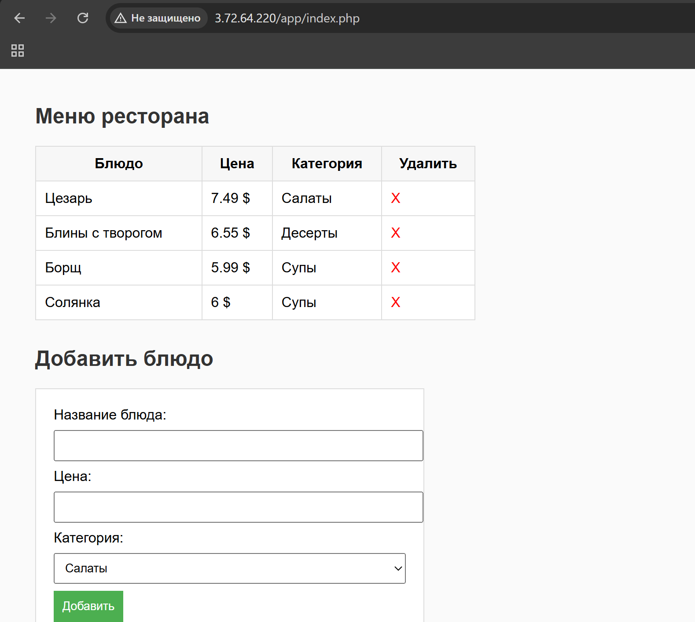

   > Какие преимущества и недостатки использования DynamoDB по сравнению с реляционной базой данных Amazon RDS в вашем случае?
   > Преимущества DynamoDB: масштабируемость, высокая скорость чтения/записи, без серверного администрирования, подходит для больших потоков данных.
   > Недостатки: ограниченные возможности сложных запросов и связей, нет транзакций как в RDS, сложнее менять структуру данных.
   > Для RDS наоборот — сложные запросы и связи удобны, но масштабирование и производительность при больших нагрузках требуют больше усилий.


5. Cитуация, в которой целесообразно использовать обе базы данных - Amazon RDS и Amazon DynamoDB - в одном приложении.

Можно использовать гибридный подход, когда разные типы данных хранятся в подходящей базе:

- Сценарий: интернет-магазин.

    - Amazon RDS хранит основные данные о товарах, заказах и пользователях, где важны связи между таблицами и сложные запросы (например, отчёты, фильтры по категориям, история заказов).

    - Amazon DynamoDB хранит сессионные данные, кэш корзины, быстрые логи кликов и просмотров, где важна скорость чтения/записи и масштабируемость под высокую нагрузку.

- Почему это оправдано:

    - Каждая база используется для задач, для которых она оптимальна.

    - RDS обеспечивает целостность и сложные операции с данными, DynamoDB — мгновенные отклики при большом потоке запросов.

Совместное использование снижает нагрузку на RDS и ускоряет работу приложения, чего нельзя добиться, используя только одну базу.

## Терраформ

#### Теоретические сведения

Terraform — это инструмент Infrastructure as Code (IaC). Позволяет описывать всю инфраструктуру в виде кода (текстовые файлы .tf) 
- После описания можно создавать, изменять и удалять ресурсы в облаке командой terraform apply
- Работает с AWS, Azure, GCP, Kubernetes, и многими другими провайдерами
- Контролирует все зависимости между ресурсами: сначала создаст Security Group, потом EC2 с этой SG

Для начала скачиваем с официального сайта Terraform на локальный компьтер и добавляем в системный PATH

Создаем файл [main.tf](terraform/main.tf)

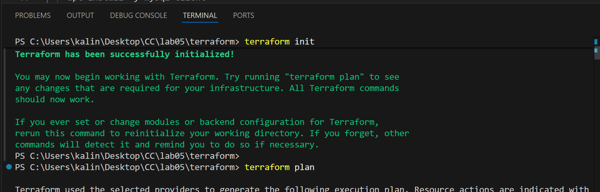

при первых попытках комманды `apply` были некоторые проблемы, напрмер: 
Оказалось что используется пользователь s3-uploader у которого не все права.

Для решения нужно заменить ключи:

```
aws configure
```
И вставить данные пользователя Sofia.

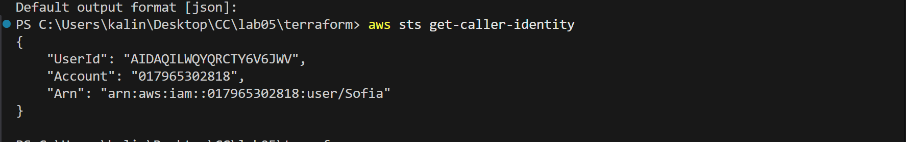

После этого все заработало


в разделе instances появился наш project-ec2-tf
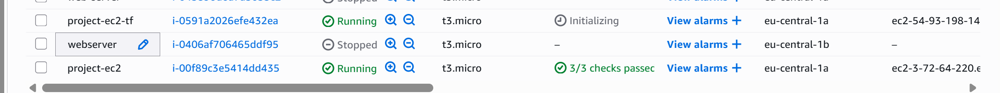

даже по ssh подключилась этому инстансу
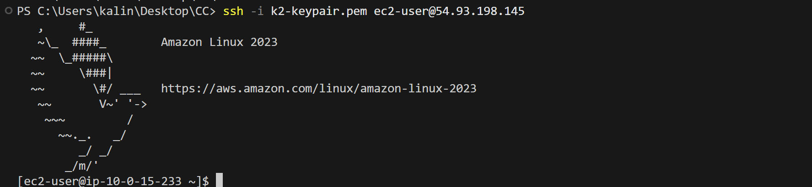

также появились security group
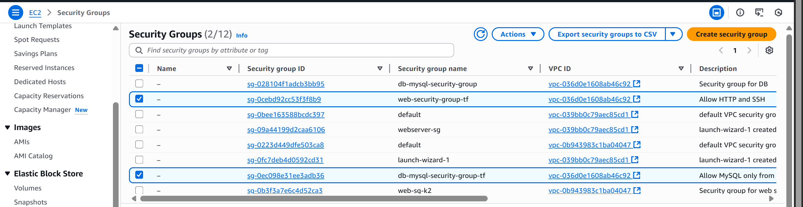

## Вывод 

В ходе лабораторной работы была изучена работа с облачными сервисами хранения данных Amazon RDS и DynamoDB. Создан основной экземпляр MySQL с Read Replica для повышения производительности и отказоустойчивости, а также настроено подключение виртуальной машины EC2 к базе данных для выполнения базовых операций CRUD. Были проверены ограничения на запись данных на Read Replica и особенности синхронизации с основным экземпляром.

Также проведена работа с таблицами в DynamoDB, выполнены операции CRUD и сравнены преимущества реляционной и NoSQL моделей данных. Лабораторная работа позволила понять, как интегрировать облачные базы данных с приложением, управлять доступом через Security Groups и оптимизировать расходы с учётом Free Tier, а также закрепить навыки безопасного развертывания и удаления ресурсов в AWS.

### Источники

1. [Curs Базы данных в облаке. AWS RDS и DynamoDB](https://github.com/MSU-Courses/cloud-computing/tree/main/07_AWS_DB)
2. [Amazon Web Services. *Amazon RDS User Guide*.](https://docs.aws.amazon.com/AmazonRDS/latest/UserGuide/Welcome.html)  
3. [Amazon Web Services. *Amazon DynamoDB Developer Guide*.](https://docs.aws.amazon.com/amazondynamodb/latest/developerguide/Introduction.html)
