# Лабораторная работа №6. Балансирование нагрузки в облаке и авто-масштабирование

 - **Калинкова София, I2302** 
 - **30.11.2025** 

## Цель работы

Закрепить навыки работы с AWS EC2, Elastic Load Balancer, Auto Scaling и CloudWatch, создав отказоустойчивую и автоматически масштабируемую архитектуру.

Студент развернёт:

- VPC с публичными и приватными подсетями;
- Виртуальную машину с веб-сервером (nginx);
- Application Load Balancer;
- Auto Scaling Group (на основе AMI);
- нагрузочный тест с использованием CloudWatch.

## Условие

> Для студентов специализации DevOps. Для получения высшей оценки рекомендуется дополнительно автоматизировать процесс _развертывания VPC и виртуальных машин_ с помощью Terraform.

### Шаг 1. Создание VPC и подсетей

1. Создайте VPC (если уже есть — используйте существующую):
2. Создайте _2 публичные подсети_ и _2 приватные подсети_ в _разных зонах доступности_ (например, `us-east-1a` и `us-east-1b`):
   1. CIDR-блок: `10.0.1.0/24` и `10.0.2.0/24`
3. Создайте Internet Gateway и прикрепите его к VPC.
4. В Route Table пропишите маршрут для публичных подсетей:
   - Destination: `0.0.0.0/0` → Target: Internet Gateway

> Рекомендуется использовать мастер-настройки (wizard) при создании VPC.

### Шаг 2. Создание и настройка виртуальной машины

1. Запусите виртуальную машину в созданной подсети:

   1. AMI: `Amazon Linux 2`
   2. Тип: `t3.micro`
   3. В настройках сети выберите созданную VPC и подсеть.
      1. _Не забудьте назначить публичный IP-адрес_ (Enable auto-assign public IP).
   4. В настройках безопасности создайте новую группу безопасности с правилами:

      - Входящие правила:

        - SSH (порт 22) — источник: ваш IP
        - HTTP (порт 80) — источник: 0.0.0.0/0

      - Исходящие правила:

        - Все трафики — источник: 0.0.0.0/0

   5. В `Advanced Details` -> `Detailed CloudWatch monitoring` выберите `Enable`. Это позволит собирать дополнительные метрики для Auto Scaling.

   6. В настройках `UserData` укажите следующий скрипт [init.sh](./script/init.sh), который установит, запустит nginx.

2. Дождитесь, пока `Status Checks` виртуальной машины станут зелёными (`3/3 checks passed`).
3. Убедитесь, что веб-сервер работает, подключившись к публичному IP-адресу виртуальной машины через браузер (_развертывание сервера может занять до 5 минут_).


сделала файлик тераформ


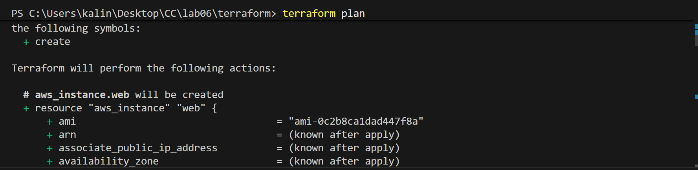
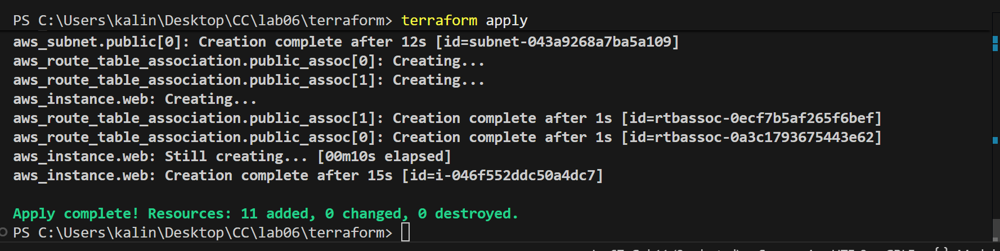


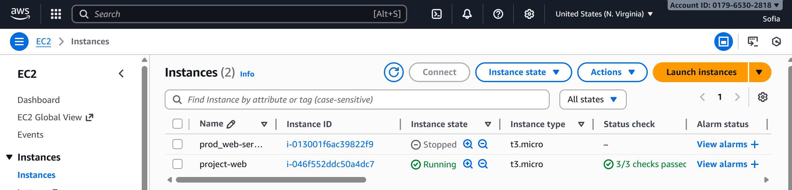
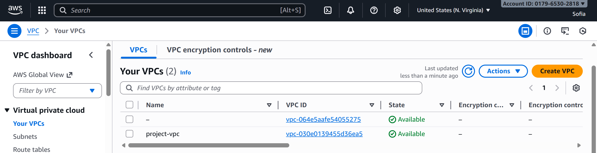

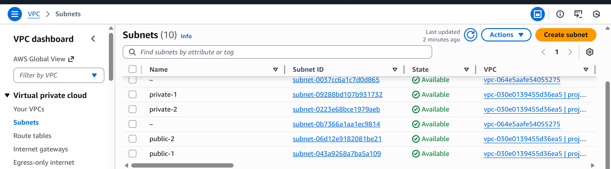
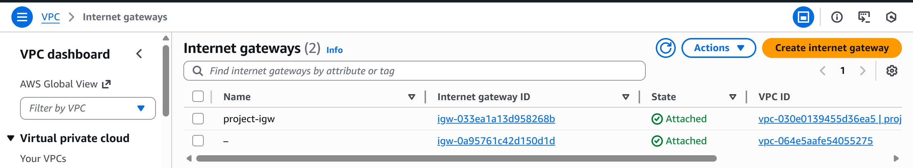
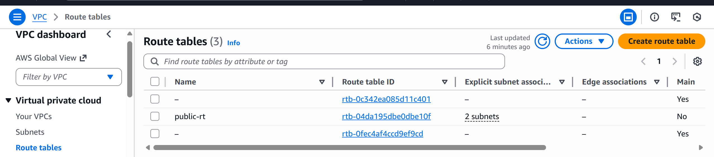

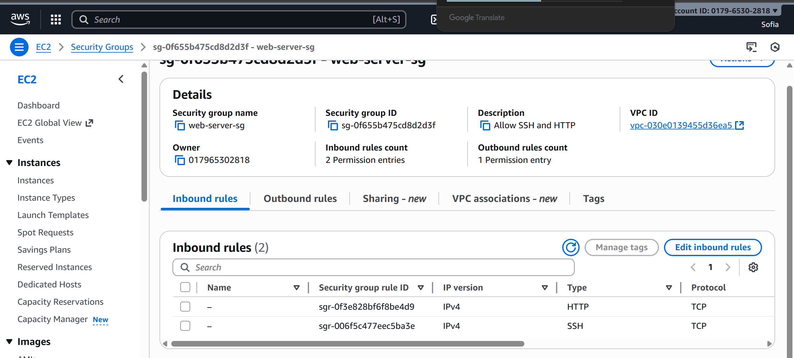

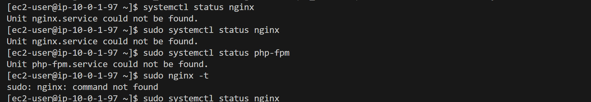
слепой шоль, нджиникса нет -_-

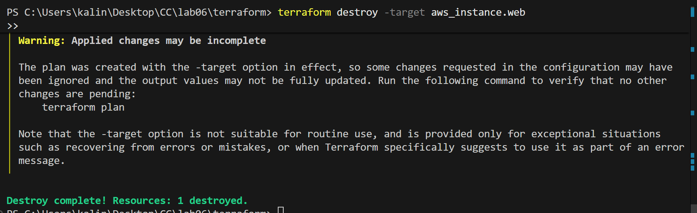

поменяла ами на 2023

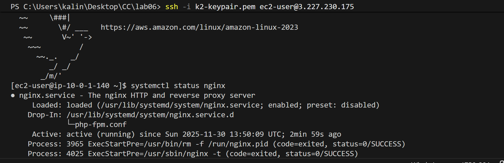
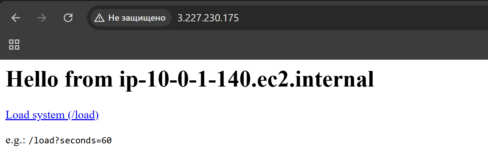


### Шаг 3. Создание AMI

1. В EC2 выберите `Instance` → `Actions` → `Image and templates` → `Create image`.
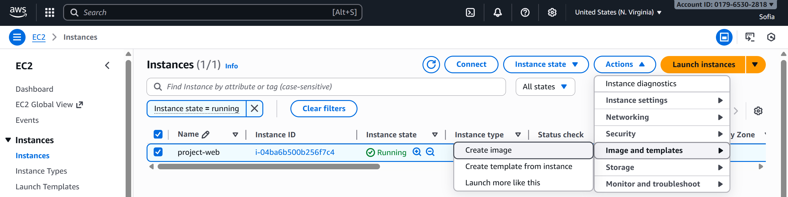
2. Назовите AMI, например: `project-web-server-ami`.
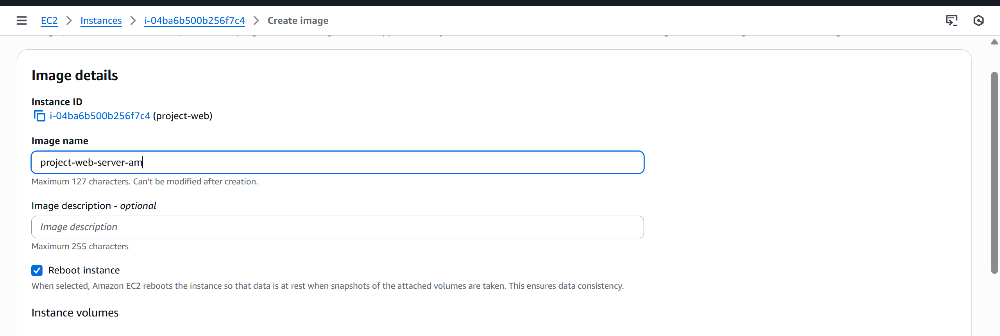
3. Дождитесь появления AMI в разделе AMIs.

> Что такое image и чем он отличается от snapshot? Какие есть варианты использования AMI?

### Шаг 4. Создание Launch Template

На основе Launch Template в дальнейшем будет создаваться Auto Scaling Group, то есть подниматься новые инстансы по шаблону.

1. В разделе EC2 выберите `Launch Templates` → `Create launch template`.
2. Укажите следующие параметры:
   1. Название: `project-launch-template`
   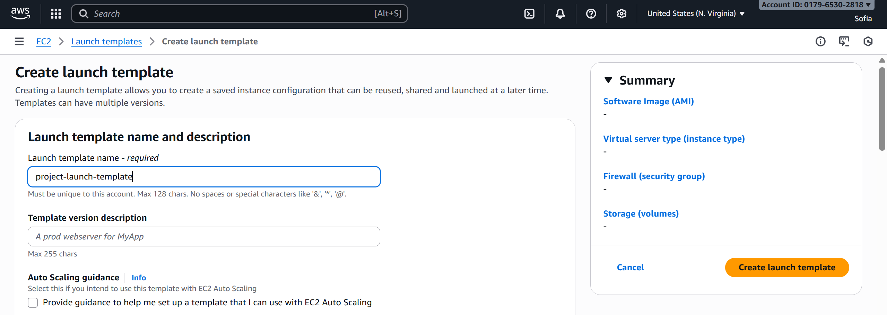
   2. AMI: выберите созданную ранее AMI (`My AMIs` -> `project-web-server-ami`).
   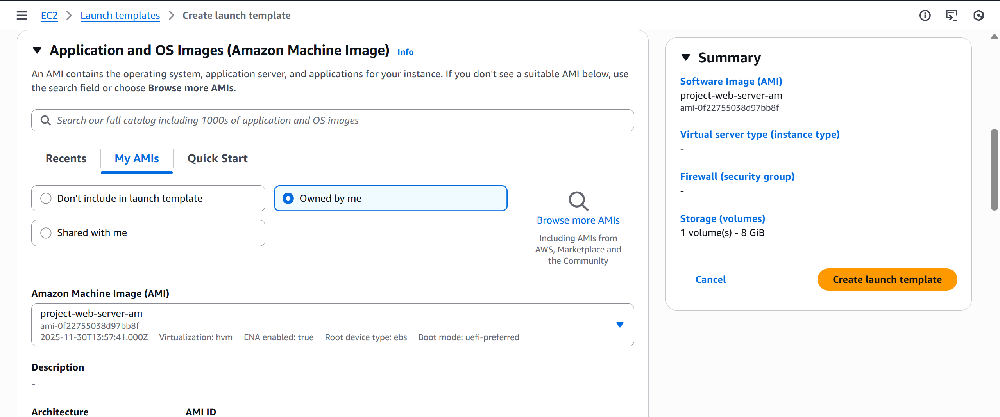
   3. Тип инстанса: `t3.micro`.
   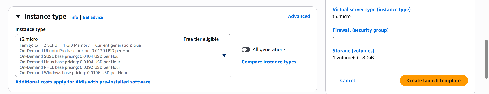
   4. Security groups: выберите ту же группу безопасности, что и для виртуальной машины.
   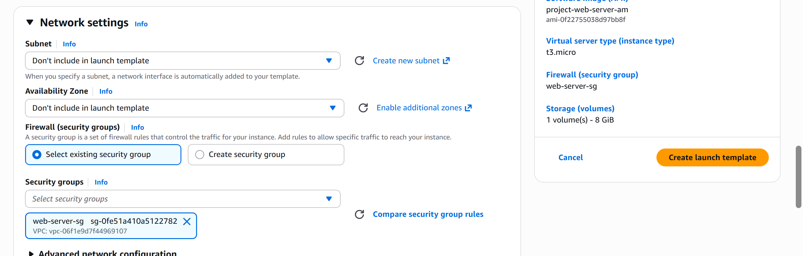
   5. Нажмите `Create launch template`.
   6. В разделе `Advanced details` -> `Detailed CloudWatch monitoring` выберите `Enable`. Это позволит собирать дополнительные метрики для Auto Scaling.
   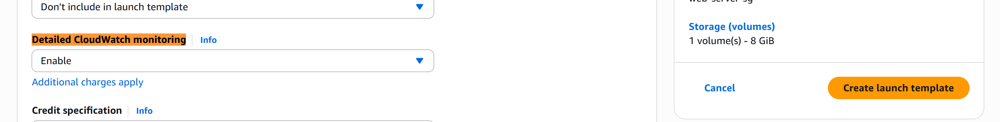
   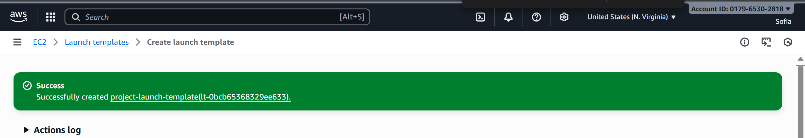

> Что такое Launch Template и зачем он нужен? Чем он отличается от Launch Configuration?

### Шаг 5. Создание Target Group

1. В разделе EC2 выберите `Target Groups` → `Create target group`.
2. Укажите следующие параметры:

   1. Название: `project-target-group`
   2. Тип: `Instances`
   3. Протокол: `HTTP`
   4. Порт: `80`
   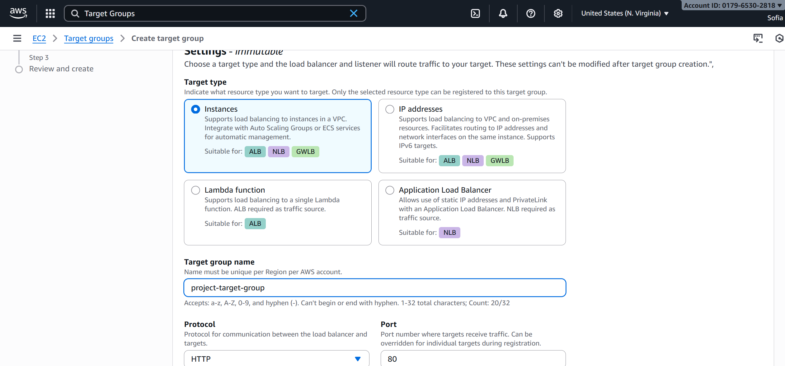
   5. VPC: выберите созданную VPC
   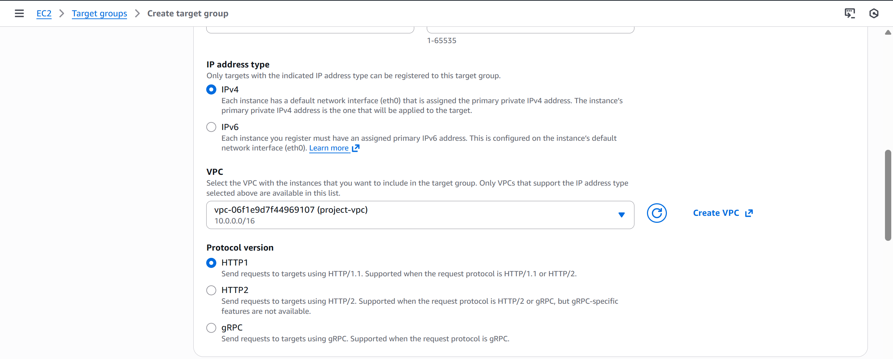

3. Нажмите `Next` -> `Next`, затем `Create target group`.
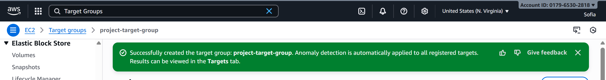

> Зачем необходим и какую роль выполняет Target Group?

### Шаг 6. Создание Application Load Balancer

1. В разделе EC2 выберите `Load Balancers` → `Create Load Balancer` → `Application Load Balancer`.
2. Укажите следующие параметры:
   1. Название: `project-alb`
   2. Scheme: `Internet-facing`.
      > В чем разница между Internet-facing и Internal?
      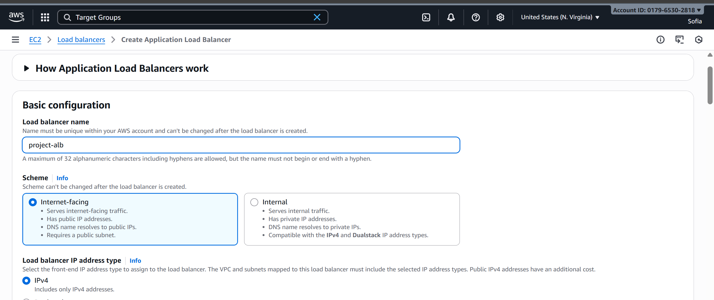
   3. Subnets: выберите созданные 2 публичные подсети.
   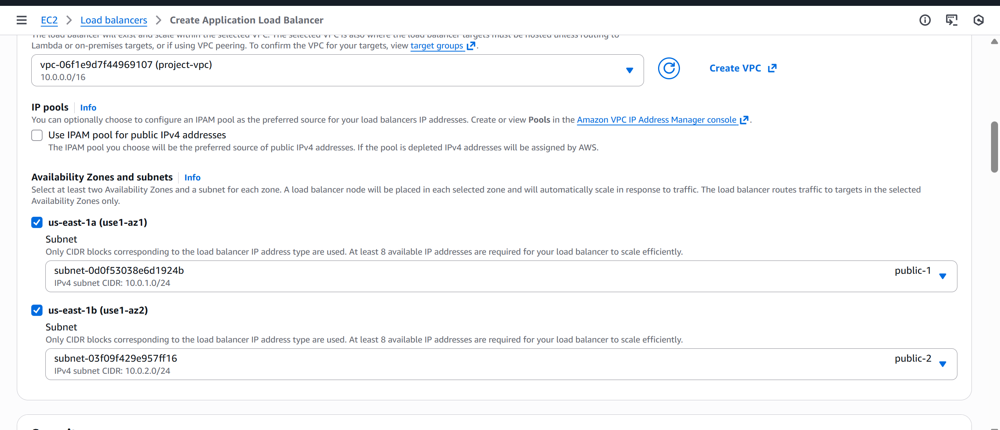
   4. Security Groups: выберите ту же группу безопасности, что и для виртуальной машины.
   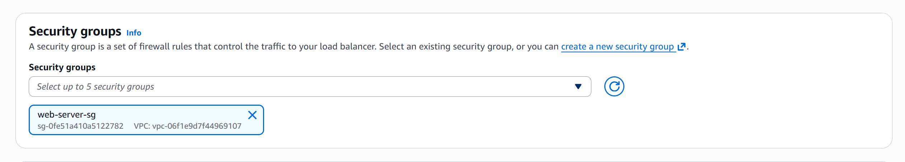
   5. Listener: протокол `HTTP`, порт `80`.
   6. Default action: выберите созданную Target Group `project-target-group`.
   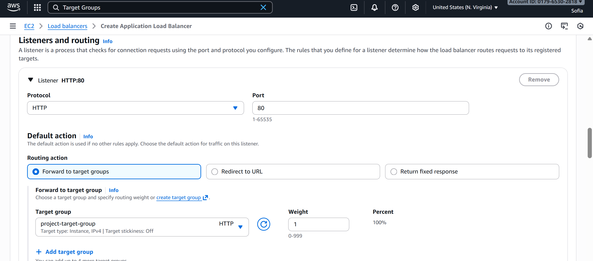
      > Что такое Default action и какие есть типы Default action?
   7. Нажмите `Create load balancer`.
   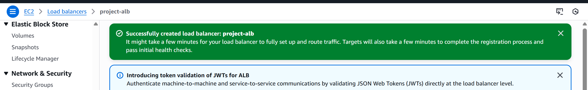
3. Перейдите в раздел `Resource map` и убедитесь что существуют связи между `Listeners`, `Rules` и `Target groups`.
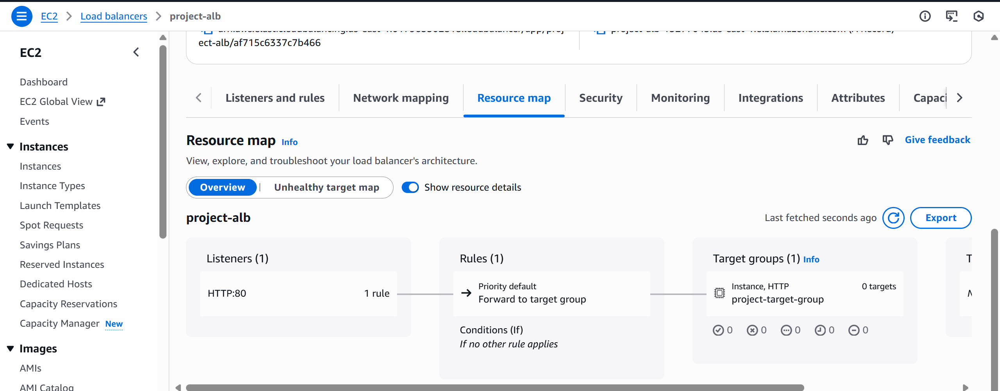

### Шаг 7. Создание Auto Scaling Group

1. В разделе EC2 выберите `Auto Scaling Groups` → `Create Auto Scaling group`.
2. Укажите следующие параметры:

   1. Название: `project-auto-scaling-group`
   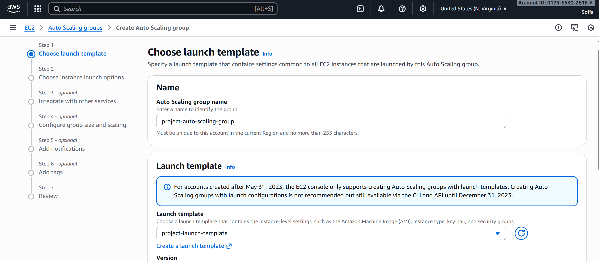
   2. Launch template: выберите созданный ранее Launch Template (`project-launch-template`).
   3. Перейдите в раздел `Choose instance launch options `.

      - В разделе`Network`: выберите созданную VPC и две приватные подсети.
      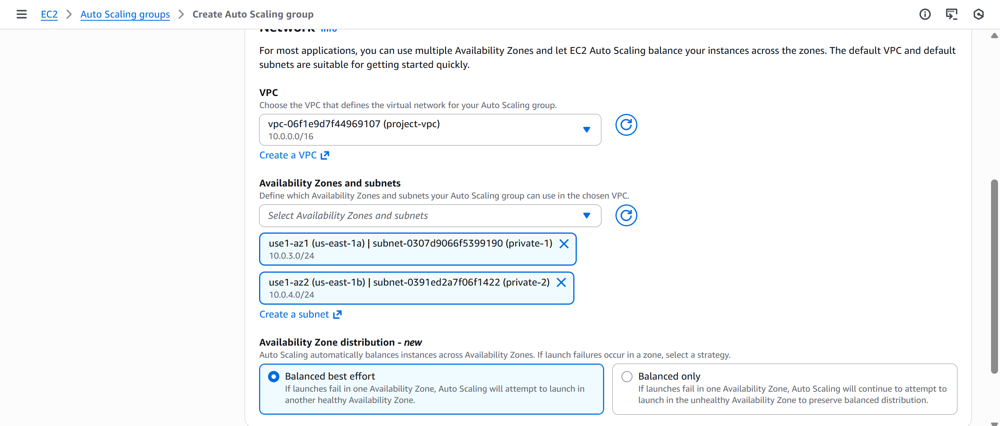

      > Почему для Auto Scaling Group выбираются приватные подсети?

   4. Availability Zone distribution: выберите `Balanced best effort`.

      > Зачем нужна настройка: `Availability Zone distribution`?

   5. Перейдите в раздел `Integrate with other services` и выберите `Attach to an existing load balancer`, затем выберите созданную Target Group (`project-target-group`).
      - Таким образом мы добавляем AutoScaling Group в Target Group нашего Load Balancer-а.
      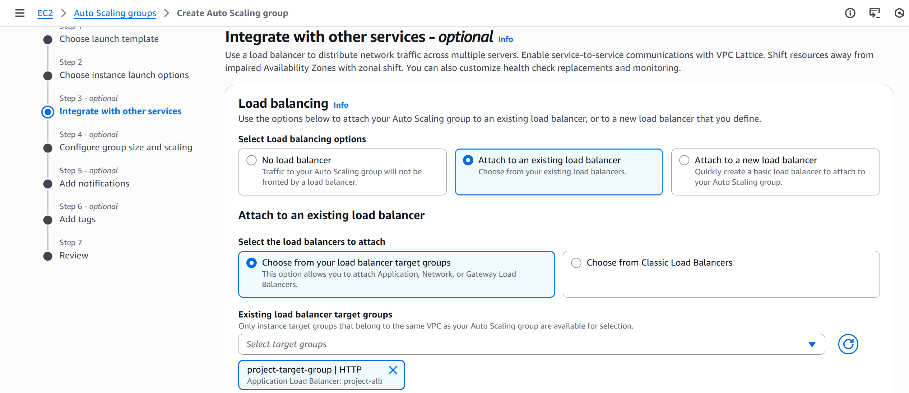
   6. Перейдите в раздел `Configure group size and scaling` и укажите:

      1. Минимальное количество инстансов: `2`
      2. Максимальное количество инстансов: `4`
      3. Желаемое количество инстансов: `2`
      4. Укажите `Target tracking scaling policy` и настройте масштабирование по CPU (Average CPU utilization — `50%` / `Instance warm-up period` — `60 seconds`).
      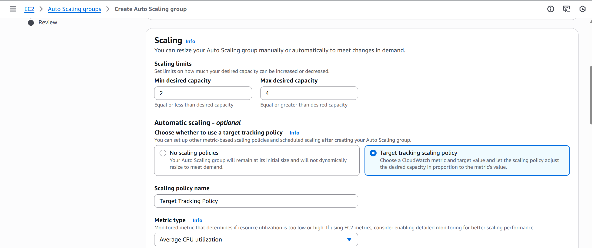
      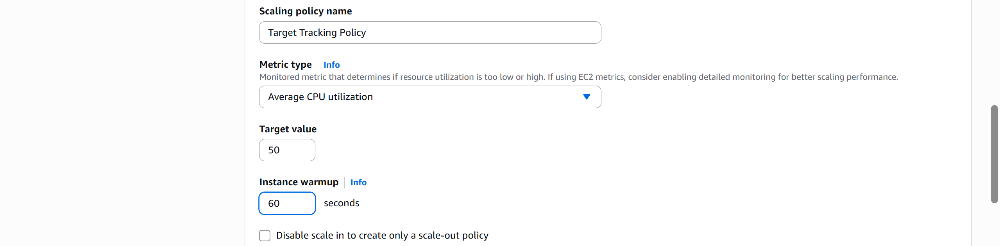

         > Что такое _Instance warm-up period_ и зачем он нужен?

      5. В разделе `Additional settings` поставьте галочку на `Enable group metrics collection within CloudWatch`, чтобы собирать метрики Auto Scaling Group в CloudWatch. _Этот пункт позволит нам отслеживать состояние группы и её производительность_.

      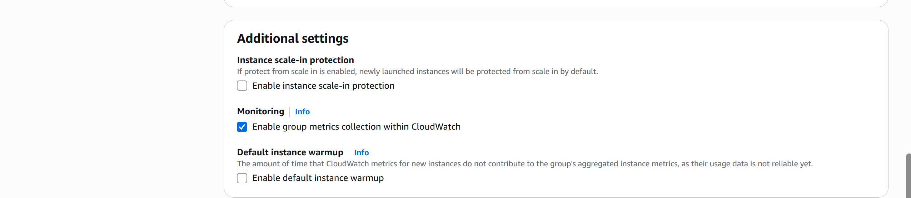

   7. Перейдите в раздел `Review` и нажмите `Create Auto Scaling group`.
   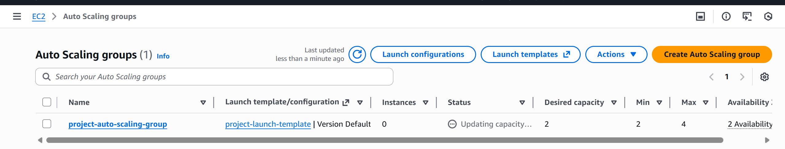

### Шаг 8. Тестирование Application Load Balancer

1. Перейдите в раздел EC2 -> `Load Balancers`, выберите созданный Load Balancer и скопируйте его DNS-имя.
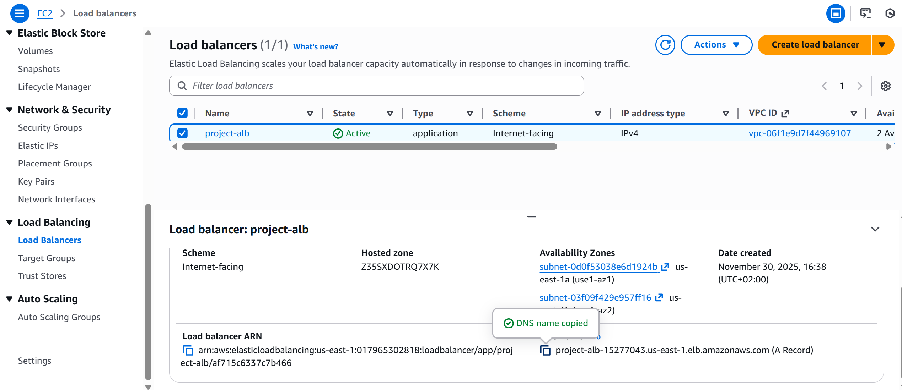
2. Вставьте DNS-имя в браузер и убедитесь, что вы видите страницу веб-сервера.

просто оставила подумать о своем поведении и он зараборал
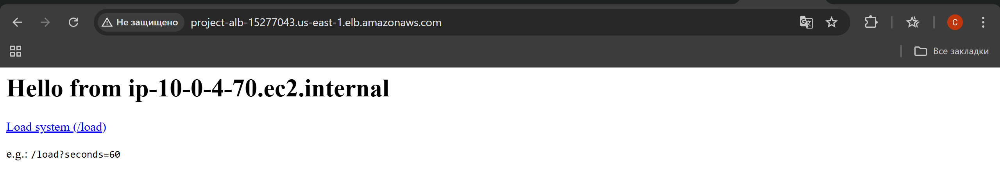
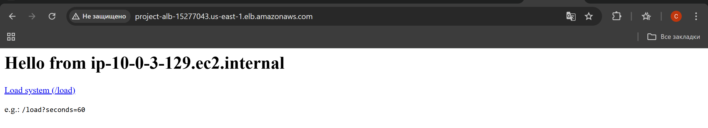
3. Обновите страницу несколько раз и посмотрите на IP-адреса в ответах.
   > Какие IP-адреса вы видите и почему?

### Шаг 9. Тестирование Auto Scaling

1. Перейдите в CloudWatch -> `Alarms`, у вас должны быть созданы автоматические оповещения для Auto Scaling Group.
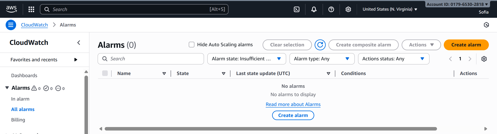
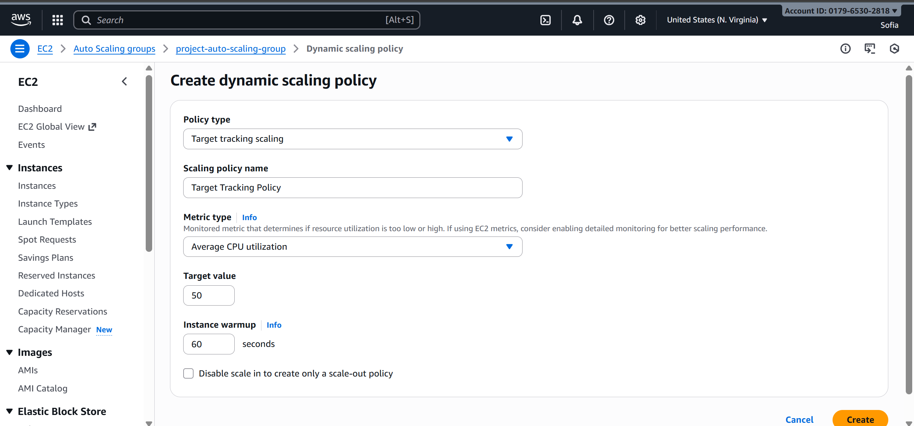
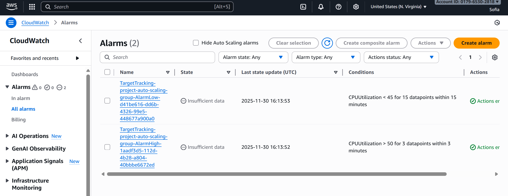
2. Выберите одно из оповещений (например, `TargetTracking-XX-AlarmHigh-...`), откройте и посмотрите на график CPU Utilization. На данный момент график должен быть низким (около 0-1%).
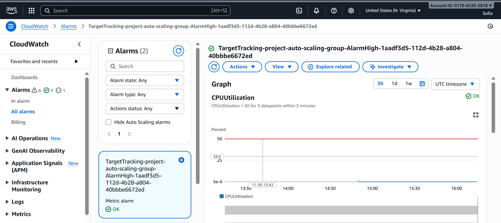
3. Перейдите в браузер и откройте 6-7 вкладок со следующим адресом:

   ```
   http://<DNS-имя вашего Load Balancer-а>/load?seconds=60
   ```


4. Вернитесь в CloudWatch и посмотрите на график CPU Utilization. Через несколько минут вы должны увидеть рост нагрузки.
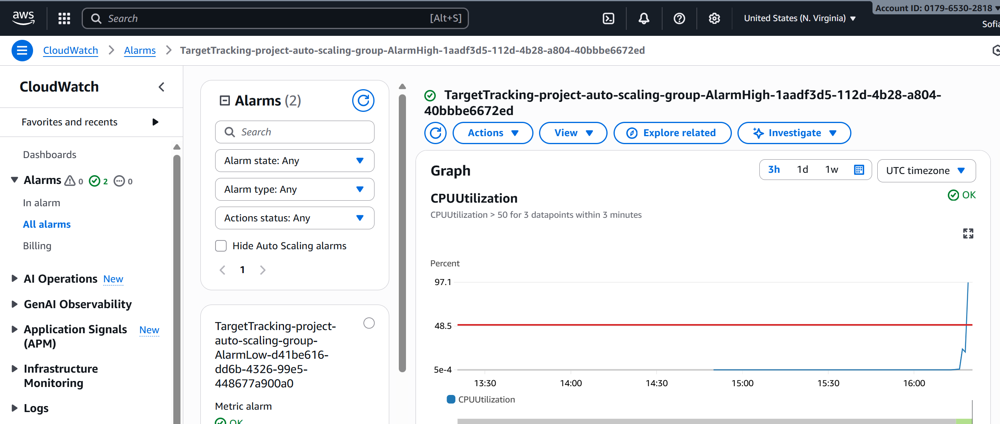
5. Подождите 2-3 минуты, пока CloudWatch не зафиксирует высокую нагрузку и не создаст `Alarm` (будет показано красным цветом).
6. Перейдите в раздел `EC2` -> `Instances` и посмотрите на количество запущенных инстансов.

   > Какую роль в этом процессе сыграл Auto Scaling?

   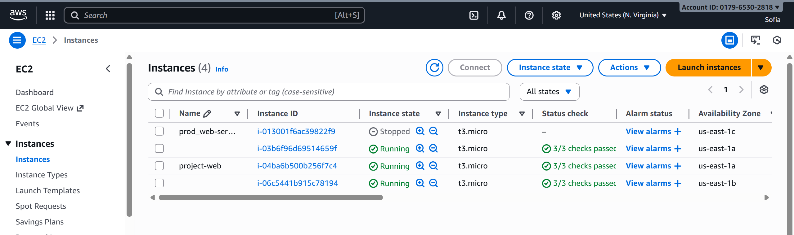

### Шаг 10. Завершение работы и очистка ресурсов

1. Остановите нагрузочный тест (закройте вкладки браузера или остановите скрипт `curl.sh`).
2. Перейдите в раздел `EC2` -> `Load Balancers`, выберите созданный Load Balancer и удалите его (`Delete`).
3. Перейдите в раздел `EC2` -> `Target Groups`, выберите созданную Target Group и удалите её (`Delete`).
4. Перейдите в раздел `EC2` -> `Auto Scaling Groups`, выберите созданную группу и удалите её (`Delete`).
5. Перейдите в раздел `EC2` -> `Instances`, выберите все запущенные инстансы и завершите их (`Terminate`).
6. Перейдите в раздел `EC2` -> `AMIs`, выберите созданную AMI и удалите её (`Deregister`), при удалении выберите удаление связанных снимков (snapshots).
7. Перейдите в раздел `EC2` -> `Launch Templates`, выберите созданный Launch Template и удалите его (`Delete`).
8. Перейдите в раздел `VPC` и удалите созданные VPC и подсети.

## Вывод


